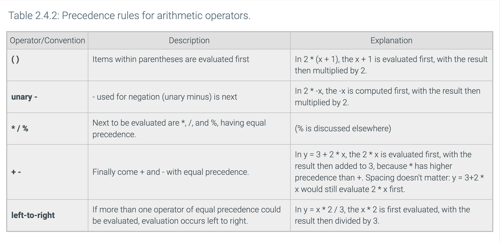

# UOP_COMP051
# 1. Introduction to C++
## 1.1 Programming (General)
A computer program consists of instructions executing one at a time. Basic instruction types are:
- Input: A program gets data, perhaps from a file, keyboard, touchscreen, network, etc.
- Process: A program performs computations on that data, such as adding two values like x + y.
- Output: A program puts that data somewhere, such as to a file, screen, network, etc.

Programs use variables to refer to data, like x, y, and z below. The name is due to a variable's value varying as a program assigns a variable like x with new values.

```Cpp
#include <iostream>
using namespace std;

int main() { // A program begins executing statements in main(). 
  int wage; // 'int wage' declares an integer variable. 'wage = 20' assigns wage with 20.

  wage = 20;

  cout << "Salary is "; // The cout statement outputs 'Salary is ' to the screen at the cursor's present location.
  cout << wage * 40 * 52; // outputs the result of wage * 40 * 52, so 20 * 40 * 52 or 41600.
  cout << endl; // 'endl' moves the output cursor to the next line on the screen.

  return 0; // The 'return 0' statement ends the program.
}
```

## 1.2 Programming Basics
### Basic input
The following statement gets an input value and puts that value into variable x: cin >> x; cin is short for characters in.

```Cpp
#include <iostream>
using namespace std;
 
int main() {
   int wage;
   
   cin >> wage; // gets an input value from the keyboard (or file, etc.) and puts that value into the wage variable.
 
   cout << "Salary is ";
   cout << wage * 40 * 52;
   cout << endl;
 
   return 0;
}
```
### Basic ouput
The cout construct supports output; cout is short for characters out.
Outputting text is achieved via: cout << "desired text";.
Text in double quotes " " is known as a string literal.
Multiple cout statements continue printing on the same output line.
The statement cout << endl; starts a new output line, called a newline.

```Cpp
#include <iostream>
using namespace std;
 
int main() {
   cout << "This is the first paragraph.";
   cout << endl;
   cout << "The cursor has been moved to the next line."
   cout << endl;
   cout << endl;
   cout << "This is the second paragraph.";

   return 0;
}
/*
This is the first paragraph.
The cursor has been moved to the next line.

This is the second paragraph
*/
```

Outputting a variable's value is achieved via: cout << x;. Note that no quotes surround x.
```Cpp
#include <iostream>
using namespace std;

int main() {
   int wage;
   
   wage = 20;

   cout << "Wage is: ";
   cout << wage; 
   cout << endl;
   cout << "Goodbye.";
   cout << endl;

   return 0;
}
/*
Wage is: 20
Goodbye.
*/
```
Programmers commonly use a single output statement for each line of output by combining the outputting of text, variable values, and a new line. The programmer simply separates the items with << symbols. Such combining can improve program readability because the program's code corresponds more closely to the program's output.
```Cpp
#include <iostream>
using namespace std;

int main() {
   int wage;

   wage = 20;

   cout << "Wage is: " << wage << endl; 
   cout << "Goodbye." << endl;

   return 0;
}
```
## 1.3 Comments and Whitespace
### Comments 
A comment is text a programmer adds to code, to be read by humans to better understand the code but ignored by the compiler. Two common kinds of comments exist:
- A single-line comment starts with // and includes all the following text on that line. Single-line comments commonly appear after a statement on the same line.
- A multi-line comment starts with /* and ends with */, where all text between /* and */ is part of the comment. A multi-line comment is also known as a block comment.

```Cpp
#include <iostream>
using namespace std;
/*
 This program calculates the amount of pasta to cook, given the
 number of people eating.
*/
int main ()
{
   int numPeople;         // Number of people that will be eating
   int totalOuncesPasta;  // Total ounces of pasta to serve numPeople
   
   // Get number of people
   cout << "Enter number of people: " << endl;
   cin  >> numPeople;
   
   // Calculate and print total ounces of pasta
   totalOuncesPasta = numPeople * 3;  // Typical ounces per person
   cout << "Cook " << totalOuncesPasta << " ounces of pasta." << endl;
   
   return 0;
}
```
### Whitespace
Whitespace refers to blank spaces (space and tab characters) between items within a statement and blank lines between statements (called newlines). A compiler ignores most whitespace (Not all spaces are ignored by the compiler. Ex: The spaces in a string literal like "Enter age: " will be printed if the string is output).

- Use blank lines to separate conceptually distinct statements.
- Indent lines the same amount.
- Align items to reduce visual clutter.
- Use a single space before and after any operators like =, +, *, or << to make statements more readable.

```Cpp
//good use of whitespace
#include <iostream>
using namespace std;

int main() {
   int myFirstVar;    // Aligned comments yield less
   int yetAnotherVar; // visual clutter 
   int thirdVar; 
  
   // Above blank line separates variable declarations from the rest
   cout << "Enter a number: ";
   cin  >> myFirstVar;
  
   // Above blank line separates user input statements from the rest   
   yetAnotherVar = myFirstVar;        // Aligned = operators
   thirdVar      = yetAnotherVar + 1; 
   // Also notice the single-space on left and right of + and =
   // (except when aligning the second = with the first =)

   cout << "Final value is " << thirdVar << endl; // Single-space on each side of <<
  
   return 0; // The above blank line separates the return from the rest
}
```
The compiler converts a high-level program into an executable program using machine code (0s and 1s).
Comments do not generate machine code.
The compiler recognizes end of statement by semicolon ";".

## 1.4 Errors and Warning
### Syntax error
People make mistakes. Programmers thus make mistakes—lots of them. One kind of mistake, known as a syntax error, is to violate a programming language's rules on how symbols can be combined to create a program. An example is forgetting to end a statement with a semicolon.


Example: 
```Cpp
cout << numCats. (statement ending with semicolon, not period)
cout << "Cats: " numCats; (iterms must be seperated by "<<")
cout < numCats; ("<<" is required, not "<")
cout << "Cats: << numCats; (missing the ending ")
cout << NumCats; (the declare variable is "numCats")
cout >> numCats; (must use "<<" instead of ">>" for cout)
```

### Unclear error message
Compiler error messages are often unclear or even misleading. The message is like the compiler's "best guess" of what is really wrong.

The compiler indicates a missing semicolon ';'. But the real error is the missing << symbols.
Sometimes the compiler error message refers to a line that is actually many lines past where the error actually occurred. Not finding an error at the specified line, the programmer should look to previous lines.
For example: When a compiler says that an error exists on line 5, the error may actually exist in an earlier line, but the compiler didn't get confused until reaching line 5.

The actual error could be different, like missing parentheses. If a programmer makes a mistake, the statement and subsequent statements may still be valid code, but eventually the compiler cannot make sense of the code and generates an error message.
Some errors create an upsettingly long list of error messages. Good practice is to focus on fixing just the first error reported by the compiler and then recompiling. The remaining error messages may be real but are more commonly due to the compiler's confusion caused by the first error and are thus irrelevant.

### Logic error
Because a syntax error is detected by the compiler, a syntax error is known as a type of compile-time error.
Successfully compiling means the program doesn't have compile-time errors, but the program may have other kinds of errors. A logic error, also called a bug, is an error that occurs while a program runs. For example, a programmer might mean to type numBeans * numJars but accidentally types numBeans + numJars (+ instead of *). The program would compile but would not run as intended.

### Compiler warning
A compiler will sometimes report a warning, which doesn't stop the compiler from creating an executable program but indicates a possible logic error. Ex: Some compilers will report a warning like "Warning, dividing by 0 is not defined" if encountering code like: totalItems = numItems / 0 (running that program does result in a runtime error).

# 2. Variables / Assignment
## 2.1 Variables and assignment (general)
- In a program, a variable is a named item, such as x or numPeople, used to hold a value.
- An assignment assigns a variable with a value, such as x = 5 => x is assigned with 5 and x keeps that value during subsequent assignments, until x is assigned again.
- An assignment's left side must be a variable. The right side can be an expression, so an assignment may be x = 5, y = x, or z = x + 2. The 5, x, and x + 2 are each an expression that evaluates to a value.
- "=" is not equal. "=" is an assignment of a left-side variable with a right-side value. "=" is NOT equality as in mathematics. Thus, x = 5 is read as "x is assigned with 5", and not as "x equals 5". When one sees x = 5, one might think of a value being put into a box.

### Assignments with variable on the left and right
Increasing a variable's value by 1, as in x = x + 1, is common, and known as incrementing the variable.
Because in programming = means assignment, a variable may appear on both the left and right as in x = x + 1.

## 2.2 Variables (int)
### Variables declaration
- A variable declaration is a statement that declares a new variable, specifying the variable's name and type. Ex: int userAge; declares a new variable named userAge that can hold an integer value.
- The compiler allocates a memory location for userAge capable of storing an integer.
- Allocation is the process of determining a suitable memory location to store data like variables.
When a statement that assigns a variable with a value executes, the processor writes the value into the variable's memory location. Likewise, reading a variable's value reads the value from the variable's memory location. The programmer must declare a variable before any statement that assigns or reads the variable, so that the variable's memory location is known.
```Cpp
#include <iostream>
using namespace std;

int main() {
   int userAge;

   cout << "Enter your age: ";
   cin >> userAge;
   cout << userAge << " is a great age." << endl;

   return 0;
}
```
### Assignment Statement
- An assignment statement assigns the variable on the left-side of the = with the current value of the right-side expression.
- An expression may be a number like 80, a variable name like numApples, or a simple calculation like numApples + 1.
- Simple calculations can involve standard math operators like +, -, and *, and parentheses as in 2 * (numApples - 1). An integer like 80 appearing in an expression is known as an integer literal.

```Cpp

#include <iostream>
using namespace std;

int main() {
   int litterSize;
   int yearlyLitters;
   int annualMice;

   litterSize    = 3; // Low end of litter size range
   yearlyLitters = 5; // Low end of litters per year

   cout << "One female mouse may give birth to ";
   annualMice = litterSize * yearlyLitters;
   cout << annualMice << " mice," << endl;
   
   litterSize    = 14; // High end
   yearlyLitters = 10; // High end

   cout << "and up to ";
   annualMice = litterSize * yearlyLitters;
   cout << annualMice << " mice, in a year." << endl;
   
   return 0;
}

/*
One female mouse may give birth to 15 mice,
and up to 140 mice, in a year.
*/
```

### Initializing Variables
Although not required, an integer variable is often assigned an initial value when declared. Ex: int maxScore = 100; declares an int variable named maxScore with an initial value of 100.

### Assignment statement with same variables on both sides
Commonly, a variable appears on both the right and left side of the = operator.
Ex: If numItems is 5, after numItems = numItems + 1; executes, numItems will be 6. The statement reads the value of numItems (5), adds 1, and assigns numItems with the result of 6, which replaces the value previously held in numItems.

```Cpp
#include <iostream>
using namespace std;
            
int main() {
   int yourFriends;
   int totalFriends;
            
   cout << "Enter the number of people you know: ";
   cin >> yourFriends;
   totalFriends = yourFriends;
   cout << " You know " << totalFriends << " people.\n";
   totalFriends = totalFriends * yourFriends;
   cout << " Those people know " << totalFriends << " people.\n";
   totalFriends = totalFriends * yourFriends;
   cout << " And they know " << totalFriends << " people.\n\n";
            
   return 0;
}
/*
Enter the number of people you know: 200
You know 200 people.
Those people know 40000 people.
And they know 8000000 people.
*/
```

### Common error
- A common error is to read a variable that has not yet been assigned a value. If a variable is declared but not initialized, the variable's memory location contains some unknown value, commonly but not always 0.
- A program with an uninitialized variable may thus run correctly on a system that has 0 in the memory location, but then fail on a different system—a very difficult bug to fix.

## 2.3 Identifiers
### Rules of identifiers
A name created by a programmer for an item like a variable or function is called an identifier. An identifier must:
- be a sequence of letters (a-z, A-Z), underscores (_), and digits (0-9)
- start with a letter or underscore

Note that "_", called an underscore, is considered to be a letter.
Identifiers are case sensitive, meaning upper and lower case letters differ. So numCats and NumCats are different.

- A reserved word is a word that is part of the language, like int, short, or double. A reserved word is also known as a keyword. A programmer cannot use a reserved word as an identifier. Many language editors will automatically color a program's reserved words.


### Style guidelines for identifiers
While various (crazy-looking) identifiers may be valid, programmers may follow identifier naming conventions (style) defined by their company, team, teacher, etc. Two common conventions for naming variables are:
- Camel case: Lower camel case abuts multiple words, capitalizing each word except the first, as in numApples or peopleOnBus.
- Underscore separated: Words are lowercase and separated by an underscore, as in num_apples or people_on_bus.

## 2.4 Arithmetic expression
### Basic
- An expression is any individual item or combination of items, like variables, literals, operators, and parentheses, that evaluates to a value, like 2 * (x + 1). A common place where expressions are used is on the right side of an assignment statement, as in y = 2 * (x + 1).
- A literal is a specific value in code like 2.
- An operator is a symbol that performs a built-in calculation, like +, which performs addition.
The addition operator is "+", as in "x + y".
The subtraction operator is "-", as in "x - y".
The multiplication operator is "*", as in "x * y".
The division operator is "/", as in "x / y".

### Evaluation of expressions
An expression evaluates to a value, which replaces the expression. Ex: If x is 5, then x + 1 evaluates to 6, and y = x + 1 assigns y with 6.
An expression is evaluated using the order of standard mathematics, such order known in programming as precedence rules.


## 2.5 Arithmetic expression
Below is a simple program that includes an expression involving integers.
```Cpp
#include <iostream>
using namespace std;

/* Computes the total cost of leasing a car given the down payment,
   monthly rate, and number of months
*/

int main() {
   int downPayment;
   int paymentPerMonth;
   int numMonths;
   int totalCost;  // Computed total cost to be output

   cout << "Enter down payment: ";
   cin  >> downPayment;

   cout << "Enter monthly payment: ";
   cin  >> paymentPerMonth;

   cout << "Enter number of months: ";
   cin  >> numMonths;

   totalCost = downPayment + (paymentPerMonth * numMonths);

   cout << "Total cost: " << totalCost << endl;

   return 0;
}
/*
Enter down payment: 500
Enter monthly payment: 300
Enter number of months: 60
Total cost: 18500
*/
```
### Single space around operator
- A single space around operators for readability, as in "numItems + 2", rather than "numItems+2". An exception is minus used as negative, as in: xCoord = -yCoord. Minus (-) used as negative is known as unary minus.

### Compound operator
Special operators called compound operators provide a shorthand way to update a variable, such as userAge += 1 being shorthand for userAge = userAge + 1. Other compound operators include -=, *=, /=, and %=.

### No commas allowed
Commas are not allowed in an integer literal. So 1,333,555 is written as 1333555.

## 2.6 Example

## 2.7 Floating-point numbers (double)
### Floating-point (double) variables
- A floating-point number is a real number containing a decimal point that can appear anywhere (or "float") in the number.
- A floating-point literal is a number with a fractional part, even if the fraction is 0, as in 1.0, 0.0, or 99.573. Good practice is to always have a digit before the decimal point, as in 0.5, since .5 might mistakenly be viewed as 5.

```Cpp
#include <iostream>
using namespace std;

int main() {
   double milesTravel; // User input of miles to travel
   double hoursFly;    // Travel hours if flying those miles
   double hoursDrive;  // Travel hours if driving those miles
   
   cout << "Enter miles to travel: ";
   cin  >> milesTravel;
   
   hoursFly   = milesTravel / 500.0; // Plane flies 500 mph
   hoursDrive = milesTravel / 60.0;  // Car drives 60 mph
   
   cout << milesTravel << " miles would take:" << endl;
   cout << "   " << hoursFly << " hours to fly" << endl;
   cout << "   " << hoursDrive << " hours to drive" << endl;
   
   return 0;
}
/*
Enter miles to travel: 1800
1800 miles would take:
   3.6 hours to fly
   30 hours to drive
*/
/*
Enter miles to travel: 400.5
400.5 miles would take:
   0.801 hours to fly,
   6.675 hours to drive.
*/
```
Scientific notation
Very large and very small floating-point values may be printed using scientific notation. Ex: If a floating variable holds the value 299792458.0 (the speed of light in m/s), the value will be printed as 2.99792e+08.

### Choosing a variable type (double vs int)
A programmer should choose a variable's type based on the type of value held.
- Integer variables are typically used for values that are counted, like 42 cars, 10 pizzas, or -95 days.
- Floating-point variables are typically used for measurements, like 98.6 degrees, 0.00001 meters, or -55.667 degrees.
- Floating-point variables are also used when dealing with fractions of countable items, such as the average number of cars per household.

### Floating point division by 0
- Dividing a nonzero floating-point number by zero is undefined in regular arithmetic. Many programming languages produce an error when performing floating-point division by 0, but C++ does not. C++ handles this operation by producing infinity or -infinity, depending on the signs of the operands. Printing a floating-point variable that holds infinity or -infinity outputs inf or -inf.
- If the dividend and divisor in floating-point division are both 0, the division results in a "not a number". Not a number (NaN) indicates an unrepresentable or undefined value. Printing a floating-point variable that is not a number outputs nan.

```Cpp
#include <iostream>
using namespace std;

int main() {
   double gasVolume;
   double oilVolume;
   double mixRatio;
   
   cout << "Enter gas volume: ";
   cin  >> gasVolume;

   cout << "Enter oil volume: ";
   cin  >> oilVolume;

   mixRatio = gasVolume / oilVolume;
   
   cout << "Gas to oil mix ratio is " << mixRatio << ":1" << endl;
   
   return 0;
}
/*
Enter gas volume: 10.5
Enter oil volume: 0.0
Gas to oil mix ratio is inf:1
*/
```
### Manipulating floating-point output
- Some floating-point numbers have many digits after the decimal point. Ex: Irrational numbers (Ex: 3.14159265359...) and repeating decimals (Ex: 4.33333333...) have an infinite number of digits after the decimal.
- By default, most programming languages output at least 5 digits after the decimal point. But for many simple programs, this level of detail is not necessary.
- Representing currency with two digits after the decimal). The syntax for outputting the double myFloat with two digits after the decimal point is " cout << fixed << setprecision(2) << myFloat; "

```C
/* Note: setprecision() is found in the iomanip library. fixed and setprecision() are manipulators that need only be written once if the desired number of digits after the decimal point is the same for multiple floating-point numbers. */
cout << fixed << setprecision(3) << 3.1244 << endl;
cout << 2.1 << endl;
/*
3.124
2.100
*/

cout << "Default output of pi: " << M_PI << endl;
/*
The mathematical constant pi (π) is irrational, a floating-point number whose digits after the decimal point are infinite and non-repeating. The cmath library defines the constant M_PI with the value of pi.
Though C++ does not attempt to output the full value of pi, by default, 5 digits after the decimal are output.
*/
cout << "pi reduced to 4 digits after the decimal: ";
cout << fixed << setprecision(4) << M_PI << endl;
/*
cout << fixed << setprecision(4) outputs pi to only four digits after the decimal. The last digit is rounded up in the output, but the value of pi remains the same.
*/

/*
Default output of pi: 3.14159
pi reduced to 4 digits after the decimal: 3.1416
*/

```

## 2.8 Scientific notation for floating-point literals
- Scientific notation is useful for representing floating-point numbers that are much greater than or much less than 0, such as 6.02 x 1023. A floating-point literal using scientific notation is written using an e preceding the power-of-10 exponent, as in 6.02e23 to represent 6.02 x 10^23. 0.001 is 1 x 10^-3 and can be written as 1.0e-3.

```Cpp
#include <iostream>
using namespace std;

int main() {
   double avogadrosNumber = 6.02e23; // Approximation of atoms per mole  
   double gramsPerMoleGold = 196.9665;
   double gramsGold;
   double atomsGold;
   
   cout << "Enter grams of gold: ";
   cin  >> gramsGold;
   
   atomsGold = gramsGold / gramsPerMoleGold * avogadrosNumber;
   
   cout << gramsGold << " grams of gold contains ";
   cout << atomsGold << " atoms" << endl;
   
   return 0;
}
/*
Enter grams of gold: 4.5
4.5 grams of gold contains 1.37536e+22 atoms
*/
```
## 2.9 Constant variable
One reason is to improve code readability. newPrice = origPrice - 5 is less clear than newPrice = origPrice - priceDiscount. When a variable represents a literal, the variable's value should not be changed in the code. If the programmer precedes the variable declaration with the keyword const, then the compiler will report an error if a later statement tries to change that variable's value. An initialized variable whose value cannot change is called a constant variable.

```Cpp
#include <iostream>
using namespace std;

/*
 * Estimates distance of lightning based on seconds
 * between lightning and thunder
 */

int main() {
   const double SPEED_OF_SOUND   = 761.207; // Miles/hour (sea level)
   const double SECONDS_PER_HOUR = 3600.0;  // Secs/hour
   double secondsBetween;
   double timeInHours;
   double distInMiles;
   
   cout << "Enter seconds between lightning and thunder: ";
   cin  >> secondsBetween;
   
   timeInHours = secondsBetween / SECONDS_PER_HOUR;
   distInMiles = SPEED_OF_SOUND * timeInHours;
   
   cout << "Lightning strike was approximately" << endl;
   cout << distInMiles << " miles away." << endl;
   
   return 0;
}
/*
Enter seconds between lightning and thunder: 7
Lightning strike was approximately
1.48012 miles away.
*/
```


