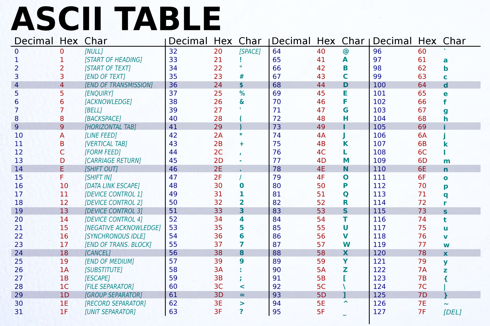
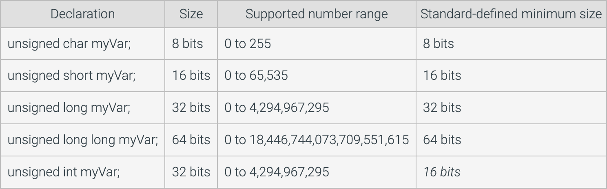
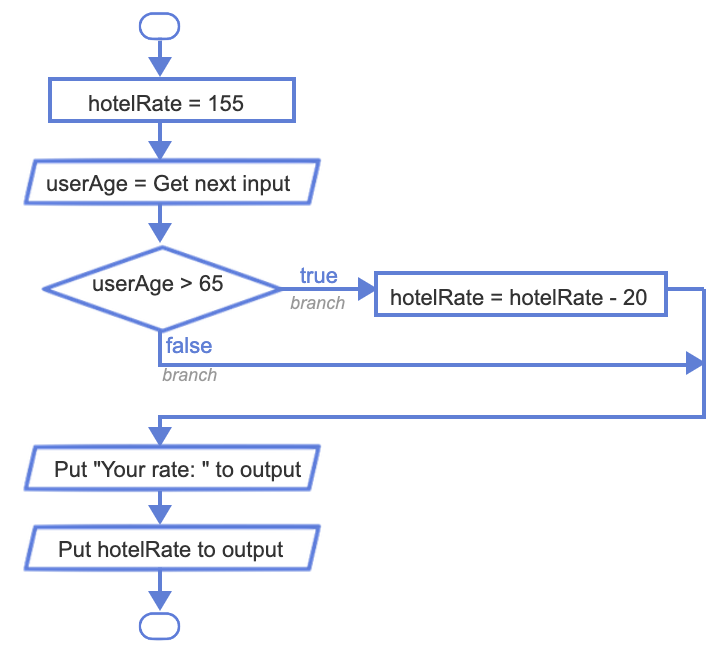
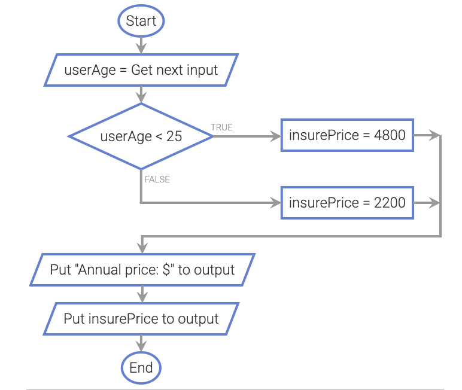
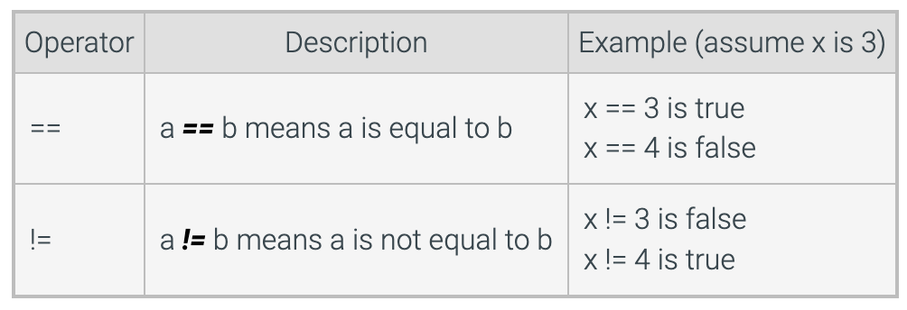

# UOP_COMP051
# 1. Introduction to C++
## 1.1 Programming (General)
A computer program consists of instructions executing one at a time. Basic instruction types are:
- Input: A program gets data, perhaps from a file, keyboard, touchscreen, network, etc.
- Process: A program performs computations on that data, such as adding two values like x + y.
- Output: A program puts that data somewhere, such as to a file, screen, network, etc.

Programs use variables to refer to data, like x, y, and z below. The name is due to a variable's value varying as a program assigns a variable like x with new values.

```Cpp
#include <iostream>
using namespace std;

int main() { // A program begins executing statements in main(). 
  int wage; // 'int wage' declares an integer variable. 'wage = 20' assigns wage with 20.

  wage = 20;

  cout << "Salary is "; // The cout statement outputs 'Salary is ' to the screen at the cursor's present location.
  cout << wage * 40 * 52; // outputs the result of wage * 40 * 52, so 20 * 40 * 52 or 41600.
  cout << endl; // 'endl' moves the output cursor to the next line on the screen.

  return 0; // The 'return 0' statement ends the program.
}
```

## 1.2 Programming Basics
### Basic input
The following statement gets an input value and puts that value into variable x: cin >> x; cin is short for characters in.

```Cpp
#include <iostream>
using namespace std;
 
int main() {
   int wage;
   
   cin >> wage; // gets an input value from the keyboard (or file, etc.) and puts that value into the wage variable.
 
   cout << "Salary is ";
   cout << wage * 40 * 52;
   cout << endl;
 
   return 0;
}
```
### Basic ouput
The cout construct supports output; cout is short for characters out.
Outputting text is achieved via: cout << "desired text";.
Text in double quotes " " is known as a string literal.
Multiple cout statements continue printing on the same output line.
The statement cout << endl; starts a new output line, called a newline.

```Cpp
#include <iostream>
using namespace std;
 
int main() {
   cout << "This is the first paragraph.";
   cout << endl;
   cout << "The cursor has been moved to the next line."
   cout << endl;
   cout << endl;
   cout << "This is the second paragraph.";

   return 0;
}
/*
This is the first paragraph.
The cursor has been moved to the next line.

This is the second paragraph
*/
```

Outputting a variable's value is achieved via: cout << x;. Note that no quotes surround x.
```Cpp
#include <iostream>
using namespace std;

int main() {
   int wage;
   
   wage = 20;

   cout << "Wage is: ";
   cout << wage; 
   cout << endl;
   cout << "Goodbye.";
   cout << endl;

   return 0;
}
/*
Wage is: 20
Goodbye.
*/
```
Programmers commonly use a single output statement for each line of output by combining the outputting of text, variable values, and a new line. The programmer simply separates the items with << symbols. Such combining can improve program readability because the program's code corresponds more closely to the program's output.
```Cpp
#include <iostream>
using namespace std;

int main() {
   int wage;

   wage = 20;

   cout << "Wage is: " << wage << endl; 
   cout << "Goodbye." << endl;

   return 0;
}
```
## 1.3 Comments and Whitespace
### Comments 
A comment is text a programmer adds to code, to be read by humans to better understand the code but ignored by the compiler. Two common kinds of comments exist:
- A single-line comment starts with // and includes all the following text on that line. Single-line comments commonly appear after a statement on the same line.
- A multi-line comment starts with /* and ends with */, where all text between /* and */ is part of the comment. A multi-line comment is also known as a block comment.

```Cpp
#include <iostream>
using namespace std;
/*
 This program calculates the amount of pasta to cook, given the
 number of people eating.
*/
int main ()
{
   int numPeople;         // Number of people that will be eating
   int totalOuncesPasta;  // Total ounces of pasta to serve numPeople
   
   // Get number of people
   cout << "Enter number of people: " << endl;
   cin  >> numPeople;
   
   // Calculate and print total ounces of pasta
   totalOuncesPasta = numPeople * 3;  // Typical ounces per person
   cout << "Cook " << totalOuncesPasta << " ounces of pasta." << endl;
   
   return 0;
}
```
### Whitespace
Whitespace refers to blank spaces (space and tab characters) between items within a statement and blank lines between statements (called newlines). A compiler ignores most whitespace (Not all spaces are ignored by the compiler. Ex: The spaces in a string literal like "Enter age: " will be printed if the string is output).

- Use blank lines to separate conceptually distinct statements.
- Indent lines the same amount.
- Align items to reduce visual clutter.
- Use a single space before and after any operators like =, +, *, or << to make statements more readable.

```Cpp
//good use of whitespace
#include <iostream>
using namespace std;

int main() {
   int myFirstVar;    // Aligned comments yield less
   int yetAnotherVar; // visual clutter 
   int thirdVar; 
  
   // Above blank line separates variable declarations from the rest
   cout << "Enter a number: ";
   cin  >> myFirstVar;
  
   // Above blank line separates user input statements from the rest   
   yetAnotherVar = myFirstVar;        // Aligned = operators
   thirdVar      = yetAnotherVar + 1; 
   // Also notice the single-space on left and right of + and =
   // (except when aligning the second = with the first =)

   cout << "Final value is " << thirdVar << endl; // Single-space on each side of <<
  
   return 0; // The above blank line separates the return from the rest
}
```
The compiler converts a high-level program into an executable program using machine code (0s and 1s).
Comments do not generate machine code.
The compiler recognizes end of statement by semicolon ";".

Not all spaces are ignored by the compiler. Ex: The spaces in a string literal like "Enter age: " will be printed if the string is output.


## 1.4 Errors and Warning
### Syntax error
People make mistakes. Programmers thus make mistakes—lots of them. One kind of mistake, known as a syntax error, is to violate a programming language's rules on how symbols can be combined to create a program. An example is forgetting to end a statement with a semicolon.


Example: 
```Cpp
cout << numCats. // (statement ending with semicolon, not period)
cout << "Cats: " numCats; //(iterms must be seperated by "<<")
cout < numCats; //("<<" is required, not "<")
cout << "Cats: << numCats; //(missing the ending ")
cout << NumCats; //(the declare variable is "numCats")
cout >> numCats; //(must use "<<" instead of ">>" for cout)
```

### Unclear error message
Compiler error messages are often unclear or even misleading. The message is like the compiler's "best guess" of what is really wrong.

The compiler indicates a missing semicolon ';'. But the real error is the missing << symbols.
Sometimes the compiler error message refers to a line that is actually many lines past where the error actually occurred. Not finding an error at the specified line, the programmer should look to previous lines.
For example: When a compiler says that an error exists on line 5, the error may actually exist in an earlier line, but the compiler didn't get confused until reaching line 5.

The actual error could be different, like missing parentheses. If a programmer makes a mistake, the statement and subsequent statements may still be valid code, but eventually the compiler cannot make sense of the code and generates an error message.
Some errors create an upsettingly long list of error messages. Good practice is to focus on fixing just the first error reported by the compiler and then recompiling. The remaining error messages may be real but are more commonly due to the compiler's confusion caused by the first error and are thus irrelevant.

If a compiler generates a specific message like "missing semicolon", the actual error could be different, like missing parentheses. If a programmer makes a mistake, the statement and subsequent statements may still be valid code, but eventually the compiler cannot make sense of the code and generates an error message.

### Fixing the first error
Some errors create an upsettingly long list of error messages. The remaining error messages may be real but are more commonly due to the compiler's confusion caused by the first error and are thus irrelevant.

1. Focus on FIRST error message, ignoring the rest.
2. Look at reported line of first error message. If error found, fix. Else, look at previous few lines.
3. Compile, repeat.


### Logic error
Because a syntax error is detected by the compiler, a syntax error is known as a type of compile-time error.

Successfully compiling means the program doesn't have compile-time errors, but the program may have other kinds of errors. A logic error, also called a bug, is an error that occurs while a program runs. For example, a programmer might mean to type numBeans * numJars but accidentally types numBeans + numJars (+ instead of *). The program would compile but would not run as intended.

```Cpp
#include <iostream>
using namespace std;

int main() {
   int numBeans;
   int numJars;
   int totalBeans;

   numBeans = 500;
   numJars = 3;
   
   cout << numBeans << " beans in ";
   cout << numJars  << " jars yields ";
   totalBeans = numBeans + numJars; // Oops, used + instead of *
   cout << totalBeans << " total" << endl;
   
   return 0;
}
```
### Compiling frequently
Good practice, especially for new programmers, is to compile after writing only a few lines of code, rather than writing tens of lines and then compiling. New programmers commonly write tens of lines before compiling, which may result in an overwhelming number of compilation errors and warnings and logic errors that are hard to detect and correct. This is the reason why we should compile frequently.


### Compiler warning
A compiler will sometimes report a warning, which doesn't stop the compiler from creating an executable program but indicates a possible logic error. Ex: Some compilers will report a warning like "Warning, dividing by 0 is not defined" if encountering code like: totalItems = numItems / 0 (running that program does result in a runtime error).

Default settings commonly do NOT report all important issues. Good practice is to explicitly configure the compiler to report most warnings.

## 1.6 Computer tour
### Processor or CPU
Probably the most important component and most sophisticated in a computer.
A Processor or CPU is commonly found on the Motherboard adjacent to RAM.

Processors have memory reserved at space 0 for the fastest and first in / out access.

### Memory or RAM
This is volatile storage which has a faster read / write speed. But the contents are lost if the computer loses power, or the system process is ended.

Memory size is normally allocated in bits or bytes where a byte is 8 bits.
Common sizes are in MB or GB. In intervals of 8. I.e. 4096MB of RAM or 4GB of RAM are essentially the same.

### Storage Devices or Disks
• In the past, these were spindle drives or rotating drives. Which came in various sizes and spindle speeds.
• Disks store files or information such as program files, user files (like documents and pictures), and Operating System files.
• Today – we use SSD’s or Solid-State Disks and some systems use NVmE devices for even faster storage.
• The main fault of disks is normally the access, aka read / write speed.

### Input / Output devices or I/O devices.
These are the screen, keyboard, mouse. However, computers we use often have additional peripherals such as a USB device, printers, speakers, microphones, etc. These are commonly called peripherals.

### Operating system
An operating system (OS) is a crucial software that runs on a computer or electronic device to manage and control its operations. The OS serves as an interface between the user and the hardware, while managing system resources such as memory, processor, peripherals, and storage.

The operating system provides essential services and functions such as file management, memory management, scheduling and multitasking, networking, user interface, and various other applications. It enables users to perform tasks through a graphical user interface or command line, and allows for the execution of different application programs.

There are several popular operating systems, including Windows, macOS, Linux, and mobile operating systems such as Android and iOS. Each operating system has its own characteristics and supports different applications and hardware, depending on the purpose and end-user requirements.

### Clock
Processors and systems interact with the system clock to schedule and execute operations. These are found in all sorts of devices ranging from simple gadgets to expensive research equipment.


# 2. Variables / Assignment
## 2.1 Variables and assignment (general)
- In a program, a variable is a named item, such as x or numPeople, used to hold a value.
- An assignment assigns a variable with a value, such as x = 5 => x is assigned with 5 and x keeps that value during subsequent assignments, until x is assigned again.
- An assignment's left side must be a variable. The right side can be an expression, so an assignment may be x = 5, y = x, or z = x + 2. The 5, x, and x + 2 are each an expression that evaluates to a value.
- "=" is not equal. "=" is an assignment of a left-side variable with a right-side value. "=" is NOT equality as in mathematics. Thus, x = 5 is read as "x is assigned with 5", and not as "x equals 5". When one sees x = 5, one might think of a value being put into a box.

### Assignments with variable on the left and right
Increasing a variable's value by 1, as in x = x + 1, is common, and known as incrementing the variable.
Because in programming = means assignment, a variable may appear on both the left and right as in x = x + 1.

## 2.2 Variables (int)
### Variables declaration
- A variable declaration is a statement that declares a new variable, specifying the variable's name and type. Ex: int userAge; declares a new variable named userAge that can hold an integer value.
- The compiler allocates a memory location for userAge capable of storing an integer.
- Allocation is the process of determining a suitable memory location to store data like variables.
When a statement that assigns a variable with a value executes, the processor writes the value into the variable's memory location. Likewise, reading a variable's value reads the value from the variable's memory location. The programmer must declare a variable before any statement that assigns or reads the variable, so that the variable's memory location is known.
```Cpp
#include <iostream>
using namespace std;

int main() {
   int userAge;

   cout << "Enter your age: ";
   cin >> userAge;
   cout << userAge << " is a great age." << endl;

   return 0;
}
```
### Assignment Statement
- An assignment statement assigns the variable on the left-side of the = with the current value of the right-side expression.
- An expression may be a number like 80, a variable name like numApples, or a simple calculation like numApples + 1.
- Simple calculations can involve standard math operators like +, -, and *, and parentheses as in 2 * (numApples - 1). An integer like 80 appearing in an expression is known as an integer literal.

```Cpp

#include <iostream>
using namespace std;

int main() {
   int litterSize;
   int yearlyLitters;
   int annualMice;

   litterSize    = 3; // Low end of litter size range
   yearlyLitters = 5; // Low end of litters per year

   cout << "One female mouse may give birth to ";
   annualMice = litterSize * yearlyLitters;
   cout << annualMice << " mice," << endl;
   
   litterSize    = 14; // High end
   yearlyLitters = 10; // High end

   cout << "and up to ";
   annualMice = litterSize * yearlyLitters;
   cout << annualMice << " mice, in a year." << endl;
   
   return 0;
}

/*
One female mouse may give birth to 15 mice,
and up to 140 mice, in a year.
*/
```

### Initializing Variables
Although not required, an integer variable is often assigned an initial value when declared. Ex: int maxScore = 100; declares an int variable named maxScore with an initial value of 100.

### Assignment statement with same variables on both sides
Commonly, a variable appears on both the right and left side of the = operator.
Ex: If numItems is 5, after numItems = numItems + 1; executes, numItems will be 6. The statement reads the value of numItems (5), adds 1, and assigns numItems with the result of 6, which replaces the value previously held in numItems.

```Cpp
#include <iostream>
using namespace std;
            
int main() {
   int yourFriends;
   int totalFriends;
            
   cout << "Enter the number of people you know: ";
   cin >> yourFriends;
   totalFriends = yourFriends;
   cout << " You know " << totalFriends << " people.\n";
   totalFriends = totalFriends * yourFriends;
   cout << " Those people know " << totalFriends << " people.\n";
   totalFriends = totalFriends * yourFriends;
   cout << " And they know " << totalFriends << " people.\n\n";
            
   return 0;
}
/*
Enter the number of people you know: 200
You know 200 people.
Those people know 40000 people.
And they know 8000000 people.
*/
```

### Common error
- A common error is to read a variable that has not yet been assigned a value. If a variable is declared but not initialized, the variable's memory location contains some unknown value, commonly but not always 0.
- A program with an uninitialized variable may thus run correctly on a system that has 0 in the memory location, but then fail on a different system—a very difficult bug to fix.

## 2.3 Identifiers
### Rules of identifiers
A name created by a programmer for an item like a variable or function is called an identifier. An identifier must:
- be a sequence of letters (a-z, A-Z), underscores (_), and digits (0-9)
- start with a letter or underscore

Note that "_", called an underscore, is considered to be a letter.
Identifiers are case sensitive, meaning upper and lower case letters differ. So numCats and NumCats are different.

- A reserved word is a word that is part of the language, like int, short, or double. A reserved word is also known as a keyword. A programmer cannot use a reserved word as an identifier. Many language editors will automatically color a program's reserved words.


### Style guidelines for identifiers
While various (crazy-looking) identifiers may be valid, programmers may follow identifier naming conventions (style) defined by their company, team, teacher, etc. Two common conventions for naming variables are:
- Camel case: Lower camel case abuts multiple words, capitalizing each word except the first, as in numApples or peopleOnBus.
- Underscore separated: Words are lowercase and separated by an underscore, as in num_apples or people_on_bus.

## 2.4 Arithmetic expression
### Basic
- An expression is any individual item or combination of items, like variables, literals, operators, and parentheses, that evaluates to a value, like 2 * (x + 1). A common place where expressions are used is on the right side of an assignment statement, as in y = 2 * (x + 1).
- A literal is a specific value in code like 2.
- An operator is a symbol that performs a built-in calculation, like +, which performs addition.
The addition operator is "+", as in "x + y".
The subtraction operator is "-", as in "x - y".
The multiplication operator is "*", as in "x * y".
The division operator is "/", as in "x / y".

### Evaluation of expressions
An expression evaluates to a value, which replaces the expression. Ex: If x is 5, then x + 1 evaluates to 6, and y = x + 1 assigns y with 6.
An expression is evaluated using the order of standard mathematics, such order known in programming as precedence rules.


## 2.5 Arithmetic expression
Below is a simple program that includes an expression involving integers.
```Cpp
#include <iostream>
using namespace std;

/* Computes the total cost of leasing a car given the down payment,
   monthly rate, and number of months
*/

int main() {
   int downPayment;
   int paymentPerMonth;
   int numMonths;
   int totalCost;  // Computed total cost to be output

   cout << "Enter down payment: ";
   cin  >> downPayment;

   cout << "Enter monthly payment: ";
   cin  >> paymentPerMonth;

   cout << "Enter number of months: ";
   cin  >> numMonths;

   totalCost = downPayment + (paymentPerMonth * numMonths);

   cout << "Total cost: " << totalCost << endl;

   return 0;
}
/*
Enter down payment: 500
Enter monthly payment: 300
Enter number of months: 60
Total cost: 18500
*/
```
### Single space around operator
- A single space around operators for readability, as in "numItems + 2", rather than "numItems+2". An exception is minus used as negative, as in: xCoord = -yCoord. Minus (-) used as negative is known as unary minus.

### Compound operator
Special operators called compound operators provide a shorthand way to update a variable, such as userAge += 1 being shorthand for userAge = userAge + 1. Other compound operators include -=, *=, /=, and %=.

### No commas allowed
Commas are not allowed in an integer literal. So 1,333,555 is written as 1333555.

## 2.6 Example

## 2.7 Floating-point numbers (double)
### Floating-point (double) variables
- A floating-point number is a real number containing a decimal point that can appear anywhere (or "float") in the number.
- A floating-point literal is a number with a fractional part, even if the fraction is 0, as in 1.0, 0.0, or 99.573. Good practice is to always have a digit before the decimal point, as in 0.5, since .5 might mistakenly be viewed as 5.

```Cpp
#include <iostream>
using namespace std;

int main() {
   double milesTravel; // User input of miles to travel
   double hoursFly;    // Travel hours if flying those miles
   double hoursDrive;  // Travel hours if driving those miles
   
   cout << "Enter miles to travel: ";
   cin  >> milesTravel;
   
   hoursFly   = milesTravel / 500.0; // Plane flies 500 mph
   hoursDrive = milesTravel / 60.0;  // Car drives 60 mph
   
   cout << milesTravel << " miles would take:" << endl;
   cout << "   " << hoursFly << " hours to fly" << endl;
   cout << "   " << hoursDrive << " hours to drive" << endl;
   
   return 0;
}
/*
Enter miles to travel: 1800
1800 miles would take:
   3.6 hours to fly
   30 hours to drive
*/
/*
Enter miles to travel: 400.5
400.5 miles would take:
   0.801 hours to fly,
   6.675 hours to drive.
*/
```
Scientific notation
Very large and very small floating-point values may be printed using scientific notation. Ex: If a floating variable holds the value 299792458.0 (the speed of light in m/s), the value will be printed as 2.99792e+08.

### Choosing a variable type (double vs int)
A programmer should choose a variable's type based on the type of value held.
- Integer variables are typically used for values that are counted, like 42 cars, 10 pizzas, or -95 days.
- Floating-point variables are typically used for measurements, like 98.6 degrees, 0.00001 meters, or -55.667 degrees.
- Floating-point variables are also used when dealing with fractions of countable items, such as the average number of cars per household.

### Floating point division by 0
- Dividing a nonzero floating-point number by zero is undefined in regular arithmetic. Many programming languages produce an error when performing floating-point division by 0, but C++ does not. C++ handles this operation by producing infinity or -infinity, depending on the signs of the operands. Printing a floating-point variable that holds infinity or -infinity outputs inf or -inf.
- If the dividend and divisor in floating-point division are both 0, the division results in a "not a number". Not a number (NaN) indicates an unrepresentable or undefined value. Printing a floating-point variable that is not a number outputs nan.

```Cpp
#include <iostream>
using namespace std;

int main() {
   double gasVolume;
   double oilVolume;
   double mixRatio;
   
   cout << "Enter gas volume: ";
   cin  >> gasVolume;

   cout << "Enter oil volume: ";
   cin  >> oilVolume;

   mixRatio = gasVolume / oilVolume;
   
   cout << "Gas to oil mix ratio is " << mixRatio << ":1" << endl;
   
   return 0;
}
/*
Enter gas volume: 10.5
Enter oil volume: 0.0
Gas to oil mix ratio is inf:1
*/
```
### Manipulating floating-point output
- Some floating-point numbers have many digits after the decimal point. Ex: Irrational numbers (Ex: 3.14159265359...) and repeating decimals (Ex: 4.33333333...) have an infinite number of digits after the decimal.
- By default, most programming languages output at least 5 digits after the decimal point. But for many simple programs, this level of detail is not necessary.
- Representing currency with two digits after the decimal). The syntax for outputting the double myFloat with two digits after the decimal point is " cout << fixed << setprecision(2) << myFloat; "

```C
/* Note: setprecision() is found in the iomanip library. fixed and setprecision() are manipulators that need only be written once if the desired number of digits after the decimal point is the same for multiple floating-point numbers. */
cout << fixed << setprecision(3) << 3.1244 << endl;
cout << 2.1 << endl;
/*
3.124
2.100
*/

cout << "Default output of pi: " << M_PI << endl;
/*
The mathematical constant pi (π) is irrational, a floating-point number whose digits after the decimal point are infinite and non-repeating. The cmath library defines the constant M_PI with the value of pi.
Though C++ does not attempt to output the full value of pi, by default, 5 digits after the decimal are output.
*/
cout << "pi reduced to 4 digits after the decimal: ";
cout << fixed << setprecision(4) << M_PI << endl;
/*
cout << fixed << setprecision(4) outputs pi to only four digits after the decimal. The last digit is rounded up in the output, but the value of pi remains the same.
*/

/*
Default output of pi: 3.14159
pi reduced to 4 digits after the decimal: 3.1416
*/

```

## 2.8 Scientific notation for floating-point literals
- Scientific notation is useful for representing floating-point numbers that are much greater than or much less than 0, such as 6.02 x 1023. A floating-point literal using scientific notation is written using an e preceding the power-of-10 exponent, as in 6.02e23 to represent 6.02 x 10^23. 0.001 is 1 x 10^-3 and can be written as 1.0e-3.

```Cpp
#include <iostream>
using namespace std;

int main() {
   double avogadrosNumber = 6.02e23; // Approximation of atoms per mole  
   double gramsPerMoleGold = 196.9665;
   double gramsGold;
   double atomsGold;
   
   cout << "Enter grams of gold: ";
   cin  >> gramsGold;
   
   atomsGold = gramsGold / gramsPerMoleGold * avogadrosNumber;
   
   cout << gramsGold << " grams of gold contains ";
   cout << atomsGold << " atoms" << endl;
   
   return 0;
}
/*
Enter grams of gold: 4.5
4.5 grams of gold contains 1.37536e+22 atoms
*/
```
## 2.9 Constant variable
One reason is to improve code readability. newPrice = origPrice - 5 is less clear than newPrice = origPrice - priceDiscount. When a variable represents a literal, the variable's value should not be changed in the code. If the programmer precedes the variable declaration with the keyword const, then the compiler will report an error if a later statement tries to change that variable's value. An initialized variable whose value cannot change is called a constant variable.

```Cpp
#include <iostream>
using namespace std;

/*
 * Estimates distance of lightning based on seconds
 * between lightning and thunder
 */

int main() {
   const double SPEED_OF_SOUND   = 761.207; // Miles/hour (sea level)
   const double SECONDS_PER_HOUR = 3600.0;  // Secs/hour
   double secondsBetween;
   double timeInHours;
   double distInMiles;
   
   cout << "Enter seconds between lightning and thunder: ";
   cin  >> secondsBetween;
   
   timeInHours = secondsBetween / SECONDS_PER_HOUR;
   distInMiles = SPEED_OF_SOUND * timeInHours;
   
   cout << "Lightning strike was approximately" << endl;
   cout << distInMiles << " miles away." << endl;
   
   return 0;
}
/*
Enter seconds between lightning and thunder: 7
Lightning strike was approximately
1.48012 miles away.
*/
```
## 2.10 Using math function
- Some programs require math operations beyond +, -, *, /, like computing a square root. A standard math library has about 20 math operations, known as functions.
- A function is a list of statements executed by invoking the function's name, such invoking is known as a function call. Any function input values, or arguments, appear within ( ), separated by commas if more than one.

```Cpp
#include <iostream>
#include <cmath>
using namespace std;

int main() {
   double initMass;   // Initial mass of a substance
   double growthRate; // Annual growth rate
   double yearsGrow;  // Years of growth
   double finalMass;  // Final mass after those years

   cout << "Enter initial mass: ";
   cin  >> initMass;

   cout << "Enter growth rate (Ex: 0.05 is 5%/year): ";
   cin  >> growthRate;

   cout << "Enter years of growth: ";
   cin  >> yearsGrow;

   finalMass = initMass * pow(1.0 + growthRate, yearsGrow);
   // Ex: Rate of 0.05 yields initMass * 1.05^yearsGrow

   cout << "Final mass after " << yearsGrow
        << " years is: " << finalMass << endl;

   return 0;
}
/*
Enter initial mass: 10000
Enter growth rate (Ex: 0.05 is 5%/year): 0.06
Enter years of growth: 20
Final mass after 20 years is: 32071.4
*/
```
See this https://cplusplus.com/reference/cmath/ link for a comprehensive list of built-in math functions.

#### cmath and cstdlib 
- The "c" in cmath indicates that the library comes from a C language library.
- Some math functions for integers are in a library named cstdlib, requiring: #include <cstdlib>. Ex: abs() computes the absolute value of an integer.

## 2.11 Integer division and modulo
### Division: Integer rounding
When the operands of / are integers, the operator performs integer division, which does not generate any fraction.
Eg: y = 10 / 4 = 2; y = 4 / 9 = 0; a = (1/2) * b * h = 0 (always)...

### Division: Division by 0
For integer division, the second operand of / or % must never be 0, because division by 0 is mathematically undefined. A divide-by-zero error occurs at runtime if a divisor is 0, causing a program to terminate. A divide-by-zero error is an example of a runtime error, a severe error that occurs at runtime and causes a program to terminate early.
```Cpp
#include <iostream>
using namespace std;

int main() {
   int salaryPerYear; // User input: Yearly salary
   int daysPerYear;   // User input: Days worked per year
   int salaryPerDay;  // Output:     Salary per day

   cout << "Enter yearly salary: ";
   cin  >> salaryPerYear;
   
   cout << "Enter days worked per year: ";
   cin  >> daysPerYear;

   // If daysPerYear is 0, then divide-by-zero causes program termination.
   salaryPerDay = salaryPerYear / daysPerYear;

   cout << "Salary per day is: " << salaryPerDay << endl;

   return 0;
}
/*
Enter yearly salary: 60000
Enter days worked per year: 0
Floating point exception
*/
```
### Modulo
The basic arithmetic operators include not just +, -, *, /, but also %. The modulo operator (%) evaluates the remainder of the division of two integer operands. Ex: 23 % 10 is 3.
Examples:
24 % 10 is 4. Reason: 24 / 10 is 2 with remainder 4.
50 % 50 is 0. Reason: 50 / 50 is 1 with remainder 0.
1 % 2 is 1. Reason: 1 / 2 is 0 with remainder 1.
10 % 4.0 is not valid. "Remainder" only makes sense for integer operands.

```Cpp
#include <iostream>
using namespace std;

int main() {
   int userMinutes;   // User input: Minutes
   int outHours;      // Output hours
   int outMinutes;    // Output minutes (remaining)

   cout << "Enter minutes: ";
   cin  >> userMinutes;

   outHours   = userMinutes / 60;
   outMinutes = userMinutes % 60; // 1 hour = 60 minutes, so when do this, you will get the remainder minutes

   cout << userMinutes << " minutes is ";
   cout << outHours    << " hours and ";
   cout << outMinutes  << " minutes." << endl;

   return 0;
}
/*
Enter minutes: 139
139 minutes is 2 hours and 19 minutes.
*/
```

### Modulo examples
#### Random number in a range
Given a random number randNum, % can generate a random number within a range:
randNum % 10
Yields 0 - 9: Possible remainders are 0, 1, ..., 8, 9. Remainder 10 is not possible: Ex: 19 % 10 is 9, but 20 % 10 is 0.

randNum % 51
Yields 0 - 50: Note that % 50 would yield 0 - 49.

(randNum % 9) + 1
Yields 1 - 9: The % 9 yields 9 possible values 0 - 8, so the + 1 yields 1 - 9.

(randNum % 11) + 20
Yields 20 - 30: The % 11 yields 11 possible values 0 - 10, so the + 20 yields 20 - 30.

#### Getting digits
```Cpp
#include <iostream>
using namespace std;

int main() {
   int userValue;
   int onesDigit;
   int tensDigit;
   int hundredsDigit;
   int tmpValue;
   
   cin >> userValue; // get the value from user
   
   onesDigit = userValue % 10;
   tmpValue = userValue / 10;
   tensDigit = tmpValue % 10;
   tmpValue = tmpValue / 10;
   hundredsDigit = tmpValue % 10;
   
   cout << "Row digit is: " << onesDigit << endl;
   cout << "Ten digit is: " << tensDigit << endl;
   cout << "Hundred digit is: " << hundredsDigit << endl;
   
   return 0;
}
/*
10987
Row digit is: 7
Ten digit is: 8
Hundred digit is: 9
*/
```

### Getting prefix of a phone number
Given a 10-digit phone number stored as an integer, % and / can be used to get any part, such as the prefix. For phoneNum = 1365551212 (whose prefix is 555):

tmpVal = phoneNum / 10000; // / 10000 shifts right by 4, so 136555. 
prefixNum = tmpVal % 1000; // % 1000 gets the right 3 digits, so 555.
Dividing by a power of 10 shifts a value right. 321 / 10 is 32. 321 / 100 is 3.

% by a power of 10 gets the rightmost digits. 321 % 10 is 1. 321 % 100 is 21.

## 2.12 Type convertion
A type conversion is a conversion of one data type to another, such as an int to a double. The compiler automatically performs several common conversions between int and double types, such automatic conversions are known as implicit conversion.

int-to-double conversion is straightforward: 25 becomes 25.0.
double-to-int conversion just drops the fraction: 4.9 becomes 4.

### Type casting
- Ex: If a program needs a floating-point result from dividing two integers, then at least one of the integers needs to be converted to double so floating-point division is performed. Otherwise, integer division is performed, evaluating to only the quotient and ignoring the remainder. A type cast explicitly converts a value of one type to another type.
- The static_cast operator (static_cast<type>(expression)) converts the expression's value to the indicated type. Ex: If myIntVar is 7, then static_cast<double>(myIntVar) converts int 7 to double 7.0.
``` Cpp
#include <iostream>
using namespace std;

int main() {
   int kidsInFamily1;       // Should be int, not double
   int kidsInFamily2;       // (know anyone with 2.3 kids?)
   int numFamilies; 
   
   double avgKidsPerFamily; // Expect fraction, so double

   kidsInFamily1 = 3;
   kidsInFamily2 = 4;
   numFamilies = 2; 
   
   avgKidsPerFamily = static_cast<double>(kidsInFamily1 + kidsInFamily2)
                      / static_cast<double>(numFamilies);
   
   cout << "Average kids per family: " << avgKidsPerFamily << endl;
   
   return 0;
}
/*
Average kids per family: 3.5
*/
```
eg:
static_cast<double>(10) / static_cast<double>(4) = 2.5
static_cast<double>(15/4) = 3 // This common error first does integer division of 15 / 4 which is 3, then converts to 3.0.

## 2.13 Binary
- Normally, a programmer can think in terms of base ten numbers. However, a compiler must allocate some finite quantity of bits (e.g., 32 bits) for a variable, and that quantity of bits limits the range of numbers that the variable can represent. Thus, some background on how the quantity of bits influences a variable's number range is helpful.
- Because each memory location is composed of bits (0s and 1s), a processor stores a number using base 2, known as a binary number.
- For a number in the more familiar base 10, known as a decimal number, each digit must be 0-9 and each digit's place is weighed by increasing powers of 10.
Eg: Decimal numbers use weighed powers of 10:
212 = 2 * 10^2 + 1 * 10^1 + 2 * 10^0
Eg: In base 2, each digit must be 0-1 and each digit's place is weighed by increasing powers of 2.
1101 = 1 * 2^3 + 1 * 2^2 + 0 * 2^1 + 1 * 2^0 = 8 + 4 + 0 + 1 = 13

The compiler translates decimal numbers into binary numbers before storing the number into a memory location. The compiler would convert the decimal number 212 to the binary number 11010100, meaning 1*128 + 1*64 + 0*32 + 1*16 + 0*8 + 1*4 + 0*2 + 0*1 = 212, and then store that binary number in memory.

## 2.14 Characters
### Basics
A variable of char type, as in char myChar;, can store a single character like the letter m. A character literal is surrounded with single quotes, as in myChar = 'm';.
``` Cpp
#include <iostream>
using namespace std;

int main() {
   char arrowBody;
   char arrowHead;

   arrowBody = '-';
   arrowHead = '>';

   cout << arrowBody << arrowBody << arrowBody << arrowHead << endl;

   arrowBody = 'o';

   cout << arrowBody << arrowBody << arrowBody << arrowHead << endl;

   return 0;
}
/*
--->
ooo>
*/
```
### Getting a characters from input
``` Cpp
#include <iostream>
using namespace std;

int main() {
   char bodyChar;
   char headChar;

   cout << "Type two characters: ";
   cin  >> bodyChar;
   cin  >> headChar;

   // Output arrow body then head
   cout << bodyChar << bodyChar << bodyChar;
   cout << headChar << endl;

   return 0;
}
/*
Type two characters: ->
--->
...
Type two characters:    *     /
***/
*/
```

### A character is internally stored as a number
Under the hood, a char variable stores a number. Ex: 'a' is stored as 97. In an output statement, the compiler outputs the number's corresponding character.
ASCII is an early standard for encoding characters as numbers. The following table shows the ASCII encoding as a decimal number (Dec) for common printable characters (for readers who have studied binary numbers, the table shows the binary encoding also). Other characters such as control characters (e.g., a "line feed" character) or extended characters (e.g., the letter "n" with a tilde above it as used in Spanish) are not shown.



### Escape sequences
In addition to regular characters like Z, $, or 5, character encoding includes numbers for several special characters. Ex: A newline character is encoded as 10. Because no visible character exists for a newline, the language uses an escape sequence: A two-character sequence starting with \ that represents a special character.
Common escape sequences:
\n : newline
\t : tab
\' : single quote
\" : double quote
\\ : backplash

eg:
Goal output: Say "Hello"
cout << "Say \"Hello"";    // Each \" represents a single " character. The \ is needed so the compiler doesn't treat the " before the H as the end of the string "Say ".

Goal output: OK    bye
(Assume a tab exists between OK and bye).
cout << "OK\tbye";    // Upon seeing the \, the compiler looks at the next character. Seeing the t, the compiler inserts a single tab character.

### Common errors
- A common error is to use double quotes rather than single quotes around a character literal, as in myChar = "x", yielding a compiler error.
- Similarly, a common error is to forget the quotes around a character literal, as in myChar = x, usually yielding a compiler error (unless x is also a declared variable, then perhaps yielding a logic error).

## 2.15 String
### String and string literals
A string is a sequence of characters. A string literal surrounds a character sequence with double quotes, as in "Hello", "52 Main St.", or "42", vs. an integer literal like 42 or character literal like 'a'. Various characters may be in a string, such as letters, numbers, spaces, or symbols like $ or %, as in "$100 for Julia!!". Earlier sections showed string literals being output, as in: cout << "Hello";.

### String variables and assignments
- Some variables should hold a string. A string data type isn't built into C++ like char, int, or double, but is available in the standard library and can be used after adding: #include <string>. A programmer can then declare a string variable as: string firstName;.
- A programmer can assign a string just as for other types. Ex: str1 = "Hello", or str1 = str2. The string type automatically reallocates memory for str1 if the right-side string is larger or smaller, and then copies the characters into str1.
- A programmer can initialize a string variable during declaration: string firstMonth = "January";. Otherwise, a string variable is automatically initialized to an empty string "".
``` Cpp
#include <iostream>
#include <string>
using namespace std;
 
int main() {
   string sentenceSubject;
   string sentenceVerb;
   string sentenceObject = "an apple";

   sentenceSubject = "boy";
   sentenceVerb = "ate";

   cout << "A ";
   cout << sentenceSubject << " ";
   cout << sentenceVerb << " ";
   cout << sentenceObject << "." << endl;
 
   return 0;
}
/*
A boy ate an apple.
*/
```

### Getting a string without whitespaces from input
A whitespace character is a character used to represent horizontal and vertical spaces in text, and includes spaces, tabs, and newline characters. Ex: "Oh my goodness!" has two whitespace characters, one between h and m, the other between y and g.

Below shows the basic approach to get a string from input into variable userString. The approach automatically skips initial whitespace, then gets characters until the next whitespace is seen.

Eg:
```Cpp
cin >> userString;
cout << userString;

// Hi there -> Hi
// abc -> abc
```

### Getting a string with whitespace from input
Sometimes a programmer wishes to get whitespace characters into a string, such as getting a user's input of the name "Franklin D. Roosevelt" into a string variable presidentName.

For such cases, the language supports getting an entire line into a string. The function getline(cin, stringVar) gets all remaining text on the current input line, up to the next newline character (which is removed from input but not put in stringVar).

Eg:
```Cpp
getline (cin, userString1);
getline (cin, userString2);

cout << "String 1: " << userString1;
cout << "String 2: " << userString2;

/*
Hello there!
Welcome.
->
String 1: Hello there!
String 2: Welcome.

(this is a blank)
abc
def
->
String 1:
String 2: abc
*/
```
### Mixing cin and getline
Mixing cin >> and getline() can be tricky, because cin >> leaves the newline in the input, while getline() does not skip leading whitespace.

## 2.16 Integer overflow
An integer variable cannot store a number larger than the maximum supported by the variable's data type. An overflow occurs when the value being assigned to a variable is greater than the maximum value the variable can store.

A common error is to try to store a value greater than about 2 billion into an int variable. For example, the decimal number 4,294,967,297 requires 33 bits in binary, namely 100000000000000000000000000000001 (we chose the decimal number for easy binary viewing). Trying to assign that number into an int results in overflow. The 33rd bit is lost and only the lower 32 bits are stored, namely 00000000000000000000000000000001, which is decimal number 1.

Declaring the variable of type long long, (described in another section) which uses at least 64 bits, would solve the above problem. But even that variable could overflow if assigned a large enough value.

Most compilers detect when a statement assigns to a variable a literal constant so large as to cause overflow. The compiler may not report a syntax error (the syntax is correct), but may output a compiler warning message that indicates a potential problem. A GNU compiler outputs the message "warning: overflow in implicit constant conversion", and a Microsoft compiler outputs "warning: '=': truncation of constant value". Generally, good practice is for a programmer to not ignore compiler warnings.

A common source of overflow involves intermediate calculations. Given int variables num1, num2, num3 each with values near 1 billion, (num1 + num2 + num3) / 3 will encounter overflow in the numerator, which will reach about 3 billion (max int is around 2 billion), even though the final result after dividing by 3 would have been only 1 billion. Dividing earlier can sometimes solve the problem, as in (num1 / 3) + (num2 / 3) + (num3 / 3), but programmers should pay careful attention to possible implicit type conversions.

## 2.17 Numeric data types
int and double are the most common numeric data types. However, several other numeric types exist. The following table summarizes available integer numeric data types.

The size of integer numeric data types can vary between compilers, for reasons beyond our scope. The following table lists the sizes for numeric integer data types used in this material along with the minimum size for those data types defined by the language standard.


- int is the most commonly used integer type.
- long long is used for integers expected to exceed about 2 billion. That is not a typo; the word appears twice.
- short is rarely used. One situation is to save memory when storing many (e.g., tens of thousands) of smaller numbers, which might occur for arrays (another section). Another situation is in embedded computing systems having a tiny processor with little memory, as in a hearing aid or TV remote control. Similarly, char, while technically a number, is rarely used to directly store a number, except as noted for short.

## 2.18 Unsigned 
Sometimes a programmer knows that a variable's numbers will always be positive (0 or greater), such as when the variable stores a person's age or weight. The programmer can prepend the word "unsigned" to inform the compiler that the integers will always be positive.



```Cpp
#include <iostream>
using namespace std;

int main() {
   unsigned long memSizeGiB;
   unsigned long long memSizeBytes;
   unsigned long long memSizeBits;
   
   cout << "Enter memory size in GiBs: ";
   cin >> memSizeGiB;
   
   // 1 GiB = 1024 MiB, 1 MiB = 1024 KiB, 1 KiB = 1024 bytes
   memSizeBytes = memSizeGiB * (1024 * 1024 * 1024);
   // 1 byte = 8 bits
   memSizeBits = memSizeBytes * 8;
   
   cout << "Memory size in bytes: " << memSizeBytes << endl;
   cout << "Memory size in bits: " << memSizeBits << endl;
   
  return 0;
}

/*
Enter memory size in GiBs: 1
Memory size in bytes: 1073741824
Memory size in bits: 8589934592

...

Enter memory size in GiBs: 4
Memory size in bytes: 4294967296
Memory size in bits: 34359738368
*/
```

## 2.19 Random numbers
### Generating a random number
The rand() function, in the C standard library, returns a random integer each time the function is called, in the range 0 to RAND_MAX.

``` Cpp
#include <iostream>
#include <cstdlib>
using namespace std;

int main() {
   cout << rand() << endl;
   cout << rand() << endl;
   cout << rand() << endl;

   cout << "(RAND_MAX: " << RAND_MAX << ")" << endl;

   return 0;
}
/*
16807
282475249
1622650073
(RAND_MAX: 2147483647)
/*
```
Line 2 includes the C standard library, which defines the rand() function and RAND_MAX.

RAND_MAX is a machine-dependent value, but is at least 32,767. Above, RAND_MAX is about 2 billion.

Usually, a programmer wants a random integer restricted to a specific number of possible values. The modulo operator % can be used. Ex: integer % 10 has 10 possible remainders: 0, 1, 2, ..., 8, 9.

rand() % N yields N possible values, from 0 to N-1

### Specific ranges
A programmer wants random integers in the range 10 to 15. The number of possible values is 15 − 10 + 1. (People often forget the + 1.)
rand() % 6 generates 6 possible values as desired, but with range 0 to 5.
Adding 10 still generates 6 values, but now those values start at 10. The range thus becomes 10 to 15.

The following program randomly moves a student from one seat to another seat in a lecture hall, perhaps to randomly move students before an exam. The seats are in 20 rows numbered 1 to 20. Each row has 30 seats (columns) numbered 1 to 30. The student should be moved from the left side (columns 1 to 15) to the right side (columns 16 to 30).
``` Cpp
#include <iostream>
#include <cstdlib>
using namespace std;

// Switch a student
// from a random seat on the left  (cols  1 to 15)
//   to a random seat on the right (cols 16 to 30)
// Seat rows are 1 to 20

int main() {
   int rowNumL;
   int colNumL;
   int rowNumR;
   int colNumR;

   rowNumL = (rand() % 20) + 1;  // 1 to 20
   colNumL = (rand() % 15) + 1;  // 1 to 15

   rowNumR = (rand() % 20) + 1;  // 1 to 20
   colNumR = (rand() % 15) + 16; // 16 to 30

   cout << "Move from ";
   cout << "row " << rowNumL << " col " << colNumL;
   cout << " to " ;
   cout << "row " << rowNumR << " col " << colNumR;
   cout << endl;

   return 0;
}
/*
Move from row 8 col 5 to row 14 col 24
/*
```
### Pseudo-random
The integers generated by rand() are known as pseudo-random. "Pseudo" means "not actually, but having the appearance of". The integers are pseudo-random because each time a program runs, calls to rand() yield the same sequence of values. Earlier in this section, a program called rand() three times and output 16807, 282475249, 1622650073. Every time the program is run, those same three integers will be printed. Such reproducibility is important for testing some programs. (Players of classic arcade games like Pac-man may notice that the seemingly-random actions of objects actually follow the same pattern every time the game is played, allowing players to master the game by repeating the same winning actions).

Internally, the rand() function has an equation to compute the next "random" integer from the previous one, (invisibly) keeping track of the previous one. For the first call to rand(), no previous random integer exists, so the function uses a built-in integer known as the seed. By default, the seed is 1. A programmer can change the seed using the function srand(), as in srand(2) or srand(99).

If the seed is different for each program run, the program will get a unique sequence. One way to get a different seed for each program run is to use the current time as the seed. The function time() returns the number of seconds since Jan 1, 1970.

Note that the seeding should only be done once in a program, before the first call to rand().

### 2.20 Debugging
Debugging is the process of determining and fixing the cause of a problem in a computer program. Troubleshooting is another word for debugging. Far from being an occasional nuisance, debugging is a core programmer task, like diagnosing is a core medical doctor task. Skill in carrying out a methodical debugging process can improve a programmer's productivity.

Consider a program that, given a circle's circumference, computes the circle's area. Below, the output area is clearly too large. In particular, if circumference is 10, then radius is 10 / (2 * PI_VAL), so about 1.6. The area is then PI_VAL * 1.6 * 1.6, or about 8, but the program outputs about 775.

``` Cpp
#include <iostream>
using namespace std;

int main() {
   const double PI_VAL = 3.14159265;

   double circleRadius;
   double circleCircumference;
   double circleArea;
   
   cout << "Enter circumference: ";
   cin  >> circleCircumference;
   
   circleRadius = circleCircumference / 2 * PI_VAL;
   circleArea = PI_VAL * circleRadius * circleRadius;
   
   cout << "Circle area is: " << circleArea << endl;
   
   return 0;
}

/*
Enter circumference: 10
Circle area is: 775.157
/*

```
First, a programmer may predict that the problem is a bad output statement. This prediction can be tested by adding the statement circleArea = 999;. The output statement is OK, and the predicted problem is invalidated. Note that a temporary statement commonly has a "FIXME" comment to remind the programmer to delete this statement.

``` Cpp
#include <iostream>
using namespace std;

int main() {
   const double PI_VAL = 3.14159265;

   double circleRadius;
   double circleCircumference;
   double circleArea;
   
   cout << "Enter circumference: ";
   cin  >> circleCircumference;
   
   circleRadius = circleCircumference / 2 * PI_VAL;
   circleArea = PI_VAL * circleRadius * circleRadius;
   
   circleArea = 999; // FIXME delete
   cout << "Circle area is: " << circleArea << endl;
   
   return 0;
}
/*
Enter circumference: 0
Circle area is: 999
/*
```
Next, the programmer predicts the problem is a bad area computation. This prediction is tested by assigning the value 0.5 to radius and checking to see if the output is 0.7855 (which was computed by hand). The area computation is OK, and the predicted problem is invalidated. Note that a temporary statement is commonly left-aligned to make clear it is temporary.
``` Cpp
#include <iostream>
using namespace std;

int main() {
   const double PI_VAL = 3.14159265;

   double circleRadius;
   double circleCircumference;
   double circleArea;
   
   cout << "Enter circumference: ";
   cin  >> circleCircumference;
   
   circleRadius = circleCircumference / 2 * PI_VAL;
   
   circleRadius = 0.5; // FIXME delete
   circleArea = PI_VAL * circleRadius * circleRadius;
   
   cout << "Circle area is: " << circleArea << endl;
   
   return 0;
}
/*
Enter circumference: 0
Circle area is: 0.785398
/*
```
The programmer then predicts the problem is a bad radius computation. This prediction is tested by assigning PI_VAL to the circumference, and checking to see if the radius is 0.5. The radius computation fails, and the prediction is likely validated. Note that unused code was temporarily commented out.
``` Cpp
#include <iostream>
using namespace std;

int main() {
   const double PI_VAL = 3.14159265;

   double circleRadius;
   double circleCircumference;
   double circleArea;
   
   cout << "Enter circumference: ";
   cin  >> circleCircumference;
   
   circleCircumference = PI_VAL;               // FIXME delete
   circleRadius = circleCircumference / 2 * PI_VAL;
   cout << "Radius: " << circleRadius << endl; // FIXME delete

   /*
    circleArea = PI_VAL * circleRadius * circleRadius;
    
    cout << "Circle area is: " << circleArea << endl;
    */
   
   return 0;
}
/*
Enter circumference: 0
Radius: 4.9348
*/
```
The last test seems to validate that the problem is a bad radius computation. The programmer visually examines the expression for a circle's radius given the circumference, which looks fine at first glance. However, the programmer notices that radius = circumference / 2 * PI_VAL; should have been radius = circumference / (2 * PI_VAL);. The parentheses around the product in the denominator are necessary and represent the desired order of operations. Changing to radius = circumference / (2 * PI_VAL); solves the problem.


# 3. Branches
## 3.1 If-else branches
### Branch Basic (If)
In a program, a branch is a sequence of statements only executed under a certain condition. Ex: A hotel may discount a price only for people over age 65. An if branch is a branch taken only IF an expression is true.

1. A decision leads to two program branches. If the expression is true, the first branch executes. Else, the second branch executes.
2. If userAge is 68, then 68 > 65 is true. So the first branch executes, which discounts hotelRate.
3. Execution rejoins the other branch, and continues with subsequent statements, outputting 135. If userAge were instead 50, the output would be 155.

### If-else branches
An if-else branch has two branches: The first branch is executed IF an expression is true, ELSE the other branch is executed.

In the example below, if a user inputs an age less than 25, the statement insurePrice = 4800 executes. Else, insurePrice = 2200 executes.


### If-elseif-else branches
An if-else can be extended to an if-elseif-else structure. Each branch's expression is checked in sequence; as soon as one branch's expression is found to be true, that branch is taken. If no expression is found true, execution will reach the else branch, which then executes.
The else part is optional. If omitted, then if none of the previous expressions are true, no branch executes.

1. This program detects the specific value of a variable. If numYears is 1, the first branch executes and "Newlyweds" is output.
2. Else, if numYears is 25, the second branch executes and "Silver" is output. Else, if numYears is 50, the third branch executes and "Golden" is output.
3. Else, the last branch executes.

## 3.2 Detecting equal values with branches
### Detecting if two items are equal using an if statement
```Cpp
#include <iostream>
using namespace std;

int main() {
   int hotelRate;
   int numYears;

   hotelRate = 150;

   cout << "Enter number of years married: ";
   cin >> numYears;

   if (numYears == 50) {
      cout << "Congratulations on 50 years "
            << "of marriage!" << endl;

      hotelRate = hotelRate / 2;
   }

   cout << "Your hotel rate: ";
   cout << hotelRate << endl;

   return 0;
}
```
1. An if statement executes a group of statements if an expression is true. The program assigns hotelRate with 150 and then gets the number of years the user has been married from input.
2. numYears is 50. So the expression numYears == 50 evaluates to true, and the if's statement will execute. Thus, the statement following the opening brace { will execute next.
3. hotelRate is divided in half, which is the discount for guests celebrating their 50th wedding anniversary.
4. The closing brace } indicates the end of the group of statements.
5. The program completes by printing the hotel rate.

### Equality and inequality operators


### If else statement
```Cpp
#include <iostream>
using namespace std;

int main() {
   int userNum;
   int divRemainder;

   cout << "Enter a number: ";
   cin  >> userNum;

   divRemainder = userNum % 2;

   if (divRemainder == 0) {
       cout << userNum << " is even." << endl;
   }
   else {
       cout << userNum << " is odd." << endl;
   }

   return 0;
}
```


