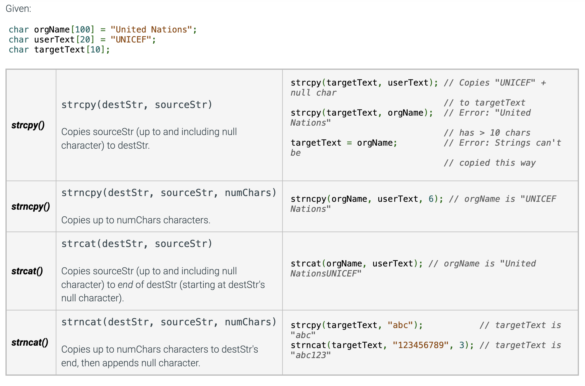
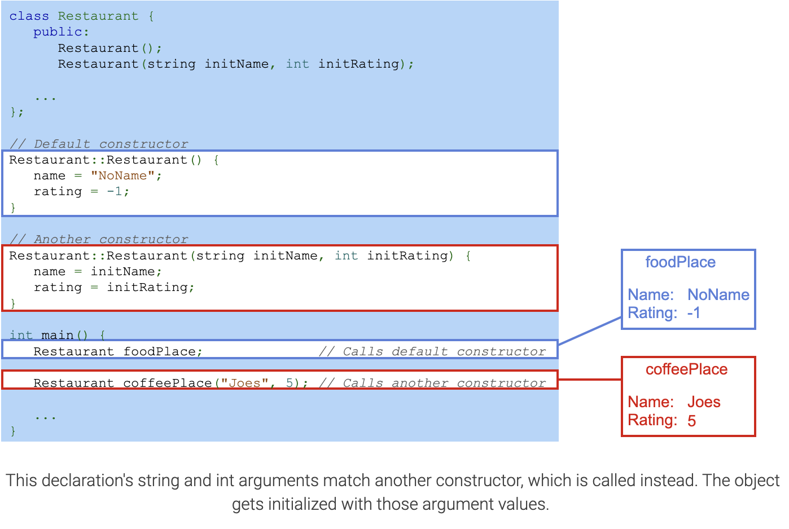

# UOP_COMP051
# 1. Introduction to C++
## 1.1 Programming (General)
A computer program consists of instructions executing one at a time. Basic instruction types are:
- Input: A program gets data, perhaps from a file, keyboard, touchscreen, network, etc.
- Process: A program performs computations on that data, such as adding two values like x + y.
- Output: A program puts that data somewhere, such as to a file, screen, network, etc.

Programs use variables to refer to data, like x, y, and z below. The name is due to a variable's value varying as a program assigns a variable like x with new values.

```Cpp
#include <iostream>
using namespace std;

int main() { // A program begins executing statements in main(). 
  int wage; // 'int wage' declares an integer variable. 'wage = 20' assigns wage with 20.

  wage = 20;

  cout << "Salary is "; // The cout statement outputs 'Salary is ' to the screen at the cursor's present location.
  cout << wage * 40 * 52; // outputs the result of wage * 40 * 52, so 20 * 40 * 52 or 41600.
  cout << endl; // 'endl' moves the output cursor to the next line on the screen.

  return 0; // The 'return 0' statement ends the program.
}
```

## 1.2 Programming Basics
### Basic input
The following statement gets an input value and puts that value into variable x: cin >> x; cin is short for characters in.

```Cpp
#include <iostream>
using namespace std;
 
int main() {
   int wage;
   
   cin >> wage; // gets an input value from the keyboard (or file, etc.) and puts that value into the wage variable.
 
   cout << "Salary is ";
   cout << wage * 40 * 52;
   cout << endl;
 
   return 0;
}
```
### Basic ouput
The cout construct supports output; cout is short for characters out.
Outputting text is achieved via: cout << "desired text";.
Text in double quotes " " is known as a string literal.
Multiple cout statements continue printing on the same output line.
The statement cout << endl; starts a new output line, called a newline.

```Cpp
#include <iostream>
using namespace std;
 
int main() {
   cout << "This is the first paragraph.";
   cout << endl;
   cout << "The cursor has been moved to the next line."
   cout << endl;
   cout << endl;
   cout << "This is the second paragraph.";

   return 0;
}
/*
This is the first paragraph.
The cursor has been moved to the next line.

This is the second paragraph
*/
```

Outputting a variable's value is achieved via: cout << x;. Note that no quotes surround x.
```Cpp
#include <iostream>
using namespace std;

int main() {
   int wage;
   
   wage = 20;

   cout << "Wage is: ";
   cout << wage; 
   cout << endl;
   cout << "Goodbye.";
   cout << endl;

   return 0;
}
/*
Wage is: 20
Goodbye.
*/
```
Programmers commonly use a single output statement for each line of output by combining the outputting of text, variable values, and a new line. The programmer simply separates the items with << symbols. Such combining can improve program readability because the program's code corresponds more closely to the program's output.
```Cpp
#include <iostream>
using namespace std;

int main() {
   int wage;

   wage = 20;

   cout << "Wage is: " << wage << endl; 
   cout << "Goodbye." << endl;

   return 0;
}
```
## 1.3 Comments and Whitespace
### Comments 
A comment is text a programmer adds to code, to be read by humans to better understand the code but ignored by the compiler. Two common kinds of comments exist:
- A single-line comment starts with // and includes all the following text on that line. Single-line comments commonly appear after a statement on the same line.
- A multi-line comment starts with /* and ends with */, where all text between /* and */ is part of the comment. A multi-line comment is also known as a block comment.

```Cpp
#include <iostream>
using namespace std;
/*
 This program calculates the amount of pasta to cook, given the
 number of people eating.
*/
int main ()
{
   int numPeople;         // Number of people that will be eating
   int totalOuncesPasta;  // Total ounces of pasta to serve numPeople
   
   // Get number of people
   cout << "Enter number of people: " << endl;
   cin  >> numPeople;
   
   // Calculate and print total ounces of pasta
   totalOuncesPasta = numPeople * 3;  // Typical ounces per person
   cout << "Cook " << totalOuncesPasta << " ounces of pasta." << endl;
   
   return 0;
}
```
### Whitespace
Whitespace refers to blank spaces (space and tab characters) between items within a statement and blank lines between statements (called newlines). A compiler ignores most whitespace (Not all spaces are ignored by the compiler. Ex: The spaces in a string literal like "Enter age: " will be printed if the string is output).

- Use blank lines to separate conceptually distinct statements.
- Indent lines the same amount.
- Align items to reduce visual clutter.
- Use a single space before and after any operators like =, +, *, or << to make statements more readable.

```Cpp
//good use of whitespace
#include <iostream>
using namespace std;

int main() {
   int myFirstVar;    // Aligned comments yield less
   int yetAnotherVar; // visual clutter 
   int thirdVar; 
  
   // Above blank line separates variable declarations from the rest
   cout << "Enter a number: ";
   cin  >> myFirstVar;
  
   // Above blank line separates user input statements from the rest   
   yetAnotherVar = myFirstVar;        // Aligned = operators
   thirdVar      = yetAnotherVar + 1; 
   // Also notice the single-space on left and right of + and =
   // (except when aligning the second = with the first =)

   cout << "Final value is " << thirdVar << endl; // Single-space on each side of <<
  
   return 0; // The above blank line separates the return from the rest
}
```
The compiler converts a high-level program into an executable program using machine code (0s and 1s).
Comments do not generate machine code.
The compiler recognizes end of statement by semicolon ";".

Not all spaces are ignored by the compiler. Ex: The spaces in a string literal like "Enter age: " will be printed if the string is output.


## 1.4 Errors and Warning
### Syntax error
People make mistakes. Programmers thus make mistakes—lots of them. One kind of mistake, known as a syntax error, is to violate a programming language's rules on how symbols can be combined to create a program. An example is forgetting to end a statement with a semicolon.


Example: 
```Cpp
cout << numCats. // (statement ending with semicolon, not period)
cout << "Cats: " numCats; //(iterms must be seperated by "<<")
cout < numCats; //("<<" is required, not "<")
cout << "Cats: << numCats; //(missing the ending ")
cout << NumCats; //(the declare variable is "numCats")
cout >> numCats; //(must use "<<" instead of ">>" for cout)
```

### Unclear error message
Compiler error messages are often unclear or even misleading. The message is like the compiler's "best guess" of what is really wrong.

The compiler indicates a missing semicolon ';'. But the real error is the missing << symbols.
Sometimes the compiler error message refers to a line that is actually many lines past where the error actually occurred. Not finding an error at the specified line, the programmer should look to previous lines.
For example: When a compiler says that an error exists on line 5, the error may actually exist in an earlier line, but the compiler didn't get confused until reaching line 5.

The actual error could be different, like missing parentheses. If a programmer makes a mistake, the statement and subsequent statements may still be valid code, but eventually the compiler cannot make sense of the code and generates an error message.
Some errors create an upsettingly long list of error messages. Good practice is to focus on fixing just the first error reported by the compiler and then recompiling. The remaining error messages may be real but are more commonly due to the compiler's confusion caused by the first error and are thus irrelevant.

If a compiler generates a specific message like "missing semicolon", the actual error could be different, like missing parentheses. If a programmer makes a mistake, the statement and subsequent statements may still be valid code, but eventually the compiler cannot make sense of the code and generates an error message.

### Fixing the first error
Some errors create an upsettingly long list of error messages. The remaining error messages may be real but are more commonly due to the compiler's confusion caused by the first error and are thus irrelevant.

1. Focus on FIRST error message, ignoring the rest.
2. Look at reported line of first error message. If error found, fix. Else, look at previous few lines.
3. Compile, repeat.


### Logic error
Because a syntax error is detected by the compiler, a syntax error is known as a type of compile-time error.

Successfully compiling means the program doesn't have compile-time errors, but the program may have other kinds of errors. A logic error, also called a bug, is an error that occurs while a program runs. For example, a programmer might mean to type numBeans * numJars but accidentally types numBeans + numJars (+ instead of *). The program would compile but would not run as intended.

```Cpp
#include <iostream>
using namespace std;

int main() {
   int numBeans;
   int numJars;
   int totalBeans;

   numBeans = 500;
   numJars = 3;
   
   cout << numBeans << " beans in ";
   cout << numJars  << " jars yields ";
   totalBeans = numBeans + numJars; // Oops, used + instead of *
   cout << totalBeans << " total" << endl;
   
   return 0;
}
```
### Compiling frequently
Good practice, especially for new programmers, is to compile after writing only a few lines of code, rather than writing tens of lines and then compiling. New programmers commonly write tens of lines before compiling, which may result in an overwhelming number of compilation errors and warnings and logic errors that are hard to detect and correct. This is the reason why we should compile frequently.


### Compiler warning
A compiler will sometimes report a warning, which doesn't stop the compiler from creating an executable program but indicates a possible logic error. Ex: Some compilers will report a warning like "Warning, dividing by 0 is not defined" if encountering code like: totalItems = numItems / 0 (running that program does result in a runtime error).

Default settings commonly do NOT report all important issues. Good practice is to explicitly configure the compiler to report most warnings.

## 1.6 Computer tour
### Processor or CPU
Probably the most important component and most sophisticated in a computer.
A Processor or CPU is commonly found on the Motherboard adjacent to RAM.

Processors have memory reserved at space 0 for the fastest and first in / out access.

### Memory or RAM
This is volatile storage which has a faster read / write speed. But the contents are lost if the computer loses power, or the system process is ended.

Memory size is normally allocated in bits or bytes where a byte is 8 bits.
Common sizes are in MB or GB. In intervals of 8. I.e. 4096MB of RAM or 4GB of RAM are essentially the same.

### Storage Devices or Disks
• In the past, these were spindle drives or rotating drives. Which came in various sizes and spindle speeds.
• Disks store files or information such as program files, user files (like documents and pictures), and Operating System files.
• Today – we use SSD’s or Solid-State Disks and some systems use NVmE devices for even faster storage.
• The main fault of disks is normally the access, aka read / write speed.

### Input / Output devices or I/O devices.
These are the screen, keyboard, mouse. However, computers we use often have additional peripherals such as a USB device, printers, speakers, microphones, etc. These are commonly called peripherals.

### Operating system
An operating system (OS) is a crucial software that runs on a computer or electronic device to manage and control its operations. The OS serves as an interface between the user and the hardware, while managing system resources such as memory, processor, peripherals, and storage.

The operating system provides essential services and functions such as file management, memory management, scheduling and multitasking, networking, user interface, and various other applications. It enables users to perform tasks through a graphical user interface or command line, and allows for the execution of different application programs.

There are several popular operating systems, including Windows, macOS, Linux, and mobile operating systems such as Android and iOS. Each operating system has its own characteristics and supports different applications and hardware, depending on the purpose and end-user requirements.

### Clock
Processors and systems interact with the system clock to schedule and execute operations. These are found in all sorts of devices ranging from simple gadgets to expensive research equipment.


# 2. Variables / Assignment
## 2.1 Variables and assignment (general)
- In a program, a variable is a named item, such as x or numPeople, used to hold a value.
- An assignment assigns a variable with a value, such as x = 5 => x is assigned with 5 and x keeps that value during subsequent assignments, until x is assigned again.
- An assignment's left side must be a variable. The right side can be an expression, so an assignment may be x = 5, y = x, or z = x + 2. The 5, x, and x + 2 are each an expression that evaluates to a value.
- "=" is not equal. "=" is an assignment of a left-side variable with a right-side value. "=" is NOT equality as in mathematics. Thus, x = 5 is read as "x is assigned with 5", and not as "x equals 5". When one sees x = 5, one might think of a value being put into a box.

### Assignments with variable on the left and right
Increasing a variable's value by 1, as in x = x + 1, is common, and known as incrementing the variable.
Because in programming = means assignment, a variable may appear on both the left and right as in x = x + 1.

## 2.2 Variables (int)
### Variables declaration
- A variable declaration is a statement that declares a new variable, specifying the variable's name and type. Ex: int userAge; declares a new variable named userAge that can hold an integer value.
- The compiler allocates a memory location for userAge capable of storing an integer.
- Allocation is the process of determining a suitable memory location to store data like variables.
When a statement that assigns a variable with a value executes, the processor writes the value into the variable's memory location. Likewise, reading a variable's value reads the value from the variable's memory location. The programmer must declare a variable before any statement that assigns or reads the variable, so that the variable's memory location is known.
```Cpp
#include <iostream>
using namespace std;

int main() {
   int userAge;

   cout << "Enter your age: ";
   cin >> userAge;
   cout << userAge << " is a great age." << endl;

   return 0;
}
```
### Assignment Statement
- An assignment statement assigns the variable on the left-side of the = with the current value of the right-side expression.
- An expression may be a number like 80, a variable name like numApples, or a simple calculation like numApples + 1.
- Simple calculations can involve standard math operators like +, -, and *, and parentheses as in 2 * (numApples - 1). An integer like 80 appearing in an expression is known as an integer literal.

```Cpp

#include <iostream>
using namespace std;

int main() {
   int litterSize;
   int yearlyLitters;
   int annualMice;

   litterSize    = 3; // Low end of litter size range
   yearlyLitters = 5; // Low end of litters per year

   cout << "One female mouse may give birth to ";
   annualMice = litterSize * yearlyLitters;
   cout << annualMice << " mice," << endl;
   
   litterSize    = 14; // High end
   yearlyLitters = 10; // High end

   cout << "and up to ";
   annualMice = litterSize * yearlyLitters;
   cout << annualMice << " mice, in a year." << endl;
   
   return 0;
}

/*
One female mouse may give birth to 15 mice,
and up to 140 mice, in a year.
*/
```

### Initializing Variables
Although not required, an integer variable is often assigned an initial value when declared. Ex: int maxScore = 100; declares an int variable named maxScore with an initial value of 100.

### Assignment statement with same variables on both sides
Commonly, a variable appears on both the right and left side of the = operator.
Ex: If numItems is 5, after numItems = numItems + 1; executes, numItems will be 6. The statement reads the value of numItems (5), adds 1, and assigns numItems with the result of 6, which replaces the value previously held in numItems.

```Cpp
#include <iostream>
using namespace std;
            
int main() {
   int yourFriends;
   int totalFriends;
            
   cout << "Enter the number of people you know: ";
   cin >> yourFriends;
   totalFriends = yourFriends;
   cout << " You know " << totalFriends << " people.\n";
   totalFriends = totalFriends * yourFriends;
   cout << " Those people know " << totalFriends << " people.\n";
   totalFriends = totalFriends * yourFriends;
   cout << " And they know " << totalFriends << " people.\n\n";
            
   return 0;
}
/*
Enter the number of people you know: 200
You know 200 people.
Those people know 40000 people.
And they know 8000000 people.
*/
```

### Common error
- A common error is to read a variable that has not yet been assigned a value. If a variable is declared but not initialized, the variable's memory location contains some unknown value, commonly but not always 0.
- A program with an uninitialized variable may thus run correctly on a system that has 0 in the memory location, but then fail on a different system—a very difficult bug to fix.

## 2.3 Identifiers
### Rules of identifiers
A name created by a programmer for an item like a variable or function is called an identifier. An identifier must:
- be a sequence of letters (a-z, A-Z), underscores (_), and digits (0-9)
- start with a letter or underscore

Note that "_", called an underscore, is considered to be a letter.
Identifiers are case sensitive, meaning upper and lower case letters differ. So numCats and NumCats are different.

- A reserved word is a word that is part of the language, like int, short, or double. A reserved word is also known as a keyword. A programmer cannot use a reserved word as an identifier. Many language editors will automatically color a program's reserved words.


### Style guidelines for identifiers
While various (crazy-looking) identifiers may be valid, programmers may follow identifier naming conventions (style) defined by their company, team, teacher, etc. Two common conventions for naming variables are:
- Camel case: Lower camel case abuts multiple words, capitalizing each word except the first, as in numApples or peopleOnBus.
- Underscore separated: Words are lowercase and separated by an underscore, as in num_apples or people_on_bus.

## 2.4 Arithmetic expression
### Basic
- An expression is any individual item or combination of items, like variables, literals, operators, and parentheses, that evaluates to a value, like 2 * (x + 1). A common place where expressions are used is on the right side of an assignment statement, as in y = 2 * (x + 1).
- A literal is a specific value in code like 2.
- An operator is a symbol that performs a built-in calculation, like +, which performs addition.
The addition operator is "+", as in "x + y".
The subtraction operator is "-", as in "x - y".
The multiplication operator is "*", as in "x * y".
The division operator is "/", as in "x / y".

### Evaluation of expressions
An expression evaluates to a value, which replaces the expression. Ex: If x is 5, then x + 1 evaluates to 6, and y = x + 1 assigns y with 6.
An expression is evaluated using the order of standard mathematics, such order known in programming as precedence rules.


## 2.5 Arithmetic expression
Below is a simple program that includes an expression involving integers.
```Cpp
#include <iostream>
using namespace std;

/* Computes the total cost of leasing a car given the down payment,
   monthly rate, and number of months
*/

int main() {
   int downPayment;
   int paymentPerMonth;
   int numMonths;
   int totalCost;  // Computed total cost to be output

   cout << "Enter down payment: ";
   cin  >> downPayment;

   cout << "Enter monthly payment: ";
   cin  >> paymentPerMonth;

   cout << "Enter number of months: ";
   cin  >> numMonths;

   totalCost = downPayment + (paymentPerMonth * numMonths);

   cout << "Total cost: " << totalCost << endl;

   return 0;
}
/*
Enter down payment: 500
Enter monthly payment: 300
Enter number of months: 60
Total cost: 18500
*/
```
### Single space around operator
- A single space around operators for readability, as in "numItems + 2", rather than "numItems+2". An exception is minus used as negative, as in: xCoord = -yCoord. Minus (-) used as negative is known as unary minus.

### Compound operator
Special operators called compound operators provide a shorthand way to update a variable, such as userAge += 1 being shorthand for userAge = userAge + 1. Other compound operators include -=, *=, /=, and %=.

### No commas allowed
Commas are not allowed in an integer literal. So 1,333,555 is written as 1333555.

## 2.6 Example

## 2.7 Floating-point numbers (double)
### Floating-point (double) variables
- A floating-point number is a real number containing a decimal point that can appear anywhere (or "float") in the number.
- A floating-point literal is a number with a fractional part, even if the fraction is 0, as in 1.0, 0.0, or 99.573. Good practice is to always have a digit before the decimal point, as in 0.5, since .5 might mistakenly be viewed as 5.

```Cpp
#include <iostream>
using namespace std;

int main() {
   double milesTravel; // User input of miles to travel
   double hoursFly;    // Travel hours if flying those miles
   double hoursDrive;  // Travel hours if driving those miles
   
   cout << "Enter miles to travel: ";
   cin  >> milesTravel;
   
   hoursFly   = milesTravel / 500.0; // Plane flies 500 mph
   hoursDrive = milesTravel / 60.0;  // Car drives 60 mph
   
   cout << milesTravel << " miles would take:" << endl;
   cout << "   " << hoursFly << " hours to fly" << endl;
   cout << "   " << hoursDrive << " hours to drive" << endl;
   
   return 0;
}
/*
Enter miles to travel: 1800
1800 miles would take:
   3.6 hours to fly
   30 hours to drive
*/
/*
Enter miles to travel: 400.5
400.5 miles would take:
   0.801 hours to fly,
   6.675 hours to drive.
*/
```
Scientific notation
Very large and very small floating-point values may be printed using scientific notation. Ex: If a floating variable holds the value 299792458.0 (the speed of light in m/s), the value will be printed as 2.99792e+08.

### Choosing a variable type (double vs int)
A programmer should choose a variable's type based on the type of value held.
- Integer variables are typically used for values that are counted, like 42 cars, 10 pizzas, or -95 days.
- Floating-point variables are typically used for measurements, like 98.6 degrees, 0.00001 meters, or -55.667 degrees.
- Floating-point variables are also used when dealing with fractions of countable items, such as the average number of cars per household.

### Floating point division by 0
- Dividing a nonzero floating-point number by zero is undefined in regular arithmetic. Many programming languages produce an error when performing floating-point division by 0, but C++ does not. C++ handles this operation by producing infinity or -infinity, depending on the signs of the operands. Printing a floating-point variable that holds infinity or -infinity outputs inf or -inf.
- If the dividend and divisor in floating-point division are both 0, the division results in a "not a number". Not a number (NaN) indicates an unrepresentable or undefined value. Printing a floating-point variable that is not a number outputs nan.

```Cpp
#include <iostream>
using namespace std;

int main() {
   double gasVolume;
   double oilVolume;
   double mixRatio;
   
   cout << "Enter gas volume: ";
   cin  >> gasVolume;

   cout << "Enter oil volume: ";
   cin  >> oilVolume;

   mixRatio = gasVolume / oilVolume;
   
   cout << "Gas to oil mix ratio is " << mixRatio << ":1" << endl;
   
   return 0;
}
/*
Enter gas volume: 10.5
Enter oil volume: 0.0
Gas to oil mix ratio is inf:1
*/
```
### Manipulating floating-point output
- Some floating-point numbers have many digits after the decimal point. Ex: Irrational numbers (Ex: 3.14159265359...) and repeating decimals (Ex: 4.33333333...) have an infinite number of digits after the decimal.
- By default, most programming languages output at least 5 digits after the decimal point. But for many simple programs, this level of detail is not necessary.
- Representing currency with two digits after the decimal). The syntax for outputting the double myFloat with two digits after the decimal point is " cout << fixed << setprecision(2) << myFloat; "

```C
/* Note: setprecision() is found in the iomanip library. fixed and setprecision() are manipulators that need only be written once if the desired number of digits after the decimal point is the same for multiple floating-point numbers. */
cout << fixed << setprecision(3) << 3.1244 << endl;
cout << 2.1 << endl;
/*
3.124
2.100
*/

cout << "Default output of pi: " << M_PI << endl;
/*
The mathematical constant pi (π) is irrational, a floating-point number whose digits after the decimal point are infinite and non-repeating. The cmath library defines the constant M_PI with the value of pi.
Though C++ does not attempt to output the full value of pi, by default, 5 digits after the decimal are output.
*/
cout << "pi reduced to 4 digits after the decimal: ";
cout << fixed << setprecision(4) << M_PI << endl;
/*
cout << fixed << setprecision(4) outputs pi to only four digits after the decimal. The last digit is rounded up in the output, but the value of pi remains the same.
*/

/*
Default output of pi: 3.14159
pi reduced to 4 digits after the decimal: 3.1416
*/

```

## 2.8 Scientific notation for floating-point literals
- Scientific notation is useful for representing floating-point numbers that are much greater than or much less than 0, such as 6.02 x 1023. A floating-point literal using scientific notation is written using an e preceding the power-of-10 exponent, as in 6.02e23 to represent 6.02 x 10^23. 0.001 is 1 x 10^-3 and can be written as 1.0e-3.

```Cpp
#include <iostream>
using namespace std;

int main() {
   double avogadrosNumber = 6.02e23; // Approximation of atoms per mole  
   double gramsPerMoleGold = 196.9665;
   double gramsGold;
   double atomsGold;
   
   cout << "Enter grams of gold: ";
   cin  >> gramsGold;
   
   atomsGold = gramsGold / gramsPerMoleGold * avogadrosNumber;
   
   cout << gramsGold << " grams of gold contains ";
   cout << atomsGold << " atoms" << endl;
   
   return 0;
}
/*
Enter grams of gold: 4.5
4.5 grams of gold contains 1.37536e+22 atoms
*/
```
## 2.9 Constant variable
One reason is to improve code readability. newPrice = origPrice - 5 is less clear than newPrice = origPrice - priceDiscount. When a variable represents a literal, the variable's value should not be changed in the code. If the programmer precedes the variable declaration with the keyword const, then the compiler will report an error if a later statement tries to change that variable's value. An initialized variable whose value cannot change is called a constant variable.

```Cpp
#include <iostream>
using namespace std;

/*
 * Estimates distance of lightning based on seconds
 * between lightning and thunder
 */

int main() {
   const double SPEED_OF_SOUND   = 761.207; // Miles/hour (sea level)
   const double SECONDS_PER_HOUR = 3600.0;  // Secs/hour
   double secondsBetween;
   double timeInHours;
   double distInMiles;
   
   cout << "Enter seconds between lightning and thunder: ";
   cin  >> secondsBetween;
   
   timeInHours = secondsBetween / SECONDS_PER_HOUR;
   distInMiles = SPEED_OF_SOUND * timeInHours;
   
   cout << "Lightning strike was approximately" << endl;
   cout << distInMiles << " miles away." << endl;
   
   return 0;
}
/*
Enter seconds between lightning and thunder: 7
Lightning strike was approximately
1.48012 miles away.
*/
```
## 2.10 Using math function
- Some programs require math operations beyond +, -, *, /, like computing a square root. A standard math library has about 20 math operations, known as functions.
- A function is a list of statements executed by invoking the function's name, such invoking is known as a function call. Any function input values, or arguments, appear within ( ), separated by commas if more than one.

```Cpp
#include <iostream>
#include <cmath>
using namespace std;

int main() {
   double initMass;   // Initial mass of a substance
   double growthRate; // Annual growth rate
   double yearsGrow;  // Years of growth
   double finalMass;  // Final mass after those years

   cout << "Enter initial mass: ";
   cin  >> initMass;

   cout << "Enter growth rate (Ex: 0.05 is 5%/year): ";
   cin  >> growthRate;

   cout << "Enter years of growth: ";
   cin  >> yearsGrow;

   finalMass = initMass * pow(1.0 + growthRate, yearsGrow);
   // Ex: Rate of 0.05 yields initMass * 1.05^yearsGrow

   cout << "Final mass after " << yearsGrow
        << " years is: " << finalMass << endl;

   return 0;
}
/*
Enter initial mass: 10000
Enter growth rate (Ex: 0.05 is 5%/year): 0.06
Enter years of growth: 20
Final mass after 20 years is: 32071.4
*/
```
See this https://cplusplus.com/reference/cmath/ link for a comprehensive list of built-in math functions.

#### cmath and cstdlib 
- The "c" in cmath indicates that the library comes from a C language library.
- Some math functions for integers are in a library named cstdlib, requiring: #include <cstdlib>. Ex: abs() computes the absolute value of an integer.

## 2.11 Integer division and modulo
### Division: Integer rounding
When the operands of / are integers, the operator performs integer division, which does not generate any fraction.
Eg: y = 10 / 4 = 2; y = 4 / 9 = 0; a = (1/2) * b * h = 0 (always)...

### Division: Division by 0
For integer division, the second operand of / or % must never be 0, because division by 0 is mathematically undefined. A divide-by-zero error occurs at runtime if a divisor is 0, causing a program to terminate. A divide-by-zero error is an example of a runtime error, a severe error that occurs at runtime and causes a program to terminate early.
```Cpp
#include <iostream>
using namespace std;

int main() {
   int salaryPerYear; // User input: Yearly salary
   int daysPerYear;   // User input: Days worked per year
   int salaryPerDay;  // Output:     Salary per day

   cout << "Enter yearly salary: ";
   cin  >> salaryPerYear;
   
   cout << "Enter days worked per year: ";
   cin  >> daysPerYear;

   // If daysPerYear is 0, then divide-by-zero causes program termination.
   salaryPerDay = salaryPerYear / daysPerYear;

   cout << "Salary per day is: " << salaryPerDay << endl;

   return 0;
}
/*
Enter yearly salary: 60000
Enter days worked per year: 0
Floating point exception
*/
```
### Modulo
The basic arithmetic operators include not just +, -, *, /, but also %. The modulo operator (%) evaluates the remainder of the division of two integer operands. Ex: 23 % 10 is 3.
Examples:
24 % 10 is 4. Reason: 24 / 10 is 2 with remainder 4.
50 % 50 is 0. Reason: 50 / 50 is 1 with remainder 0.
1 % 2 is 1. Reason: 1 / 2 is 0 with remainder 1.
10 % 4.0 is not valid. "Remainder" only makes sense for integer operands.
100 % 0 = Error. Because 100 % 0 is undefined (as 100 / 0 is undefined) and causes the program to terminate.

```Cpp
#include <iostream>
using namespace std;

int main() {
   int userMinutes;   // User input: Minutes
   int outHours;      // Output hours
   int outMinutes;    // Output minutes (remaining)

   cout << "Enter minutes: ";
   cin  >> userMinutes;

   outHours   = userMinutes / 60;
   outMinutes = userMinutes % 60; // 1 hour = 60 minutes, so when do this, you will get the remainder minutes

   cout << userMinutes << " minutes is ";
   cout << outHours    << " hours and ";
   cout << outMinutes  << " minutes." << endl;

   return 0;
}
/*
Enter minutes: 139
139 minutes is 2 hours and 19 minutes.
*/
```

### Modulo examples
#### Random number in a range
Given a random number randNum, % can generate a random number within a range:
randNum % 10
Yields 0 - 9: Possible remainders are 0, 1, ..., 8, 9. Remainder 10 is not possible: Ex: 19 % 10 is 9, but 20 % 10 is 0.

randNum % 51
Yields 0 - 50: Note that % 50 would yield 0 - 49.

(randNum % 9) + 1
Yields 1 - 9: The % 9 yields 9 possible values 0 - 8, so the + 1 yields 1 - 9.

(randNum % 11) + 20
Yields 20 - 30: The % 11 yields 11 possible values 0 - 10, so the + 20 yields 20 - 30.

#### Getting digits
```Cpp
#include <iostream>
using namespace std;

int main() {
   int userValue;
   int onesDigit;
   int tensDigit;
   int hundredsDigit;
   int tmpValue;
   
   cin >> userValue; // get the value from user
   
   onesDigit = userValue % 10;
   tmpValue = userValue / 10;
   tensDigit = tmpValue % 10;
   tmpValue = tmpValue / 10;
   hundredsDigit = tmpValue % 10;
   
   cout << "Row digit is: " << onesDigit << endl;
   cout << "Ten digit is: " << tensDigit << endl;
   cout << "Hundred digit is: " << hundredsDigit << endl;
   
   return 0;
}
/*
10987
Row digit is: 7
Ten digit is: 8
Hundred digit is: 9
*/
```

### Getting prefix of a phone number
Given a 10-digit phone number stored as an integer, % and / can be used to get any part, such as the prefix. For phoneNum = 1365551212 (whose prefix is 555):

tmpVal = phoneNum / 10000; // / 10000 shifts right by 4, so 136555. 
prefixNum = tmpVal % 1000; // % 1000 gets the right 3 digits, so 555.
Dividing by a power of 10 shifts a value right. 321 / 10 is 32. 321 / 100 is 3.

% by a power of 10 gets the rightmost digits. 321 % 10 is 1. 321 % 100 is 21.

## 2.12 Type convertion
A type conversion is a conversion of one data type to another, such as an int to a double. The compiler automatically performs several common conversions between int and double types, such automatic conversions are known as implicit conversion.

int-to-double conversion is straightforward: 25 becomes 25.0.
double-to-int conversion just drops the fraction: 4.9 becomes 4.

### Type casting
- Ex: If a program needs a floating-point result from dividing two integers, then at least one of the integers needs to be converted to double so floating-point division is performed. Otherwise, integer division is performed, evaluating to only the quotient and ignoring the remainder. A type cast explicitly converts a value of one type to another type.
- The static_cast operator (static_cast<type>(expression)) converts the expression's value to the indicated type. Ex: If myIntVar is 7, then static_cast<double>(myIntVar) converts int 7 to double 7.0.
``` Cpp
#include <iostream>
using namespace std;

int main() {
   int kidsInFamily1;       // Should be int, not double
   int kidsInFamily2;       // (know anyone with 2.3 kids?)
   int numFamilies; 
   
   double avgKidsPerFamily; // Expect fraction, so double

   kidsInFamily1 = 3;
   kidsInFamily2 = 4;
   numFamilies = 2; 
   
   avgKidsPerFamily = static_cast<double>(kidsInFamily1 + kidsInFamily2)
                      / static_cast<double>(numFamilies);
   
   cout << "Average kids per family: " << avgKidsPerFamily << endl;
   
   return 0;
}
/*
Average kids per family: 3.5
*/
```
eg:
static_cast<double>(10) / static_cast<double>(4) = 2.5
static_cast<double>(15/4) = 3 // This common error first does integer division of 15 / 4 which is 3, then converts to 3.0.

## 2.13 Binary
- Normally, a programmer can think in terms of base ten numbers. However, a compiler must allocate some finite quantity of bits (e.g., 32 bits) for a variable, and that quantity of bits limits the range of numbers that the variable can represent. Thus, some background on how the quantity of bits influences a variable's number range is helpful.
- Because each memory location is composed of bits (0s and 1s), a processor stores a number using base 2, known as a binary number.
- For a number in the more familiar base 10, known as a decimal number, each digit must be 0-9 and each digit's place is weighed by increasing powers of 10.
Eg: Decimal numbers use weighed powers of 10:
212 = 2 * 10^2 + 1 * 10^1 + 2 * 10^0
Eg: In base 2, each digit must be 0-1 and each digit's place is weighed by increasing powers of 2.
1101 = 1 * 2^3 + 1 * 2^2 + 0 * 2^1 + 1 * 2^0 = 8 + 4 + 0 + 1 = 13

The compiler translates decimal numbers into binary numbers before storing the number into a memory location. The compiler would convert the decimal number 212 to the binary number 11010100, meaning 1*128 + 1*64 + 0*32 + 1*16 + 0*8 + 1*4 + 0*2 + 0*1 = 212, and then store that binary number in memory.

## 2.14 Characters
### Basics
A variable of char type, as in char myChar;, can store a single character like the letter m. A character literal is surrounded with single quotes, as in myChar = 'm';.
``` Cpp
#include <iostream>
using namespace std;

int main() {
   char arrowBody;
   char arrowHead;

   arrowBody = '-';
   arrowHead = '>';

   cout << arrowBody << arrowBody << arrowBody << arrowHead << endl;

   arrowBody = 'o';

   cout << arrowBody << arrowBody << arrowBody << arrowHead << endl;

   return 0;
}
/*
--->
ooo>
*/
```
### Getting a characters from input
``` Cpp
#include <iostream>
using namespace std;

int main() {
   char bodyChar;
   char headChar;

   cout << "Type two characters: ";
   cin  >> bodyChar;
   cin  >> headChar;

   // Output arrow body then head
   cout << bodyChar << bodyChar << bodyChar;
   cout << headChar << endl;

   return 0;
}
/*
Type two characters: ->
--->
...
Type two characters:    *     /
***/
*/
```

### A character is internally stored as a number
Under the hood, a char variable stores a number. Ex: 'a' is stored as 97. In an output statement, the compiler outputs the number's corresponding character.
ASCII is an early standard for encoding characters as numbers. The following table shows the ASCII encoding as a decimal number (Dec) for common printable characters (for readers who have studied binary numbers, the table shows the binary encoding also). Other characters such as control characters (e.g., a "line feed" character) or extended characters (e.g., the letter "n" with a tilde above it as used in Spanish) are not shown.


### Escape sequences
In addition to regular characters like Z, $, or 5, character encoding includes numbers for several special characters. Ex: A newline character is encoded as 10. Because no visible character exists for a newline, the language uses an escape sequence: A two-character sequence starting with \ that represents a special character.
Common escape sequences:
\n : newline
\t : tab
\' : single quote
\" : double quote
\\ : backplash

eg:
Goal output: Say "Hello"
cout << "Say \"Hello"";    // Each \" represents a single " character. The \ is needed so the compiler doesn't treat the " before the H as the end of the string "Say ".

Goal output: OK    bye
(Assume a tab exists between OK and bye).
cout << "OK\tbye";    // Upon seeing the \, the compiler looks at the next character. Seeing the t, the compiler inserts a single tab character.

### Common errors
- A common error is to use double quotes rather than single quotes around a character literal, as in myChar = "x", yielding a compiler error.
- Similarly, a common error is to forget the quotes around a character literal, as in myChar = x, usually yielding a compiler error (unless x is also a declared variable, then perhaps yielding a logic error).

## 2.15 String
### String and string literals
A string is a sequence of characters. A string literal surrounds a character sequence with double quotes, as in "Hello", "52 Main St.", or "42", vs. an integer literal like 42 or character literal like 'a'. Various characters may be in a string, such as letters, numbers, spaces, or symbols like $ or %, as in "$100 for Julia!!". Earlier sections showed string literals being output, as in: cout << "Hello";.

### String variables and assignments
- Some variables should hold a string. A string data type isn't built into C++ like char, int, or double, but is available in the standard library and can be used after adding: #include <string>. A programmer can then declare a string variable as: string firstName;.
- A programmer can assign a string just as for other types. Ex: str1 = "Hello", or str1 = str2. The string type automatically reallocates memory for str1 if the right-side string is larger or smaller, and then copies the characters into str1.
- A programmer can initialize a string variable during declaration: string firstMonth = "January";. Otherwise, a string variable is automatically initialized to an empty string "".
``` Cpp
#include <iostream>
#include <string>
using namespace std;
 
int main() {
   string sentenceSubject;
   string sentenceVerb;
   string sentenceObject = "an apple";

   sentenceSubject = "boy";
   sentenceVerb = "ate";

   cout << "A ";
   cout << sentenceSubject << " ";
   cout << sentenceVerb << " ";
   cout << sentenceObject << "." << endl;
 
   return 0;
}
/*
A boy ate an apple.
*/
```

### Getting a string without whitespaces from input
A whitespace character is a character used to represent horizontal and vertical spaces in text, and includes spaces, tabs, and newline characters. Ex: "Oh my goodness!" has two whitespace characters, one between h and m, the other between y and g.

Below shows the basic approach to get a string from input into variable userString. The approach automatically skips initial whitespace, then gets characters until the next whitespace is seen.

Eg:
```Cpp
cin >> userString;
cout << userString;

// Hi there -> Hi
// abc -> abc
```

### Getting a string with whitespace from input
Sometimes a programmer wishes to get whitespace characters into a string, such as getting a user's input of the name "Franklin D. Roosevelt" into a string variable presidentName.

For such cases, the language supports getting an entire line into a string. The function getline(cin, stringVar) gets all remaining text on the current input line, up to the next newline character (which is removed from input but not put in stringVar).

Eg:
```Cpp
getline (cin, userString1);
getline (cin, userString2);

cout << "String 1: " << userString1;
cout << "String 2: " << userString2;

/*
Hello there!
Welcome.
->
String 1: Hello there!
String 2: Welcome.

(this is a blank)
abc
def
->
String 1:
String 2: abc
*/
```
### Mixing cin and getline
Mixing cin >> and getline() can be tricky, because cin >> leaves the newline in the input, while getline() does not skip leading whitespace.

## 2.16 Integer overflow
An integer variable cannot store a number larger than the maximum supported by the variable's data type. An overflow occurs when the value being assigned to a variable is greater than the maximum value the variable can store.

A common error is to try to store a value greater than about 2 billion into an int variable. For example, the decimal number 4,294,967,297 requires 33 bits in binary, namely 100000000000000000000000000000001 (we chose the decimal number for easy binary viewing). Trying to assign that number into an int results in overflow. The 33rd bit is lost and only the lower 32 bits are stored, namely 00000000000000000000000000000001, which is decimal number 1.

Declaring the variable of type long long, (described in another section) which uses at least 64 bits, would solve the above problem. But even that variable could overflow if assigned a large enough value.

Most compilers detect when a statement assigns to a variable a literal constant so large as to cause overflow. The compiler may not report a syntax error (the syntax is correct), but may output a compiler warning message that indicates a potential problem. A GNU compiler outputs the message "warning: overflow in implicit constant conversion", and a Microsoft compiler outputs "warning: '=': truncation of constant value". Generally, good practice is for a programmer to not ignore compiler warnings.

A common source of overflow involves intermediate calculations. Given int variables num1, num2, num3 each with values near 1 billion, (num1 + num2 + num3) / 3 will encounter overflow in the numerator, which will reach about 3 billion (max int is around 2 billion), even though the final result after dividing by 3 would have been only 1 billion. Dividing earlier can sometimes solve the problem, as in (num1 / 3) + (num2 / 3) + (num3 / 3), but programmers should pay careful attention to possible implicit type conversions.

## 2.17 Numeric data types
int and double are the most common numeric data types. However, several other numeric types exist. The following table summarizes available integer numeric data types.

The size of integer numeric data types can vary between compilers, for reasons beyond our scope. The following table lists the sizes for numeric integer data types used in this material along with the minimum size for those data types defined by the language standard.


- int is the most commonly used integer type.
- long long is used for integers expected to exceed about 2 billion. That is not a typo; the word appears twice.
- short is rarely used. One situation is to save memory when storing many (e.g., tens of thousands) of smaller numbers, which might occur for arrays (another section). Another situation is in embedded computing systems having a tiny processor with little memory, as in a hearing aid or TV remote control. Similarly, char, while technically a number, is rarely used to directly store a number, except as noted for short.

## 2.18 Unsigned 
Sometimes a programmer knows that a variable's numbers will always be positive (0 or greater), such as when the variable stores a person's age or weight. The programmer can prepend the word "unsigned" to inform the compiler that the integers will always be positive.


```Cpp
#include <iostream>
using namespace std;

int main() {
   unsigned long memSizeGiB;
   unsigned long long memSizeBytes;
   unsigned long long memSizeBits;
   
   cout << "Enter memory size in GiBs: ";
   cin >> memSizeGiB;
   
   // 1 GiB = 1024 MiB, 1 MiB = 1024 KiB, 1 KiB = 1024 bytes
   memSizeBytes = memSizeGiB * (1024 * 1024 * 1024);
   // 1 byte = 8 bits
   memSizeBits = memSizeBytes * 8;
   
   cout << "Memory size in bytes: " << memSizeBytes << endl;
   cout << "Memory size in bits: " << memSizeBits << endl;
   
  return 0;
}

/*
Enter memory size in GiBs: 1
Memory size in bytes: 1073741824
Memory size in bits: 8589934592

...

Enter memory size in GiBs: 4
Memory size in bytes: 4294967296
Memory size in bits: 34359738368
*/
```

## 2.19 Random numbers
### Generating a random number
The rand() function, in the C standard library, returns a random integer each time the function is called, in the range 0 to RAND_MAX.

``` Cpp
#include <iostream>
#include <cstdlib>
using namespace std;

int main() {
   cout << rand() << endl;
   cout << rand() << endl;
   cout << rand() << endl;

   cout << "(RAND_MAX: " << RAND_MAX << ")" << endl;

   return 0;
}
/*
16807
282475249
1622650073
(RAND_MAX: 2147483647)
/*
```
Line 2 includes the C standard library, which defines the rand() function and RAND_MAX.

RAND_MAX is a machine-dependent value, but is at least 32,767. Above, RAND_MAX is about 2 billion.

Usually, a programmer wants a random integer restricted to a specific number of possible values. The modulo operator % can be used. Ex: integer % 10 has 10 possible remainders: 0, 1, 2, ..., 8, 9.

rand() % N yields N possible values, from 0 to N-1

### Specific ranges
A programmer wants random integers in the range 10 to 15. The number of possible values is 15 − 10 + 1. (People often forget the + 1.)
rand() % 6 generates 6 possible values as desired, but with range 0 to 5.
Adding 10 still generates 6 values, but now those values start at 10. The range thus becomes 10 to 15.

The following program randomly moves a student from one seat to another seat in a lecture hall, perhaps to randomly move students before an exam. The seats are in 20 rows numbered 1 to 20. Each row has 30 seats (columns) numbered 1 to 30. The student should be moved from the left side (columns 1 to 15) to the right side (columns 16 to 30).
``` Cpp
#include <iostream>
#include <cstdlib>
using namespace std;

// Switch a student
// from a random seat on the left  (cols  1 to 15)
//   to a random seat on the right (cols 16 to 30)
// Seat rows are 1 to 20

int main() {
   int rowNumL;
   int colNumL;
   int rowNumR;
   int colNumR;

   rowNumL = (rand() % 20) + 1;  // 1 to 20
   colNumL = (rand() % 15) + 1;  // 1 to 15

   rowNumR = (rand() % 20) + 1;  // 1 to 20
   colNumR = (rand() % 15) + 16; // 16 to 30

   cout << "Move from ";
   cout << "row " << rowNumL << " col " << colNumL;
   cout << " to " ;
   cout << "row " << rowNumR << " col " << colNumR;
   cout << endl;

   return 0;
}
/*
Move from row 8 col 5 to row 14 col 24
/*
```
### Pseudo-random
The integers generated by rand() are known as pseudo-random. "Pseudo" means "not actually, but having the appearance of". The integers are pseudo-random because each time a program runs, calls to rand() yield the same sequence of values. Earlier in this section, a program called rand() three times and output 16807, 282475249, 1622650073. Every time the program is run, those same three integers will be printed. Such reproducibility is important for testing some programs. (Players of classic arcade games like Pac-man may notice that the seemingly-random actions of objects actually follow the same pattern every time the game is played, allowing players to master the game by repeating the same winning actions).

Internally, the rand() function has an equation to compute the next "random" integer from the previous one, (invisibly) keeping track of the previous one. For the first call to rand(), no previous random integer exists, so the function uses a built-in integer known as the seed. By default, the seed is 1. A programmer can change the seed using the function srand(), as in srand(2) or srand(99).

If the seed is different for each program run, the program will get a unique sequence. One way to get a different seed for each program run is to use the current time as the seed. The function time() returns the number of seconds since Jan 1, 1970.

Note that the seeding should only be done once in a program, before the first call to rand().

### 2.20 Debugging
Debugging is the process of determining and fixing the cause of a problem in a computer program. Troubleshooting is another word for debugging. Far from being an occasional nuisance, debugging is a core programmer task, like diagnosing is a core medical doctor task. Skill in carrying out a methodical debugging process can improve a programmer's productivity.

Consider a program that, given a circle's circumference, computes the circle's area. Below, the output area is clearly too large. In particular, if circumference is 10, then radius is 10 / (2 * PI_VAL), so about 1.6. The area is then PI_VAL * 1.6 * 1.6, or about 8, but the program outputs about 775.

``` Cpp
#include <iostream>
using namespace std;

int main() {
   const double PI_VAL = 3.14159265;

   double circleRadius;
   double circleCircumference;
   double circleArea;
   
   cout << "Enter circumference: ";
   cin  >> circleCircumference;
   
   circleRadius = circleCircumference / 2 * PI_VAL;
   circleArea = PI_VAL * circleRadius * circleRadius;
   
   cout << "Circle area is: " << circleArea << endl;
   
   return 0;
}

/*
Enter circumference: 10
Circle area is: 775.157
/*

```
First, a programmer may predict that the problem is a bad output statement. This prediction can be tested by adding the statement circleArea = 999;. The output statement is OK, and the predicted problem is invalidated. Note that a temporary statement commonly has a "FIXME" comment to remind the programmer to delete this statement.

``` Cpp
#include <iostream>
using namespace std;

int main() {
   const double PI_VAL = 3.14159265;

   double circleRadius;
   double circleCircumference;
   double circleArea;
   
   cout << "Enter circumference: ";
   cin  >> circleCircumference;
   
   circleRadius = circleCircumference / 2 * PI_VAL;
   circleArea = PI_VAL * circleRadius * circleRadius;
   
   circleArea = 999; // FIXME delete
   cout << "Circle area is: " << circleArea << endl;
   
   return 0;
}
/*
Enter circumference: 0
Circle area is: 999
/*
```
Next, the programmer predicts the problem is a bad area computation. This prediction is tested by assigning the value 0.5 to radius and checking to see if the output is 0.7855 (which was computed by hand). The area computation is OK, and the predicted problem is invalidated. Note that a temporary statement is commonly left-aligned to make clear it is temporary.
``` Cpp
#include <iostream>
using namespace std;

int main() {
   const double PI_VAL = 3.14159265;

   double circleRadius;
   double circleCircumference;
   double circleArea;
   
   cout << "Enter circumference: ";
   cin  >> circleCircumference;
   
   circleRadius = circleCircumference / 2 * PI_VAL;
   
   circleRadius = 0.5; // FIXME delete
   circleArea = PI_VAL * circleRadius * circleRadius;
   
   cout << "Circle area is: " << circleArea << endl;
   
   return 0;
}
/*
Enter circumference: 0
Circle area is: 0.785398
/*
```
The programmer then predicts the problem is a bad radius computation. This prediction is tested by assigning PI_VAL to the circumference, and checking to see if the radius is 0.5. The radius computation fails, and the prediction is likely validated. Note that unused code was temporarily commented out.
``` Cpp
#include <iostream>
using namespace std;

int main() {
   const double PI_VAL = 3.14159265;

   double circleRadius;
   double circleCircumference;
   double circleArea;
   
   cout << "Enter circumference: ";
   cin  >> circleCircumference;
   
   circleCircumference = PI_VAL;               // FIXME delete
   circleRadius = circleCircumference / 2 * PI_VAL;
   cout << "Radius: " << circleRadius << endl; // FIXME delete

   /*
    circleArea = PI_VAL * circleRadius * circleRadius;
    
    cout << "Circle area is: " << circleArea << endl;
    */
   
   return 0;
}
/*
Enter circumference: 0
Radius: 4.9348
*/
```
The last test seems to validate that the problem is a bad radius computation. The programmer visually examines the expression for a circle's radius given the circumference, which looks fine at first glance. However, the programmer notices that radius = circumference / 2 * PI_VAL; should have been radius = circumference / (2 * PI_VAL);. The parentheses around the product in the denominator are necessary and represent the desired order of operations. Changing to radius = circumference / (2 * PI_VAL); solves the problem.


# 3. Branches
## 3.1 If-else branches
### Branch Basic (If)
In a program, a branch is a sequence of statements only executed under a certain condition. Ex: A hotel may discount a price only for people over age 65. An if branch is a branch taken only IF an expression is true.

1. A decision leads to two program branches. If the expression is true, the first branch executes. Else, the second branch executes.
2. If userAge is 68, then 68 > 65 is true. So the first branch executes, which discounts hotelRate.
3. Execution rejoins the other branch, and continues with subsequent statements, outputting 135. If userAge were instead 50, the output would be 155.

### If-else branches
An if-else branch has two branches: The first branch is executed IF an expression is true, ELSE the other branch is executed.

In the example below, if a user inputs an age less than 25, the statement insurePrice = 4800 executes. Else, insurePrice = 2200 executes.


### If-elseif-else branches
An if-else can be extended to an if-elseif-else structure. Each branch's expression is checked in sequence; as soon as one branch's expression is found to be true, that branch is taken. If no expression is found true, execution will reach the else branch, which then executes.
The else part is optional. If omitted, then if none of the previous expressions are true, no branch executes.

1. This program detects the specific value of a variable. If numYears is 1, the first branch executes and "Newlyweds" is output.
2. Else, if numYears is 25, the second branch executes and "Silver" is output. Else, if numYears is 50, the third branch executes and "Golden" is output.
3. Else, the last branch executes.

## 3.2 Detecting equal values with branches
### Detecting if two items are equal using an if statement
```Cpp
#include <iostream>
using namespace std;

int main() {
   int hotelRate;
   int numYears;

   hotelRate = 150;

   cout << "Enter number of years married: ";
   cin >> numYears;

   if (numYears == 50) {
      cout << "Congratulations on 50 years "
            << "of marriage!" << endl;

      hotelRate = hotelRate / 2;
   }

   cout << "Your hotel rate: ";
   cout << hotelRate << endl;

   return 0;
}
```
1. An if statement executes a group of statements if an expression is true. The program assigns hotelRate with 150 and then gets the number of years the user has been married from input.
2. numYears is 50. So the expression numYears == 50 evaluates to true, and the if's statement will execute. Thus, the statement following the opening brace { will execute next.
3. hotelRate is divided in half, which is the discount for guests celebrating their 50th wedding anniversary.
4. The closing brace } indicates the end of the group of statements.
5. The program completes by printing the hotel rate.

### Equality and inequality operators


### If else statement
```Cpp
#include <iostream>
using namespace std;

int main() {
   int userNum;
   int divRemainder;

   cout << "Enter a number: ";
   cin  >> userNum;

   divRemainder = userNum % 2;

   if (divRemainder == 0) {
       cout << userNum << " is even." << endl;
   }
   else {
       cout << userNum << " is odd." << endl;
   }

   return 0;
}
```

### Multi-branch If-else statement
An If-else statement can be extended to have three (or more) branches. Each branch's expression is checked in sequence. As soon as one branch's expression is found to be true, that branch's statements execute (and no subsequent branch is considered). If no expression is true, the else branch executes. The example below detects values of 1, 10, 25, or 50 for variable numYears.
```Cpp
#include <iostream>
using namespace std;

int main() {
   int numYears;

   cout << "Enter number years married: ";
   cin  >> numYears;

   if (numYears == 1) {
      cout << "Your first year -- great!" << endl;
   }
   else if (numYears == 10) {
      cout << "A whole decade -- impressive." << endl;
   }
   else if (numYears == 25) {
      cout << "Your silver anniversary -- enjoy." << endl;
   }
   else if (numYears == 50) {
      cout << "Your golden anniversary -- amazing." << endl;
   }
   else {
      cout << "Nothing special." << endl;
   }

   return 0;
}
```

### Comparing characters, strings, and floating-point types
The relational and equality operators work for integer, character, and floating-point built-in types.

Comparing characters compares their ASCII numerical encoding.

Floating-point types should not be compared using the equality operators, due to the imprecise representation of floating-point numbers, as discussed in a later section.

The operators can also be used for the string type. Strings are equal if they have the same number of characters and corresponding characters are identical. If string myStr = "Tuesday", then (myStr == "Tuesday") is true, while (myStr == "tuesday") is false because T differs from t.

## 3.3 Detecting ranges with branches (general)
### Detecting ranges using if-elseif-else
An if-elseif-else structure can detect number ranges with each branch performing a different action for each range. Each expression only needs to indicate the upper range part; if execution reaches an expression, the lower range part is implicit from the previous expressions being false.


### Using multi-branch if-else to detect ranges


## 3.4 Detecting ranges with branches
### Relational operators
A relational operator checks how one operand's value relates to another, like being greater than.


### Detecting ranges with if-else statements
```Cpp
#include <iostream>
using namespace std;

int main() {
   int userAge;
   int insurancePrice;

   cout << "Enter your age: ";
   cin  >> userAge;

   if (userAge < 16) {             // Age 15 and under
      cout << "Too young." << endl;
      insurancePrice = 0;
   }
   else if (userAge < 25) {        // Age 16 - 24
      insurancePrice = 4800;
   }
   else if (userAge < 40) {        // Age 25 - 39
      insurancePrice = 2350;
   }
   else {                          // Age 40 and up
      insurancePrice = 2100;
   }

   cout << "Annual price: $" << insurancePrice << endl;
   return 0;
}
```

## 3.5 Detecting ranges using logical operators
### Logical AND, OR, and NOT (general)
A logical operator treats operands as being true or false, and evaluates to true or false. Logical operators include AND, OR, and NOT. Programming languages typically use various symbols for those operators, but below the words AND, OR, and NOT are used for introductory purposes.


### Logical operators


```Cpp
if ((userChannel >= 2) && (userChannel <= 499)) {
   channelType = 's';
}
else if ((userChannel >= 1002) && (userChannel <= 1499)) {
   channelType = 'h';
}
else {
   channelType = 'e';
}
```
### Detecting ranges implicitly vs. explicitly
A programmer often uses logical operators to detect a range by explicitly specifying the high-end and low-end of the range. However, if a program should detect increasing ranges without gaps, a multi-branch if-else statement can be used without logical operators; the low-end of the range is implicitly known upon reaching an expression. Likewise, a decreasing range without gaps has implicitly-known high-ends.
```Cpp
// Explictly defined ranges:
if (x < 0) {
 // Negative
}
else if ( (x >= 0) && (x <= 10) ) {
 // 0..10
}
else if ( (x >= 11) && (x <= 20) ) {
 // 11..20
}
else {
 // 21+
}

//Implictly defined ranges
if (x < 0) {
 // Negative
}
else if (x <= 10) {
 // 0..10
}
else if (x <= 20) {
 // 11..20
}
else {
 // 21+
}
```

1. This code detects ranges explicitly using the AND operator. The first branch executes when x < 0, the second when (x >=0) && (x <= 10).
2. But, if the first branch doesn't execute, x must be >= 0. So the second branch's expression can just be x <= 10. The x >= 0 is implicit.
3. Implicit ranges can simplify a multi-branch if statement for ranges without gaps.

## 3.6 Detecting ranges with gaps
### Basic ranges with gaps
Oftentimes, ranges contain gaps. Ex: Movie theaters often give ticket discounts to children (anyone 12 and under) and seniors (anyone 65 and older). The gap is the group of people aged 13 to 64. An if-else statement can be used to detect such ranges with gaps.

```Cpp
#include <iostream>
using namespace std;

int main() {
   int userAge;
   int movieTicketPrice;

   cout << "Enter your age: ";
   cin  >> userAge;

   if (userAge <= 12) {            // Age 12 and under
      cout << "Child ticket discount." << endl;
      movieTicketPrice = 11;
   }
   else if (userAge >= 65) {       // Age 65 and older
      cout << "Senior ticket discount." << endl;    
      movieTicketPrice = 12;
   }
   else {                          // All other ages
      movieTicketPrice = 14;
   }

   cout << "Movie ticket price: $"
         << movieTicketPrice << endl;
   return 0;
}
```
### Ranges with gaps using logical operators
```Cpp
if (officeNum >= 100 && officeNum <= 150) {
   // valid office number
}
else if (officeNum >= 200 && officeNum <= 250) {
   // valid office number
}
else {
   // invalid office number
}
```
```Cpp
if ((officeNum >= 100 && officeNum <= 150) || (officeNum >= 200 && officeNum <= 250)) {
   // valid office number
}
else {
   // invalid office number
}
```
## 3.7 Detecting multiple features with branches
### Multiple distinct if statements
A programmer can use multiple if statements in sequence to detect multiple features with independent actions. Multiple sequential if statements looks similar to a multi-branch if-else statement but has a very different meaning. Each if-statement is independent, and thus more than one branch can execute, in contrast to the multi-branch if-else arrangement.
```Cpp
#include <iostream>
using namespace std;

int main() {
   int userAge;
   
   cout << "Enter age: ";
   cin  >> userAge;
   
   // Note that more than one "if" statement can execute
   if (userAge < 16) {
      cout << "Enjoy your early years." << endl;
   }
   
   if (userAge > 15) {
      cout << "You are old enough to drive." << endl;
   }
   
   if (userAge > 17) {
      cout << "You are old enough to vote." << endl;
   }
   
   if (userAge > 24) {
      cout << "Most car rental companies will rent to you." << endl;
   }
   
   if (userAge > 34) {
      cout << "You can run for president." << endl;
   }
   
   return 0;
}
/*
Enter age: 12
Enjoy your early years.

...

Enter age: 27
You are old enough to drive.
You are old enough to vote.
Most car rental companies will rent to you.

...

Enter age: 99
You are old enough to drive.
You are old enough to vote.
Most car rental companies will rent to you.
You can run for president.
*/
```

### Nested if-else statements
A branch's statements can include any valid statements, including another if-else statement, which are known as nested if-else statements. Nested if statements are commonly used to make decisions that are based on multiple features. Ex: To calculate a discount based on both the number of items purchased and the total cost of those items, one if statement checks the number of items purchased and a nested if statement can check the total cost.

```Cpp
if (numItems > 3) {     
   if (totalCost > 100) {       // numItems > 3 and totalCost > 100
      saleDiscount = 20;
   }
   else if (totalCost > 50) {  // numItems > 3 and totalCost > 50
      saleDiscount = 10;
   }
}
else if (numItems > 0) {
   ...
}
```

## 3.8 Common branching errors
### Common error: Missing braces
```Cpp
if (numSales < 20)
   salesBonus = 0;
else
   totBonus = totBonus + 1; 
   salesBonus = 20;
```
Indentation is irrelevant.
salesBonus = 20; is not part of else, 
so always executes.

### Common error: Using the incorrect operators
Perhaps the most common error in C and C++ is to use = rather than == in an if-else expression, as in: if (numDogs = 9) { ... }. That code is not a syntax error. The statement assigns numDogs with 9, and then because that value is non-zero, the expression is considered true. C's designers allowed assignment in expressions to allow compact code, and use = for assignment rather than := or similar to save typing. Many people believe those language design decisions were mistakes, leading to many bugs. Some modern compilers provide a warning when = appears in an if-else expression.

Another common error is to use invalid character sequences like =>, !<, or <>, which are not valid operators.

## 3.9 Example: Toll calculation
### Calculating toll based on time of day
```Cpp
#include <iostream>
#include <iomanip>
using namespace std;

int main() {
   int timeHour;      // Time of travel hour
   int timeMinute;    // Time of travel minute
   char inputColon;   // Used to read time format
   double tollAmount;
   
   cout << "Enter time of travel (HH:MM in 24 hour format): ";
   
   // Read an integer (hour), colon (char), and integer (minute)
   cin  >> timeHour >> inputColon >> timeMinute;
   
   // Determine toll based on hour of travel
   if (timeHour < 6) {         // Before 6:00 am
      tollAmount = 1.55;
   }
   else if (timeHour < 10) {   // 6 am to 9:59 am
      tollAmount = 4.65;
   }
   else if (timeHour < 18) {   // 10 am to 5:59 pm
      tollAmount = 2.35;
   }
   else {                      // 6 pm and after
      tollAmount = 1.55;
   }
   
   // Output time and toll amount
   cout << "Toll at " << timeHour << ":";
   
   // Output minute with formatting (discussed elsewhere) to
   // print two digits for minutes.
   cout << setw(2) << setfill('0') << timeMinute;
   cout << " is " << tollAmount << endl;
   
   return 0;
}
```

### Calculating toll based on time of day and day of week
```Cpp
#include <iostream>
#include <iomanip>
using namespace std;

int main() {
   int timeHour;      // Time of travel hour (24 hour format)
   int timeMinute;    // Time of travel minute
   int typeOfDay;     // 0 - weekday, 1 - weekend/holiday
   char inputColon;   // Used to read time format
   double tollAmount;
   
   cout << "Enter time of travel (HH:MM in 24 hour format): ";
   
   // Read an integer (hour), colon (char), and integer (minute)
   cin  >> timeHour >> inputColon >> timeMinute;
   
   cout << "Enter type of day (0 - weekday, 1 - weekend/holiday): ";
   cin >> typeOfDay;
   
   if (typeOfDay == 0) { // Weekday time and rates
                         // Determine toll based on hour of travel
      if (timeHour < 6) {         // Before 6:00 am
         tollAmount = 1.55;
      }
      else if (timeHour < 10) {   // 6 am to 9:59 am
         tollAmount = 4.65;
      }
      else if (timeHour < 18) {   // 10 am to 5:59 pm
         tollAmount = 2.35;
      }
      else {                      // 6 pm and after
         tollAmount = 1.55;
      }
   }
   else { // Weekend/holiday time and rates
          // Determine toll based on hour of travel
      if (timeHour < 8) {         // Before 8:00 am
         tollAmount = 1.55;
      }
      else if (timeHour < 12) {   // 8 am to 11:59 am
         tollAmount = 3.05;
      }
      else if (timeHour < 16) {   // 12 pm to 3:59 pm
         tollAmount = 3.45;
      }
      else if (timeHour < 19) {   // 4 pm to 6:5 9pm
         tollAmount = 3.60;
      }
      else if (timeHour < 22) {   // 7 pm to 9:59 pm
         tollAmount = 3.05;
      }
      else {                      // 10 pm and after
         tollAmount = 1.55;
      }
   }
   
   // Output toll using am/pm format
   cout << "Toll at ";
   
   // Output hour adjusting for am/pm format
   if (timeHour == 0) {
      cout << "12:";
   }
   else if (timeHour <= 12) {
      cout << timeHour << ":";
   }
   else {
      cout << timeHour - 12 << ":";
   }
   
   // Output minute with formatting (discussed elsewhere) to
   // print two digits for minutes.
   cout << setw(2) << setfill('0') << timeMinute;

   // Output am/pm
   if (timeHour < 12) {
      cout << " am";
   }
   else {
      cout << " pm";
   }
   
   cout << " is " << tollAmount << endl;
   
   return 0;
}
```

## 3.10 Order of evaluation
### Precedence rules
The order in which operators are evaluated in an expression are known as precedence rules. Arithmetic, logical, and relational operators are evaluated in the order shown below.


### Common error: Missing parentheses
A common error is to write an expression that is evaluated in a different order than expected. Good practice is to use parentheses in expressions to make the intended order of evaluation explicit. Several examples are below.

### Common error: Math expression for range
A common error often made by new programmers is to write expressions like (16 < age < 25), as one might see in mathematics.

The meaning, however, almost certainly is not what the programmer intended. Suppose age is presently 28. The expression is evaluated left-to-right, so evaluation of 16 < age yields true. Next, the expression true < 25 is evaluated; clearly not the programmer's intent. However, true is actually 1, and evaluating 1 < 25 will yield true. Thus, the above expression evaluates to true, even for ages greater than 25.

Thus, 16 < age < 25 is actually the same as (16 < age) < 25, which evaluates to (true) < 25 for any age over 16, which is the same as (1) < 25, which evaluates to true. The correct way to do such a comparison is: (age > 16) && (age < 25).

### Common error: Bitwise rather than logical operators
Logical AND is && and not just &, and logical OR is || and not just |. & and | represent bitwise operators, which perform AND or OR on corresponding individual bits of the operands.

A common error is to use a bitwise operator instead of a logical operator, typing & instead of &&, or typing | instead of ||. A bitwise operator may yield different behavior than expected.

## 3.11 Switch statements
### Switch statement
A switch statement can more clearly represent multi-branch behavior involving a variable being compared to constant values. The program executes the first case whose constant expression matches the value of the switch expression, executes that case's statements, and then jumps to the end. If no case matches, then the default case statements are executed.

```Cpp
switch (a) {
  case 0:
     // Print "zero"
     break;

  case 1:
     // Print "one"
     break;

  case 2:
     // Print "two"
     break;

   default:
     // Print "unknown"
     break;
}
```
### Switch statement general form
The switch statement's expression should be an integer or char. The expression should not be a string or a floating-point type. Each case must have a constant expression like 2 or 'q'; a case expression cannot be a variable.

The order of cases doesn't matter assuming break statements exist at the end of each case. The earlier program could have been written with case 3 first, then case 2, then case 0, then case 1, for example (though that would be bad style).

Good practice is to always have a default case for a switch statement. A programmer may be sure all cases are covered only to be surprised that some case was missing.

```Cpp
switch (expression) {
   case constantExpr1: 
      // Statements
      break;

   case constantExpr2:
      // Statements
      break;
   
   ...
   
   default: // If no other case matches
      // Statements
      break;
}
```
```Cpp
#include <iostream>
using namespace std;

/* Estimates dog's age in equivalent human years.
   Source: www.dogyears.com
*/

int main() {
   int dogAgeYears;

   cout << "Enter dog's age (in years): ";
   cin  >> dogAgeYears;

   switch (dogAgeYears) {
      case 0:
         cout << "That's 0..14 human years." << endl;
         break;

      case 1:
         cout << "That's 15 human years." << endl;
         break;

      case 2:
         cout << "That's 24 human years." << endl;
         break;

      case 3:
         cout << "That's 28 human years." << endl;
         break;

      case 4:
         cout << "That's 32 human years." << endl;
         break;

      case 5:
         cout << "That's 37 human years." << endl;
         break;

      default:
         cout << "Human years unknown." << endl;
         break;
   }

   return 0;
}
```

### Omitting the break statement
Omitting the break statement for a case will cause the statements within the next case to be executed. Such "falling through" to the next case can be useful when multiple cases, such as cases 0, 1, and 2, should execute the same statements.

The following extends the previous program for dog ages less than 1 year old. If the dog's age is 0, the program asks for the dog's age in months. Within the  switch (dogAgeMonths) statement, "falling through" is used to execute the same display statement for several values of dogAgeMonths. For example, if dogAgeMonths is 0, 1 or 2, the same statement executes.

A common error occurs when the programmer forgets to include a break statement at the end of a case's statements.

```Cpp
#include <iostream>
using namespace std;

int main() {
   int dogAgeYears;
   int dogAgeMonths;

   cout << "Enter dog's age (in years): ";
   cin >> dogAgeYears;

   if (dogAgeYears == 0) {
      cout << "Enter dog's age in months: ";
      cin  >> dogAgeMonths;

      switch (dogAgeMonths) {
         case 0:
         case 1:
         case 2:
            cout << "That's 0..14 human months." << endl;
            break;

         case 3:
         case 4:
         case 5:
         case 6:
            cout << "That's 1..5 human years." << endl;
            break;

         case 7:
         case 8:
            cout << "That's 5..9 human years." << endl;
            break;

         case 9:
         case 10:
         case 11:
         case 12:
            cout << "That's 9..15 human years." << endl;
            break;

         default:
            cout << "Invalid input." << endl;
            break;
      }
   }
   else {
      cout << "FIXME: Do earlier dog year cases." << endl;
      switch (dogAgeYears) {
      }
   }

   return 0;
}
```

## 3.12 Boolean data type
### Boolean data type
Boolean refers to a quantity that has only two possible values, true or false. C++ has the built-in data type bool for representing Boolean quantities.

A Boolean variable may be set using true or false keywords. Ex: isWeekend = true; assigns isWeekend with the Boolean value true. A Boolean variable may also be set to the result of a logical expression. Ex: isLargeParty = (partySize > 6); assigns isLargeParty with the result of the expression partySize > 6.

```Cpp
#include <iostream>
using namespace std;

int main() {
   int waitTime;
   int partySize;
   char day;
   bool isLargeParty;
   bool isWeekend;
   
   // Get day of reservation
   cout << "Day of reservation (T/W/R/F/S/U): ";
   cin >> day;
   if (day == 'F' || day == 'S' || day == 'U') {
      isWeekend = true;
   }
   else {
      isWeekend = false;
   }
   
   // Get party size
   cout << "Enter party size: ";
   cin  >> partySize;
   isLargeParty = (partySize > 6);
   
   // Determine wait time based on day of week and party size
   if (isWeekend && !isLargeParty) {
      waitTime = 30;
   }
   else if (!isWeekend && !isLargeParty) {
      waitTime = 10;
   }
   else if (isWeekend && isLargeParty) {
      waitTime = 45;
   }
   else {
      waitTime = 15;
   }
   
   cout << "Restaurant wait time is " << waitTime
        << " minutes." << endl;
   
   return 0;
}
```
### Uses of Boolean data types
A programmer can use a Boolean variable to simplify a complex expression. An expression that combines logical and relational operators can be simplified by assigning bool variables with the result of the expression using relational operators. The if-else expression can then consist of only logical operations using those variables.

The following program assigns bool variables isHot, isReallyHot, and isHumid with the results of expressions comparing currentTemp, desiredTemp, and currentHumidity. The if-else statement then uses isHot and isHumid in the if-else's expressions.

```Cpp
isHot = (currentTemp > desiredTemp);
isReallyHot = (currentTemp > (desiredTemp + 5.0));
isHumid = (currentHumidity > 0.50);
   
if (isReallyHot) {
   // Use A/C and evaporative cooler
   acOn = true;
   evapCoolerOn = true;
}
else if (isHot && isHumid) {
   // Use A/C
   acOn = true;
   evapCoolerOn = false;
}
else if (isHot && !isHumid) {
   // Use evaporative cooler
   acOn = false;
   evapCoolerOn = true;
}
else {
   acOn = false;
   evapCoolerOn = false;
}
```
## 3.13 String comparisons
### String comparison: Equality
Two strings are commonly compared for equality. Equal strings have the same number of characters, and each corresponding character is identical.
```Cpp
#include <iostream>
#include <string>
using namespace std;

int main() {
   string userWord;

   cout << "Enter a word: ";
   cin  >> userWord;

   if (userWord == "USA") {
      cout << "United States of America";
   }
   else {
      cout << userWord;
   }
   cout << endl;

   return 0;
}
```
### String comparison: Relational
Strings are sometimes compared relationally (less than, greater than), as when sorting words alphabetically. A comparison begins at index 0 and compares each character until the evaluation results in false, or the end of a string is reached. 'A' is 65, 'B' is 66, etc., while 'a' is 97, 'b' is 98, etc. So "Apples" is less than "apples" because 65 is less than 97.
A programmer compares strings relationally using the relational operators <, <=, >, and >=.

A common error is to forget that case matters in a string comparison. A programmer can compare strings while ignoring case by first converting both strings to lowercase before comparing (discussed elsewhere).

## 3.14 String access operations
### String character indices
A string is a sequence of characters in memory. Each string character has a position number called an index, starting with 0 (not 1).

### Accessing string characters
at(): The notation someString.at(x) accesses the character at index x of a string.

```Cpp
#include <iostream>
#include <string>
using namespace std;

int main() {
   string userWord;

   cout << "Enter a 5-letter word: ";
   cin  >> userWord;

   cout << "Scrambled: ";
   cout << userWord.at(3);
   cout << userWord.at(1);
   cout << userWord.at(4);
   cout << userWord.at(0);
   cout << userWord.at(2);
   cout << endl;

   return 0;
}
/*
Enter a 5-letter word: water
Scrambled: earwt

...

Enter a 5-letter word: Quick
Scrambled: cukQi

...

Enter a 5-letter word: 98765
Scrambled: 68597
*/
```
### Changing a character in a string
A character in a string can be assigned. If userString is "abcde", then userString.at(3) = 'X' yields "abcXe".

```Cpp
#include <iostream>
#include <string>
using namespace std;

int main() {
   string userWord ="Caterpillar";
   int replaceIndex;
   
   cout << "Enter an index (0-10): ";
   cin  >> replaceIndex;

   userWord.at(replaceIndex) = '*';

   cout << "Updated string: ";
   cout << userWord << endl;

   return 0;
}
/*
Enter an index (0-10): 0
Updated string: *aterpillar

...

Enter an index (0-10): 3
Updated string: Cat*rpillar

...

Enter an index (0-10): 10
Updated string: Caterpilla*
*/
```

### Working with the end of a string
Determining the last character in a string is often useful. If a string's length is known, the last character is at index length - 1.
Ex: "Hey" has length 3, with y at index 2. The function s1.size() returns s1's length. Ex: If s1 is "Hey", s1.size() returns 3.

A common task is to append (add to the end) a string to an existing string. The function s1.append(s2) appends string s2 to string s1.
Ex: If s1 is "Hey", s1.append("!!!") makes s1 "Hey!!!".

The example program below might be part of a "caption contest" for a website where a user enters a string below an image. The program automatically adds a period if the user did not include any punctuation at the caption's end.
```Cpp
#include <iostream>
#include <string>
using namespace std;

int main() {
   string userCaption;
   char lastChar;
   int lastIndex;

   cout << "Enter a caption: ";
   getline(cin, userCaption);

   lastIndex = userCaption.size() - 1;
   lastChar  = userCaption.at(lastIndex);

   if ( (lastChar != '.') && (lastChar != '!') && (lastChar != '?') ) {
      // User's caption lacked ending punctuation, so add a period
      userCaption.append(".");
   }

   cout << "New: ";
   cout << userCaption << endl;

   return 0;
}
/*
Enter a caption: Hello world
New: Hello world.

...

Enter a caption: Anyone home?
New: Anyone home?

...

Enter a caption: TGIF!
New: TGIF!

...

Enter a caption: Another day.
New: Another day.

...

Enter a caption: Life is sweet
New: Life is sweet.
*/
```
The size() and length() functions both return a string's length. Ex: For the string firstName = "Tosi", firstName.size() and firstName.length() both return 4.

### Common errors
A common error is to access an invalid string index, especially exactly one larger than the largest index. Given userText with size 8, the range of valid indices are 0 … 7; accessing with index 8 is an error.

The .at(index) function generates an exception if the index is out of range for the string's size. An exception is a detected runtime error that commonly prints an error message and terminates the program.

C++ also supports C-style access of a string using brackets [] rather than .at(), as in: someString[0]. However, such C-style access does not provide such error checking. Good practice is to use .at() rather than brackets for accessing a string's characters, due to .at()'s error checking.

## 3.15 Character operations
Including the cctype library via #include <cctype> provides access to several functions for working with characters. ctype stands for character type. The first c indicates the library is originally from the C language.


```Cpp
#include <iostream>
#include <cctype>
using namespace std;

int main() {
   char let0;
   char let1;

   cout << "Enter a two-letter state abbreviation: ";
   cin >> let0;
   cin >> let1;

   if ( ! (isalpha(let0) && isalpha(let1)) ) {
      cout << "Error: Both are not letters." << endl;
   }
   else {
      let0 = toupper(let0);
      let1 = toupper(let1);
      cout << "Capitalized: " << let0 << let1 << endl;
   }

   return 0;
}
```
## 3.16 More string operations
### Finding in a string / Getting a substring
_substr()_functions.png)

```Cpp
#include <iostream>
#include <string>
using namespace std;

int main() {
   string emailText;
   int atSymbolIndex;
   string emailUsername;

   cout << "Enter email address: ";
   cin  >> emailText;

   atSymbolIndex = emailText.find('@');
   if (atSymbolIndex == string::npos) {
      cout << "Address is missing @" << endl;
   }
   else {
      emailUsername = emailText.substr(0, atSymbolIndex);
      cout << "Username: " << emailUsername << endl;
   }

   return 0;
}
/*
Enter email address: AbeLincoln@fakeemail.com
Username: AbeLincoln

...

Enter email address: swimming_is_fun
Address is missing @
*/
```

### Combining / Replacing


```Cpp
#include <iostream>
#include <string>
using namespace std;

int main() {
   string userName;
   string greetingText;
   int itemIndex;
   
   itemIndex = 0;
   
   cout << "Enter name: ";
   getline(cin, userName);
   
   // Combine strings using +
   greetingText = "Hello " + userName;
   
   // Append a period (could have used +)
   greetingText.push_back('.'); // '' not ""
   cout << greetingText << endl;
   
   // Insert Mr/Ms before user's name
   greetingText.insert(6, "Mr/Ms ");
   cout << greetingText << endl;
   
   // Replace occurrence of "Darn" by "@$#"
   if (greetingText.find("Darn") != string::npos) { // Found
      itemIndex = greetingText.find("Darn");
      greetingText.replace(itemIndex, 4, "@#$");
   }
   cout << greetingText << endl;
   
   return 0;
}
/*
Enter name: Julia
Hello Julia.
Hello Mr/Ms Julia.
Hello Mr/Ms Julia.

...

Enter name: Darn Rabbit
Hello Darn Rabbit.
Hello Mr/Ms Darn Rabbit.
Hello Mr/Ms @#$ Rabbit.
*/
```
## 3.17 Conditional expressions
A conditional expression has the form condition ? exprWhenTrue : exprWhenFalse.

All three operands are expressions. If the condition evaluates to true, then exprWhenTrue is evaluated. If the condition evaluates to false, then exprWhenFalse is evaluated. The conditional expression evaluates to whichever of those two expressions was evaluated. For example, if x is 2, then the conditional expression (x == 2) ? 5 : 9 * x evaluates to 5.

A conditional expression has three operands and thus the "?" and ":" together are sometimes referred to as a ternary operator.

Good practice is to restrict usage of conditional expressions to an assignment statement, as in: y = (x == 2) ? 5 : 9 * x;. Common practice is to put parentheses around the first expression of the conditional expression, to enhance readability.

## 3.18 Floating-point comparison
Floating-point numbers should not be compared using ==. Ex: Avoid float1 == float2. Reason: Some floating-point numbers cannot be exactly represented in the limited available memory bits like 64 bits. Floating-point numbers expected to be equal may be close but not exactly equal.

Floating-point numbers should be compared for "close enough" rather than exact equality. Ex: If (x - y) < 0.0001, x and y are deemed equal. Because the difference may be negative, the absolute value is used: fabs(x - y) < 0.0001. fabs() is a function in the math library. The difference threshold indicating that floating-point numbers are equal is often called the epsilon. Epsilon's value depends on the program's expected values, but 0.0001 is common.

The std::abs() function is overloaded to support floating-point and integer types. However, good practice is to use the fabs() function to make the operation clear.

```Cpp
#include <iostream>
#include <cmath>
using namespace std;

int main() {
   double bodyTemp;

   cout << "Enter body temperature in Fahrenheit: ";
   cin >> bodyTemp;

   if (fabs(bodyTemp - 98.6) < 0.0001) {
      cout << "Temperature is exactly normal." << endl;
   }
   else if (bodyTemp > 98.6) {
      cout << "Temperature is above normal." << endl;
   }
   else {
      cout << "Temperature is below normal." << endl;
   }

   return 0;
}
/*
Enter body temperature in Fahrenheit: 98.6
Temperature is exactly normal.

...

Enter body temperature in Fahrenheit: 90
Temperature is below normal.

...

Enter body temperature in Fahrenheit: 99
Temperature is above normal.
*/
```
To see the inexact value stored in a floating-point variable, a manipulator can be used in an output statement. Such output formatting is discussed in another section.
Figure 3.18.2: Observing the inexact values stored in floating-point variables.
```Cpp
#include <iostream>
#include <ios>
#include <iomanip>
using namespace std;

int main() {
   double sampleValue1 = 0.2;
   double sampleValue2 = 0.3;
   double sampleValue3 = 0.7;
   double sampleValue4 = 0.0;
   double sampleValue5 = 0.25;
   
   
   cout << "sampleValue1 using just cout: " 
        << sampleValue1 << endl;

   cout << setprecision(25)
        << "sampleValue1 is " << sampleValue1 << endl
        << "sampleValue2 is " << sampleValue2 << endl
        << "sampleValue3 is " << sampleValue3 << endl
        << "sampleValue4 is " << sampleValue4 << endl
        << "sampleValue5 is " << sampleValue5 << endl;
   
   return 0;
}
/*
sampleValue1 using just cout: 0.2
sampleValue1 is 0.2000000000000000111022302
sampleValue2 is 0.2999999999999999888977698
sampleValue3 is 0.699999999999999955591079
sampleValue4 is 0
sampleValue5 is 0.25
*/
```
## 3.19 Short circuit evaluation
A logical operator evaluates operands from left to right. Short circuit evaluation skips evaluating later operands if the result of the logical operator can already be determined. The logical AND operator short circuits to false if the first operand evaluates to false, and skips evaluating the second operand. The logical OR operator short circuits to true if the first operand is true, and skips evaluating the second operand.

# 4. Loops (general)
## 4.1 Loops (general)
### Loop basics
A loop is a program construct that repeatedly executes the loop's statements (known as the loop body) while the loop's expression is true; when false, execution proceeds past the loop. Each time through a loop's statements is called an iteration.

## 4.2 While loops
### While loop: Basics
A while loop is a program construct that repeatedly executes a list of sub-statements (known as the loop body) while the loop's expression evaluates to true. Each execution of the loop body is called an iteration. Once entering the loop body, execution continues to the body's end, even if the expression would become false midway through.
```Cpp
while (expression) { // Loop expression
    // Loop body: Executes if expression evaluated to true 
    // After body, execution jumps back to the "while"
}
// Statements that execute after the expression evaluates to false
```
```Cpp
#include <iostream>
using namespace std;

int main() {
  int currPower;
  char userChar;
 
  currPower = 2;
  userChar = 'y';
 
  while (userChar == 'y') {
     cout << currPower << endl;
     currPower = currPower * 2;
     cin >> userChar;
  }
 
  cout << "Done" << endl;
 
  return 0;
```

### Basic while loop example
```Cpp
#include <iostream>
using namespace std;

int main() {
   double celsiusValue;
   double fahrenheitValue;
   char userChar;

   celsiusValue = 0.0;
   userChar = 'y';

   while (userChar == 'y') {
      fahrenheitValue = (celsiusValue * 9.0 / 5.0) + 32.0;

      cout << celsiusValue << " C is ";
      cout << fahrenheitValue << " F" << endl; 

      cout << "Type y to continue, any other to quit: ";
      cin >> userChar;

      celsiusValue = celsiusValue + 5;
      cout << endl;
   }

   cout << "Goodbye." << endl;

   return 0;
}
/*
0 C is 32 F
Type y to continue, any other to quit: y

5 C is 41 F
Type y to continue, any other to quit: y

10 C is 50 F
Type y to continue, any other to quit: y

15 C is 59 F
Type y to continue, any other to quit: y

20 C is 68 F
Type y to continue, any other to quit: y

25 C is 77 F
Type y to continue, any other to quit: y

30 C is 86 F
Type y to continue, any other to quit: y

35 C is 95 F
Type y to continue, any other to quit: y

40 C is 104 F
Type y to continue, any other to quit: q

Goodbye.
*/
```

### Getting input before a loop
The above examples got user input into a variable only at the end of the loop body. The examples assigned that variable an initial value that always caused the loop body to execute the first time. Another common pattern gets that initial value from user input as well, thus getting input in two places: before the loop, and at the loop body's end.
```Cpp
// Get input into userChar

while (userChar == 'y') {
   // Do something ...
   // Get input into userChar
}
```

### Loop expressions
Various kinds of expressions are found in while loop expressions. For example, sometimes a loop is executed as long as a value is greater than another value, or less than another value. Sometimes a loop is executed as long as a value is NOT equal to another value.

Below is an example with a relational operator in the loop expression.
```Cpp
#include <iostream>
using namespace std;

int main() {
  int userNum;
 
  cin >> userNum;
 
  while (userNum > 0) {
     cout << userNum % 10 << endl;
     userNum = userNum / 10;
  }
 
  return 0;
}
```

### Common Errors
A common error is to use the opposite loop expression than desired, like using x == 0 rather than x != 0. Programmers should remember that the expression describes when the loop should iterate, not when the loop should terminate.

An infinite loop is a loop that never stops iterating. A common error is to accidentally create an infinite loop, often by forgetting to update a variable in the body, or by creating a loop expression whose evaluation to false isn't always reachable.

```Cpp
numKids = 2;

// Get userChar from input

while (userChar == 'y') {
 // Put numKids to output
 // numKids = numKids * 2;
}
// forgot to get userChar from input again
```

```Cpp
// Get userVal from input

while (userVal != 0) {
 // Put userVal to output
 // userVal = userVal - 2;
}

// 3 1 -1 -3 -5
// loop expression always evaluates to true
```

## 4.3 More while examples
The following is an example of using a loop to compute a mathematical quantity. The program computes the greatest common divisor (GCD) among two user-entered integers numA and numB, using Euclid's algorithm: If numA > numB, set numA to numA - numB, else set numB to numB - numA. These steps are repeated until numA equals numB, at which point numA and numB each equal the GCD.
```Cpp
#include <iostream>
using namespace std;

// Output GCD of user-input numA and numB

int main() {
   int numA;  // User input
   int numB;  // User input
   
   cout << "Enter first positive integer: ";
   cin  >> numA;
   
   cout << "Enter second positive integer: ";
   cin  >> numB;
   
   while (numA != numB) { // Euclid's algorithm
      if (numB > numA) {
         numB = numB - numA;
      }
      else {
         numA = numA - numB;
      }
   }
   
   cout << "GCD is: " << numA << endl;
   
   return 0;
}
/*
Enter first positive integer: 9
Enter second positive integer: 7
GCD is: 1

...

Enter first positive integer: 15
Enter second positive integer: 10
GCD is: 5

...

Enter first positive integer: 99
Enter second positive integer: 33
GCD is: 33

...

Enter first positive integer: 500
Enter second positive integer: 500
GCD is: 500
*/
```

```Cpp
#include <iostream>
using namespace std;

// Outputs average of list of positive integers
// List ends with 0 (sentinel)
// Ex: 10 1 6 3 0  yields (10 + 1 + 6 + 3) / 4, or 5

int main() {
   int currValue;
   int valuesSum;
   int numValues;

   valuesSum = 0;
   numValues = 0;

   cin >> currValue;

   while (currValue > 0) { // Get values until 0 (or less)
      valuesSum = valuesSum + currValue;
      numValues = numValues + 1;
      cin >> currValue;
   }

   cout << "Average: " << (valuesSum / numValues) << endl;

   return 0;
}
```
## 4.4 For loops
### Basics
A loop commonly must iterate a specific number of times, such as 10 times. Though achievable with a while loop, that situation is so common that a special kind of loop exists. A for loop is a loop with three parts at the top: a loop variable initialization, a loop expression, and a loop variable update. A for loop describes iterating a specific number of times more naturally than a while loop.

```Cpp
for (initialExpression; conditionExpression; updateExpression) {
  // Loop body
}
// Statements after the loop
```
The statement i = i + 1 is so common that the language supports the shorthand ++i, with ++ known as the increment operator. (Likewise, -- is the decrement operator, --i means i = i - 1). As such, a standard way to loop N times is shown below.
```Cpp
int i;
...
for (i = 0; i < N; ++i) {
   ...
}
```
Note: Actually two increment operators exist: ++i (pre-increment) and i++ (post-increment). ++i increments before evaluating to a value, while i++ increments after. Ex: If i is 5, outputting ++i outputs 6, while outputting i++ outputs 5 (and then i becomes 6). This material primarily uses ++i for simplicity and safety, although many programmers use i++, especially in for loops.

```Cpp
#include <iostream>
using namespace std;

// Outputs average of list of integers
// First value indicates list size
// Ex: 4  10 1 6 3  yields (10 + 1 + 6 + 3) / 4, or 5

int main() {
   int currValue;
   int valuesSum;
   int numValues;
   int i;

   cin >> numValues; // Gets number of values in list

   valuesSum = 0;

   for (i = 0; i < numValues; ++i) {
      cin >> currValue; // Gets next value in list
      valuesSum += currValue;
   }

   cout << "Average: " << (valuesSum / numValues) << endl;

   return 0;
}
```

### Choosing among for and while loops
for: Number of iterations is computable before the loop, like iterating N times.
while: Number of iterations is not (easily) computable before the loop, like iterating until the input is 'q'.

## 4.5 More for loops examples
```Cpp
#include <iostream>
using namespace std;

// Outputs max of list of integers
// First value indicates list size
// Ex: 4 -1 9 0 3  yields 9

int main() {
   int maxSoFar;
   int currValue;
   int numValues;
   int i;
   
   cin >> numValues;
   
   for (i = 0; i < numValues; ++i) {
      cin >> currValue;
      
      if (i == 0) { // First iteration
         maxSoFar = currValue;
      }
      else if (currValue > maxSoFar) {
         maxSoFar = currValue;
      }
   }
   
   if (numValues > 0) {
      cout << "Max: " << maxSoFar << endl;
   }
   
   return 0;
}
```

### Loop style issues
#### Starting with 0
Programmers in C, C++, Java, and other languages have generally standardized on looping N times by starting with i = 0 and checking for i < N, rather than by using i = 1 and i <= N. One reason is due to other constructs (arrays / vectors), often used with loops, start with 0. Another is simply that a choice was made.

#### The ++ operators
The ++ operator can appear as ++i (prefix form) or as i++ (postfix form). ++i increments i first and then evaluates the result, while i++ evaluates the result first and then increments i. The distinction is relevant in a statement like x = ++i vs. x = i++; if i is 5, the first yields x = 6, the second x = 5.

Some consider ++i safer for beginners in case they type i = ++i, which typically works as expected (whereas i = i++ does not), so this material uses ++i throughout. The -- operator also has prefix and postfix versions. Incidentally, the C++ programming language gets its name from the ++ operator, suggesting C++ is an increment or improvement over its C language predecessor.

#### In-loop declaration of i
Variables can be declared throughout code, so many programmers use: for (int i = 0; i < N; ++i). But, the teaching experience of this material's authors suggests such declarations may confuse learners who may declare variables within loops, repeatedly re-declaring variables, etc. This material avoids the in-loop declaration approach. The authors hope to make the learning less error-prone, and have confidence that programmers can easily pick up on the common in-loop declaration approach later.

### Common errors
```Cpp
// Loop variable updated twice per iteration
for (i = 0; i < 5; ++i) {
   // Loop body
   ++i; // Oops
}
```
```Cpp
// initialExpression not related to counting iterations; move r = rand() before loop
for (i = 0, r = rand(); i < 5; ++i) {
   // Loop body 
}

// updateExpression not related to counting iterations; move r = r + 2 into loop body
for (i = 0; i < 5; ++i, r = r + 2) {
   // Loop body 
}
```

## 4.6 Loops and strings
### Iterating through a string with a for loop
```Cpp
#include <iostream>
#include <string>
#include <cctype>
using namespace std;

int main() {
   string inputWord;
   int numLetters;
   unsigned int i;

   cout << "Enter a word: ";
   cin  >> inputWord;

   numLetters = 0;
   for (i = 0; i < inputWord.size(); ++i) {
      if (isalpha(inputWord.at(i))) {
         numLetters += 1;
      }
   }

   cout << "Number of letters: " << numLetters << endl;

   return 0;
}
```

### Iterating until done with a while loop
```Cpp
#include <iostream>
#include <string>
using namespace std;

int main() {
   string userText;
   int usaIndex;

   cout << "Enter text: ";
   getline(cin, userText);

   // At least one occurrence exists
   while (userText.find("U.S.A.") != string::npos) {
      // Get index of first instance
      usaIndex = userText.find("U.S.A.");

      // U.S.A. is 6 long
      userText.replace(usaIndex, 6, "USA");
   }

   cout << "New text: " << userText<< endl;

   return 0;
}
```

## 4.7 Netsted loop
A nested loop is a loop that appears in the body of another loop. The nested loops are commonly referred to as the inner loop and outer loop.

Nested loops have various uses. One use is to generate all combinations of some items. For example, the following program generates all two-letter .com Internet domain names.
```Cpp
#include <iostream>
using namespace std;

/* Output all two-letter .com Internet domain names */

int main() {
   char letter1;
   char letter2;
   
   cout << "Two-letter domain names:" << endl;
   
   letter1 = 'a';
   while (letter1 <= 'z') {
      letter2 = 'a';
      while (letter2 <= 'z') {
         cout << letter1 << letter2 << ".com" << endl;
         ++letter2;
      }
      ++letter1;
   }
   
   return 0;
}
/*
Two-letter domain names:
aa.com
ab.com
ac.com
ad.com
ae.com
af.com
ag.com
ah.com
ai.com
aj.com
ak.com
al.com
am.com
an.com
ao.com
ap.com
aq.com
ar.com
as.com
at.com
au.com
av.com
aw.com
ax.com
ay.com
az.com
ba.com
bb.com
bc.com
bd.com
be.com

...

zw.com
zx.com
zy.com
zz.com

*/
```
Note that the program makes use of ascending characters being encoded as ascending numbers, e.g., 'a' is 97, 'b' is 98, etc., so assigning 'a' to letter1 and then incrementing yields 'b'.

Below is a nested loop example that graphically depicts an integer's magnitude by using asterisks, creating a "histogram." The inner loop is a for loop that handles the printing of the asterisks. The outer loop is a while loop that handles executing until a negative number is entered.
```Cpp
#include <iostream>
using namespace std;

int main() {
   int numAsterisk;  // Number of asterisks to print
   int i;            // Loop counter
   
   numAsterisk = 0;

   while (numAsterisk >= 0) {
      cout << "Enter an integer (negative to quit): ";
      cin >> numAsterisk;
      
      if (numAsterisk >= 0) {
         cout << "Depicted graphically:" << endl;
         for (i = 1; i <= numAsterisk; ++i) {
            cout << "*";
         }
         cout << endl << endl;
      }
   }
   
   cout << "Goodbye." << endl;

   return 0;
}
/*
Enter an integer (negative to quit): 9
Depicted graphically:
*********

Enter an integer (negative to quit): 23
Depicted graphically:
***********************

Enter an integer (negative to quit): 35
Depicted graphically:
***********************************

Enter an integer (negative to quit): -1
Goodbye.
*/
```

## 4.8 Developing programs incrementally

## 4.9 Break and Continue
A break statement in a loop causes an immediate exit of the loop. A break statement can sometimes yield a loop that is easier to understand.
The nested for loops generate all possible meal options for the number of empanadas and tacos that can be purchased. The inner loop body calculates the cost of the current meal option. If equal to the user's money, the search is over, so the break statement immediately exits the inner loop. The outer loop body also checks if equal, and if so that break statement exits the outer loop.

The program could be written without break statements, but the loop's condition expressions would be more complex and the program would require additional code, perhaps being harder to understand.
```Cpp
#include <iostream>
using namespace std;

int main() {
   const int EMPANADA_COST = 3;
   const int TACO_COST     = 4;
   
   int userMoney;
   int numTacos;
   int numEmpanadas;
   int mealCost;
   int maxEmpanadas;
   int maxTacos;

   mealCost = 0;
   
   cout << "Enter money for meal: ";
   cin >> userMoney;
   
   maxEmpanadas = userMoney / EMPANADA_COST;
   maxTacos = userMoney / TACO_COST;
   
   for (numTacos = 0; numTacos <= maxTacos; ++numTacos) {
      for (numEmpanadas = 0; numEmpanadas <= maxEmpanadas; ++numEmpanadas) {
         
         mealCost = (numEmpanadas * EMPANADA_COST) + (numTacos * TACO_COST);
         
         // Find first meal option that exactly matches user money
         if (mealCost == userMoney) {
            break;
         }
      }
      
      // If meal option exactly matching user money is found, 
      // break from outer loop as well
      if (mealCost == userMoney) {
         break;
      }
   }
   
   if (mealCost == userMoney) {
      cout << "$" << mealCost << " buys " << numEmpanadas
      << " empanadas and " << numTacos << " tacos without change." << endl;
   }
   else {
      cout << "You cannot buy a meal without having change left over." << endl;
   }
   
   return 0;
}
/*
Enter money for meal: 20
$20 buys 4 empanadas and 2 tacos without change.

...

Enter money for meal: 31
$31 buys 9 empanadas and 1 tacos without change.
*/
```

A continue statement in a loop causes an immediate jump to the loop condition check. A continue statement can sometimes improve the readability of a loop. The example below extends the previous meal finder program to find meal options for which the total number of items purchased is evenly divisible by the number of diners. The program also outputs all possible meal options, instead of just reporting the first meal option found.
The nested loops generate all possible combinations of tacos and empanadas. If the total number of tacos and empanadas is not exactly divisible by the number of diners (e.g., ((numTacos + numEmpanadas) % numDiners) != 0), the continue statement proceeds to the next iteration, thus causing incrementing of numEmpanadas and checking of the loop condition.

Break and continue statements can avoid excessive indenting/nesting within a loop. But they could be easily overlooked, and should be used sparingly, when their use is clear to the reader.
```Cpp
#include <iostream>
using namespace std;

#include <stdio.h>

int main() {
   const int EMPANADA_COST = 3;
   const int TACO_COST     = 4;
   
   int userMoney;
   int numTacos;
   int numEmpanadas;
   int mealCost;
   int maxEmpanadas;
   int maxTacos;
   int numOptions;
   int numDiners;

   mealCost = 0;
   numOptions = 0;
   
   cout << "Enter money for meal: ";
   cin >> userMoney;
   
   cout << "How many people are eating: ";
   cin >> numDiners;
   
   maxEmpanadas = userMoney / EMPANADA_COST;
   maxTacos     = userMoney / TACO_COST;
   
   numOptions = 0;
   for (numTacos = 0; numTacos <= maxTacos; ++numTacos) {
      for (numEmpanadas = 0; numEmpanadas <= maxEmpanadas; ++numEmpanadas) {
         
         // Total items purchased must be equally 
         // divisible by number of diners
         if ( ((numTacos + numEmpanadas) % numDiners) != 0) {
            continue;
         }
         
         mealCost = (numEmpanadas * EMPANADA_COST) + (numTacos * TACO_COST);
         
         if (mealCost == userMoney) {
            cout << "$" << mealCost << " buys " << numEmpanadas
                 << " empanadas and " << numTacos 
                 << " tacos without change." << endl;
            numOptions = numOptions + 1;
         }
      }
   }
   
   if (numOptions == 0) {
      cout << "You cannot buy a meal without " 
           << "having change left over." << endl;
   }
   
   return 0;
}
/*
Enter money for meal: 60
How many people are eating: 3
$60 buys 12 empanadas and 6 tacos without change.
$60 buys 0 empanadas and 15 tacos without change.

...

Enter money for meal: 54
How many people are eating: 2
$54 buys 18 empanadas and 0 tacos without change.
$54 buys 10 empanadas and 6 tacos without change.
$54 buys 2 empanadas and 12 tacos without change.
*/
```
## 4.10 Variable name scope
### Scope of names
A declared name is only valid within a region of code known as the name's scope. Ex: A variable userNum declared in main() is only valid within main(), from the declaration to main()'s end.

Most of this material declares variables at the top of main() (and if the reader has studied functions, at the top of other functions). However, a variable may be declared within other blocks too. A block is a brace-enclosed {...} sequence of statements, such as found with an if-else, for loop, or while loop. A variable name's scope extends from the declaration to the closing brace }.

```Cpp
#include <iostream>
using namespace std;

int main() {

   // int val1  = userNum;    // ERROR
  int userNum = 2;           // Name valid to main's "}"  
  int newNum  = userNum + 1;
  int i;

   for (i = 0; i < newNum; ++i) {
     int valSquared;        // Name valid to for's "}"
     valSquared = userNum * userNum;
     cout << i << " squared: " << valSquared << endl;
  }

   // cout << "Last value: " << valSquared << endl; // ERROR

   return 0;
}
```
1. userNum's scope is from the declaration to main's closing brace. Using userNum before the declaration would yield an "Undeclared name" compiler error.
2. A declaration can appear within any block (statements in braces {...}). valSquared is valid from the declaration to the closing brace.
3. valSquared is not valid outside that block.

### For loop index
Programmers commonly declare a for loop's index variable in the for loop's initialization statement. That index variable's scope covers the other parts of the for loop, up to the for loop's closing brace. The reason is clear from the for loop's equivalent while loop code shown below, noting the braces around the equivalent code.

The approach of declaring a for loop's index variable in the for loop's initialization statement makes clear that the variable's sole purpose is to serve as that loop's index.

### Common errors
A common error is to declare a variable inside a loop whose value should persist across iterations. Below, the programmer expects the output to be 0, 1 (0+1), 3 (0+1+2), 6 (0+1+2+3), and 10 (0+1+2+3+4), but instead the output is just 0, 1, 2, 3, 4.
```Cpp
#include <iostream>
using namespace std;

int main() {
   int i = 0;

   while (i < 5) {
      int tmpSum = 0;
      tmpSum = tmpSum + i; // Logic error: Sum is always just i
      cout << "tmpSum: " << tmpSum << endl;
      i = i + 1;
   }

   return 0;
}
/*
tmpSum: 0
tmpSum: 1
tmpSum: 2
tmpSum: 3
tmpSum: 4
*/
```
## 4.11 Enumerations
Some variables only need to store a small set of named values. For example, a variable representing a traffic light need only store values named GREEN, YELLOW, or RED. An enumeration type (enum) declares a name for a new type and possible values for that type.
```Cpp
enum identifier {enumerator1, enumerator2,  ...};
```
The items within the braces ("enumerators") are integer constants automatically assigned an integer value, with the first item being 0, the second 1, and so on. An enumeration declares a new data type that can be used like the built-in types int, char, etc.
```Cpp
#include <iostream>
using namespace std;

/* Manual controller for traffic light */
int main() {
   enum LightState {LS_RED, LS_GREEN, LS_YELLOW, LS_DONE};
   LightState lightVal;
   char userCmd;

   lightVal = LS_RED;
   userCmd = '-';

   cout << "User commands: n (next), r (red), q (quit)." << endl << endl;

   lightVal = LS_RED;
   while (lightVal != LS_DONE) {
      
      if (lightVal == LS_GREEN) {
         cout << "Green light  ";
         cin >> userCmd;
         if (userCmd == 'n') { // Next
            lightVal = LS_YELLOW;
         }
      }
      else if (lightVal == LS_YELLOW) {
         cout << "Yellow light  ";
         cin >> userCmd;
         if (userCmd == 'n') { // Next
            lightVal = LS_RED;
         }
      }
      else if (lightVal == LS_RED) {
         cout << "Red light  ";
         cin >> userCmd;
         if (userCmd == 'n') { // Next
            lightVal = LS_GREEN;
         }
      }
      
      if (userCmd == 'r') { // Force immediate red
         lightVal = LS_RED;
      }
      else if (userCmd == 'q') { // Quit
         lightVal = LS_DONE;
      }
   }
   
   cout << "Quit program." << endl;

   return 0;
}
/*
User commands: n (next), r (red), q (quit).

Red light  n
Green light  n
Yellow light  n
Red light  n
Green light  r
Red light  n
Green light  n
Yellow light  n
Red light  q
Quit program.
*/
```
The program declares a new enumeration type named LightState. The program then declares a new variable lightVal of that type. The loop updates lightVal based on the user's input.

The example illustrates the idea of a state machine that is sometimes used in programs, especially programs that interact with physical objects, wherein the program moves among particular situations ("states") depending on input.

Because different enumerated types might use some of the same names, e.g., enum Colors {RED, PURPLE, BLUE, GREEN}; might also appear in the same program, the program above follows the practice of prepending a distinguishing prefix, in this case "LS" (for Light State).

One might ask why the light variable wasn't simply declared as a string, and then compared with strings "GREEN", "RED", and "YELLOW". Enumerations are safer. If using a string, an assignment like light = "ORANGE" would not yield a compiler error, even though ORANGE is not a valid light color. Likewise, light == "YELOW" would not yield a compiler error, even though YELLOW is misspelled.

One could instead declare constant strings like const string LS_GREEN = "GREEN"; or even integer values like const int LS_GREEN = 0; and then use those constants in the code, but an enumeration is clearer, requires less code, and is less prone to error.

Note: Each enumerator by default is assigned an integer value of 0, 1, 2, etc. However, a programmer can assign a specific value to any enumerator. Ex: enum TvChannels {TC_CBS = 2, TC_NBC = 5, TC_ABC = 7};

# 5. Arrays/Vectors
## 5.1 Array/Vector concepts
An array is a special variable having one name, but storing a list of data items, with each item being directly accessible. Some languages use a construct similar to an array called a vector. Each item in an array is known as an element.
```Cpp
peoplePerDay[0] =  250; // assigns element 0 with the value 250
peoplePerDay[1] =  99; // assigns element 1 with the value 99
```

## 5.2 Vectors
### Vector declaration and accessing elements
A programmer commonly needs to maintain a list of items, just as people often maintain lists of items like a grocery list or a course roster. A vector is an ordered list of items of a given data type. Each item in a vector is called an element. A programmer must include the statement #include <vector> at the top of the file when planning to use vectors.
```Cpp
vector<dataType> vectorName(numElements);

vectore<int> gameScores(4); // declares a vector gameScores with 4 integer elements.

/*
Terminology note: { } are braces. < > are angle brackets, or chevrons. In a vector access, the number in .at() parentheses is called the index of the corresponding element. The first vector element is at index 0.
*/
```
```Cpp
vector<int> yearsList(4); // The declaration creates vector yearsList with 4 elements. The elements' indices will be 0, 1, 2, and 3.

yearsList.at(0) = 1999;
yearsList.at(1) = 2012;
yearsList.at(2) = 2025;

/*
currYear = yearsList.at(4); this will cause an error because yearsList.at(4) does not exists
*/
```

### Using an expression for a vector index
A powerful aspect of vectors is that the index is an expression.
```Cpp
userNums.at(i); // uses the value held in the int variable i as the index. As such, a vector is useful to easily lookup the Nth item in a list.
```
A vector's index must be an unsigned integer type. The vector index cannot be a floating-point type, even if the value is 0.0, 1.0, etc.

```Cpp
#include <iostream>
#include <vector>
using namespace std;

int main() {
   vector<int> oldestPeople(5);  
   int nthPerson;               // User input, Nth oldest person

   oldestPeople.at(0) = 122; // Died 1997 in France
   oldestPeople.at(1) = 119; // Died 1999 in U.S.
   oldestPeople.at(2) = 117; // Died 1993 in U.S. 
   oldestPeople.at(3) = 117; // Died 1998 in Canada
   oldestPeople.at(4) = 116; // Died 2006 in Ecuador

   cout << "Enter N (1..5): ";
   cin  >> nthPerson;

   if ((nthPerson >= 1) && (nthPerson <= 5)) {
      cout << "The #" << nthPerson << " oldest person lived ";
      cout << oldestPeople.at(nthPerson - 1) << " years." << endl;
   }

   return 0;
}
/*
Enter N (1..5): 1
The 1th oldest person lived 122 years.

...

Enter N (1..5): 4
The 4th oldest person lived 117 years.

...

Enter N (1..5): 9

...

Enter N (1..5): 0

...

Enter N (1..5): 5
The 5th oldest person lived 116 years.
*/
```

### Loops and vectors
A key advantage of vectors becomes evident when used in conjunction with loops. The program below uses a loop to allow a user to enter 8 integer values, storing those values in a vector, and then printing those 8 values.

A vector's size() function returns the number of vector elements. Ex: In the program below, userVals.size() is 8 because the vector was declared with 8 elements.

```Cpp
#include <iostream>
#include <vector>
using namespace std;

int main() {
   const int NUM_VALS = 8;         // Number of elements in vector
   vector<int> userVals(NUM_VALS); // User values
   unsigned int i;                 // Loop index
   
   cout << "Enter " << NUM_VALS << " integer values..." << endl;
   for (i = 0; i < userVals.size(); ++i) {
      cout << "Value: ";
      cin >> userVals.at(i);
   }
   
   cout << "You entered: ";
   for (i = 0; i < userVals.size(); ++i) {
      cout << userVals.at(i) << " ";
   }
   cout << endl;
   
   return 0;
}
/*
Enter 8 integer values...
Value: 5
Value: 99
Value: -1
Value: -44
Value: 8
Value: 555555
Value: 0
Value: 2
You entered: 5 99 -1 -44 8 555555 0 2
*/
```

### Vector initialization
A vector's elements are automatically initialized to 0s during the vector declaration.
All of a vector's elements may be initialized to another single value.
```Cpp
vector<int> myVector(3, -1); // creates a vector named myVector with three elements, each with value -1.
```

A programmer may initialize each vector element with different values by specifying the initial values in braces {} separated by commas.
```Cpp
vector<int> carSales = {5, 7, 11}; // creates a vector of three integer elements initialized with values 5, 7, and 11.
```
Such vector declaration and initialization does not require specifying the vector size, because the vector's size is automatically set to the number of elements within the braces. For a larger vector, initialization may be done by first declaring the vector, and then using a loop to assign vector elements.

### Common errors
A common error is to forget the #include <vector> at the top of the file when using vectors. Trying to then declare a vector variable may yield a strange compiler error message, such as:
```Cpp
testfile.cpp:12: error: ISO C++ forbids declaration of vector with no type
testfile.cpp:12: error: expected ; before < token
```
The same error message may be seen if the vector library is included but the namespace std is not used.

## 5.3 Array/vector iteration drill

## 5.4 Iterating through vectors
### Iterating through vectors using loops
Iterating through vectors using loops is commonplace and is an important programming skill to master. Because vector indices are numbered 0 to N - 1 rather than 1 to N, programmers commonly use this for loop structure:
```Cpp
// Iterating through myVector
for (i = 0; i < myVector.size(); ++i) {
   // Loop body accessing myVector.at(i)
}
```

### Determining a quantity about a vector's items
```Cpp
#include <iostream>
#include <vector>
using namespace std;

int main() {
   const int NUM_ELEMENTS = 8;         // Number of elements in vector
   vector<int> userVals(NUM_ELEMENTS); // User values
   unsigned int i;                     // Loop index
   int sumVal;                         // For computing sum
   
   cout << "Enter " << NUM_ELEMENTS << " integer values..." << endl;
   for (i = 0; i < userVals.size(); ++i) {
      cout << "Value: ";
      cin >> userVals.at(i);
      cout << endl;
   }
   
   // Determine sum
   sumVal = 0;
   for (i = 0; i < userVals.size(); ++i) {
      sumVal = sumVal + userVals.at(i);
   }
   cout << "Sum: " << sumVal << endl;
   
   return 0;
}
/*
Enter 8 integer values...
Value: 3
Value: 5
Value: 234
Value: 346
Value: 234
Value: 73
Value: 26
Value: -1
Sum: 920
*/
```

### Finding the maximum value in a vector
```Cpp
#include <iostream>
#include <vector>
using namespace std;

int main() {
   const int NUM_VALS = 8;         // Number of elements in vector
   vector<int> userVals(NUM_VALS); // User values
   unsigned int i;                 // Loop index
   int maxVal;                     // Computed max
   
   cout << "Enter " << NUM_VALS << " integer values..." << endl;
   for (i = 0; i < userVals.size(); ++i) {
      cout << "Value: ";
      cin >> userVals.at(i);
   }
   
   // Determine largest (max) number
   maxVal = userVals.at(0);        // Largest so far
   for (i = 0; i < userVals.size(); ++i) {
      if (userVals.at(i) > maxVal) {
         maxVal = userVals.at(i);
      }
   }
   cout << "Max: " << maxVal << endl;
   
   return 0;
}
```
The program below determines the maximum value in a user-entered list. If the user enters numbers 7, -9, 55, 44, 20, -400, 0, 2, then the program will output "max: 55". The program uses the variable maxVal to store the largest value seen thus far as the program iterates through the vector. During each iteration, if the vector's current element value is larger than the max seen thus far, the program assigns maxVal with the current vector element.

Before entering the loop, maxVal must be initialized to some value because maxVal will be compared with each vector element's value. A logical error would be to initialize maxVal to 0, because 0 is not in fact the largest value seen so far, and would result in incorrect output (of 0) if the user entered all negative numbers. Instead, the program peeks at a vector element (in this case the first element, though any element could be used) and initializes maxVal with that element's value.

### Common error: Accessing out of range vector element
A common error is to try to access a vector with an index that is out of the vector's index range. Ex: Trying to access highScores.at(8) when highScores valid indices are 0-7. Care should be taken whenever a user enters a number that is then used as a vector index, and when using a loop index as a vector index also, to ensure the array index is within a vector's valid index range. Accessing an index that is out of range causes the program to automatically abort execution, typically with an error message being automatically printed. For example, for the declaration vector highScores(8), accessing highScores.at(8), or highScores.at(i) where i is 8, yields the following error message when running the program compiled with g++:
```Cpp
terminate called after throwing an instance of 'std::out_of_range'
  what():  vector::_M_range_check
Abort
```

## 5.5 Multiple vectors
```Cpp
#include <iostream>
#include <vector>
#include <string>
using namespace std;

int main() {
   // Source: www.statista.com, 2015
   const int NUM_COUNTRIES = 5;             // Num countries supported
   vector<string> ctryNames(NUM_COUNTRIES); // Country names
   vector<int>    ctryMins(NUM_COUNTRIES);  // Mins TV watched daily
   string userCountry;                      // User defined country
   bool foundCountry = false;               // Match to country supported
   unsigned int i;                          // Loop index
   
   // Fill vector contents
   ctryNames.at(0) = "China";
   ctryMins.at(0) = 155;
   
   ctryNames.at(1) = "Sweden";
   ctryMins.at(1) = 154;
   
   ctryNames.at(2) = "Russia";
   ctryMins.at(2) = 246;
   
   ctryNames.at(3) = "UK";
   ctryMins.at(3) = 216;
   
   ctryNames.at(4) = "USA";
   ctryMins.at(4) = 274;
   
   // Prompt user for country name
   cout << "Enter country name: ";
   cin >> userCountry;
   
   // Find country's index and average TV time
   foundCountry = false;
   for (i = 0; (i < ctryNames.size()) && (!foundCountry); ++i) {
      if (ctryNames.at(i) == userCountry) {
         foundCountry = true;
         cout << "People in " << userCountry << " watch ";
         cout << ctryMins.at(i) << " mins of TV daily." << endl;
      }
   }
   if (!foundCountry) {
      cout << "Country not found; try again." << endl;
   }
   
   return 0;
}
```

## 5.6 Vector resize
Commonly, the size of a list of items is not known during a program's compile time. Thus, a vector's size need not be specified in the vector's declaration. Instead, a vector's size can be set or changed while a program executes using resize(N). Ex: highScore.resize(10) resizes the highScores vector to have 10 elements.

resize() can be called multiple times. If the new size is larger, resize() adds elements at the end. If smaller, resize() deletes elements from the end. If userScores has size 3 (elements 0, 1, 2), userScores.resize(2); would delete element 2, leaving elements 0 and 1. A subsequent access to userScores.at(2) would result in an error.

```Cpp
#include <iostream>
#include <vector>
using namespace std;

int main() {
   vector<int> userVals; // No elements yet
   int numVals;
   unsigned int i;
   
   cout << "Enter number of integer values: ";
   cin >> numVals;
   
   userVals.resize(numVals); // Allocate elements
   
   cout << "Enter " << numVals << " integer values..." << endl;
   for (i = 0; i < userVals.size(); ++i) {
      cout << "Value: ";
      cin >> userVals.at(i);
   }

   cout << "You entered: ";
   for (i = 0; i < userVals.size(); ++i) {
      cout << userVals.at(i) << " ";
   }
   cout << endl;
   
   return 0;
}
```

## 5.7 Vector push_back
### Appending items to a vector
A programmer can append a new element to the end of an existing vector using a vector's push_back() function.
``` Cpp

#include <iostream>
#include <vector>
using namespace std;

int main() {
   unsigned int i;
   vector<int> dailySales;

   cout << "Size before: " << dailySales.size();

   dailySales.push_back(521);
   dailySales.push_back(440);
   dailySales.push_back(193);
   dailySales.push_back(317);

   cout << ", after: " << dailySales.size() << endl;
   cout << "Contents:" << endl;
   for (i = 0; i < dailySales.size(); ++i) {
      cout << " " << dailySales.at(i) << endl;
   }
 
   return 0;
}
```

### Vector pop_back() and back()


```Cpp
#include <iostream>
#include <vector>
#include <string>
using namespace std;

int main() {
   vector<string> groceryList; // Vector storing shopping list
   string groceryItem;         // Individual grocery items
   string userCmd;             // User input
   
   // Prompt user to populate shopping list
   cout << "Enter grocery items or type done." << endl;
   cin >> groceryItem;
   while (groceryItem != "done") {
      groceryList.push_back(groceryItem);
      cin >> groceryItem;
   }
   
   // Display shopping list
   cout << endl << "Enter any key for next item." << endl;
   while (groceryList.size() > 0) {
      groceryItem = groceryList.back();
      groceryList.pop_back();
      cout << groceryItem << "   ";
      cin >> userCmd;
   }
   cout << endl << "Done shopping." << endl;
   
   return 0;
}
/*
Enter grocery items or type done.
Oranges
Apples
Bread
Juice
done

Enter any key for next item.
Juice   a
Bread   a
Apples   a
Oranges   a

Done shopping.
*/
```

```Cpp
#include <iostream>
#include <vector>
using namespace std;

int main() {
   vector<int> dataVect;
   int value;
   int i;

   cin >> value;
   while (value != -1) {
      dataVect.push_back(value);
      cin >> value;
   }
   
   for (i = 0; i < dataVect.size() - 1; i++)
   {
      cout << dataVect.at(i) + dataVect.back() << endl;
   }
   /* Your code goes here */

   return 0;
}
/*
0 -6 -3 -12 4 -1
4
-2
1
-8
*/
```

## 5.8 Using a loop to modify, copy, or compare vectors
### Modifying vector elements
```Cpp
#include <iostream>
#include <vector>
using namespace std;

int main() {
   const int NUM_ELEMENTS = 5;         // Number of elements
   vector<int> userVals(NUM_ELEMENTS); // User values
   unsigned int i;                     // Loop index
   
   // Prompt user to populate vector
   cout << "Enter " << NUM_ELEMENTS << " integer values..." << endl;
   for (i = 0; i < userVals.size(); ++i) {
      cout << "Value: ";
      cin >> userVals.at(i);
   }
   
   // Convert negatives to 0
   for (i = 0; i < userVals.size(); ++i) {
      if (userVals.at(i) < 0) {
         userVals.at(i) = 0;
      }
   }
   
   // Print numbers
   cout << "New values:";
   for (i = 0; i < userVals.size(); ++i) {
      cout << " " << userVals.at(i);
   }
   cout << endl;
   
   return 0;
}
/*
Enter 5 integer values...
Value: 67
Value: -5
Value: -99
Value: 4
Value: 22
New values: 67 0 0 4 22
*/
```
### Element by element vector copy
In C++, the = operator conveniently performs an element-by-element copy of a vector, called a vector copy operation. The operation vectorB = vectorA resizes vectorB to vectorA's size, appending or deleting elements as needed. vectorB commonly has a size of 0 before the operation.
```Cpp
#include <iostream>
#include <vector>
using namespace std;

int main() {
   const int   NUM_ELEMENTS = 4;         // Number of elements
   vector<int> origPrices(NUM_ELEMENTS); // Original prices
   vector<int> salePrices(NUM_ELEMENTS); // Sale prices
   unsigned int i;                       // Loop index
   
   // Assign original prices
   origPrices.at(0) = 10;
   origPrices.at(1) = 20;
   origPrices.at(2) = 30;
   origPrices.at(3) = 40;
   
   // Copy original prices to sales prices
   salePrices = origPrices;
   
   // Update salePrices. Note: does not affect origPrices
   salePrices.at(2) = 27;
   salePrices.at(3) = 35;
   
   // Output original and sale prices
   cout << "Original prices: ";
   for (i = 0; i < origPrices.size(); ++i) {
      cout << " " << origPrices.at(i);
   }
   cout << endl;
   
   cout << "Sale prices:     ";
   for (i = 0; i < salePrices.size(); ++i) {
      cout << " " << salePrices.at(i);
   }
   cout << endl;
   
   return 0;
}
/*
Original prices:  10 20 30 40
Sale prices:      10 20 27 35
*/
```
## 5.9 Swapping two variables (general)
A common method for swapping uses a temporary variable. A temporary variable is a variable used briefly to store a value. To understand the intuition of such temporary storage, consider a person holding a book in one hand and a phone in the other, wishing to swap the items. The person can temporarily place the phone on a table, move the book to the other hand, then pick up the phone.

## 5.10 Debugging example: Reversing a vector
A common vector modification is to reverse a vector's elements. One way to accomplish this goal is to perform a series of swaps.
For example, starting with a vector of numbers 10 20 30 40 50 60 70 80, we could first swap the first item with the last item, yielding 80 20 30 40 50 60 70 10.
We could next swap the second item with the second-to-last item, yielding 80 70 30 40 50 60 20 10.
The next swap would yield 80 70 60 40 50 30 20 10, and the last would yield 80 70 60 50 40 30 20 10.

```Cpp
#include <iostream>
#include <vector>
using namespace std;

int main() {
   const int NUM_ELEMENTS = 8;        // Number of elements
   vector<int> revVctr(NUM_ELEMENTS); // User values
   unsigned int i;                    // Loop index
       
   cout << "Enter " << NUM_ELEMENTS << " integer values..." << endl;
   for (i = 0; i < revVctr.size(); ++i) {
      cout << "Value: ";
      cin >> revVctr.at(i);
   }
   
   // Reverse
   for (i = 0; i < revVctr.size(); ++i) {
      revVctr.at(i) = revVctr.at(revVctr.size() - i); // Swap
   }
   
   // Print values
   cout << endl << "New values: ";
   for (i = 0; i < revVctr.size(); ++i) {
      cout << " " << revVctr.at(i);
   }
   cout << endl;
   
   return 0;
}
/*
Enter 8 integer values...
Value: 10
Value: 20
Value: 30
Value: 40
Value: 50
Value: 60
Value: 70
Value: 80
libc++abi.dylib: terminating with uncaught exception 
of type std::out_of_range: vector
*/
```

Something went wrong: The program aborted (exited abnormally). The reported message indicates an "out of range" problem related to a vector, meaning the program tried to access a vector element that doesn't exist. Let's try to find the code that caused the problem.

The first and third for loops are fairly standard, so let's initially focus attention on the middle for loop that does the reversing. The swap statement inside that loop is revVctr.at(i) = revVctr.at(revVctr.size() - i). When i is 0, the statement will execute revVctr.at(0) = revVctr.at(8). However, revVctr has size 8 and thus valid indices are 0..7. revVctr.at(8) does not exist. The program should actually swap elements 0 and 7, then 1 and 6, etc. Thus, let's change the right-side index to revVctr.size() - 1 - i. The revised program is shown below.

```Cpp
#include <iostream>
#include <vector>
using namespace std;

int main() {
   const int NUM_ELEMENTS = 8;        // Number of elements
   vector<int> revVctr(NUM_ELEMENTS); // User values
   unsigned int i;                    // Loop index
   
   cout << "Enter " << NUM_ELEMENTS << " integer values..." << endl;
   for (i = 0; i < revVctr.size(); ++i) {
      cout << "Value: ";
      cin >> revVctr.at(i);
   }
   
   // Reverse
   for (i = 0; i < revVctr.size(); ++i) {
      revVctr.at(i) = revVctr.at(revVctr.size() - 1 - i); // Swap
   }
   
   // Print values
   cout << endl << "New values: ";
   for (i = 0; i < revVctr.size(); ++i) {
      cout << " " << revVctr.at(i);
   }
   cout << endl;
   
   return 0;
}
/*
Enter 8 integer values...
Value: 10
Value: 20
Value: 30
Value: 40
Value: 50
Value: 60
Value: 70
Value: 80

New values:  80 70 60 50 50 60 70 80
*/
```
We failed to actually swap the vector elements, instead the code just copies values in one direction. We need to add code to properly swap. We add a variable tmpValue to temporarily hold revVctr.at(i) so we don't lose that element's value.

```Cpp
#include <iostream>
#include <vector>
using namespace std;

int main() {
   const int NUM_ELEMENTS = 8;        // Number of elements
   vector<int> revVctr(NUM_ELEMENTS); // User values
   unsigned int i;                    // Loop index
   int tmpValue;                      // Placeholder
   
   cout << "Enter " << NUM_ELEMENTS << " integer values..." << endl;
   for (i = 0; i < revVctr.size(); ++i) {
      cout << "Value: ";
      cin >> revVctr.at(i);
   }
   
   // Reverse
   for (i = 0; i < revVctr.size(); ++i) {
      tmpValue = revVctr.at(i);  // These 3 statements swap
      revVctr.at(i) = revVctr.at(revVctr.size() - 1 - i);
      revVctr.at(revVctr.size() - 1 - i) = tmpValue;
   }
   
   // Print values
   cout << endl << "New values: ";
   for (i = 0; i < revVctr.size(); ++i) {
      cout << " " << revVctr.at(i);
   }
   cout << endl;
   
   return 0;
}
/*Enter 8 integer values...
Value: 10
Value: 20
Value: 30
Value: 40
Value: 50
Value: 60
Value: 70
Value: 80

New values:  10 20 30 40 50 60 70 80
*/
```
The new values are not reversed. Again, let's manually trace the loop iterations.
i is 0: revVctr.at(0) = revVctr.at(7). Vector now: 80 20 30 40 50 60 70 10.
i is 1: revVctr.at(1) = revVctr.at(6). Vector now: 80 70 30 40 50 60 20 10.
i is 2: revVctr.at(2) = revVctr.at(5). Vector now: 80 70 60 40 50 30 20 10.
i is 3: revVctr.at(3) = revVctr.at(4). Vector now: 80 70 60 50 40 30 20 10. Looks reversed.
i is 4: revVctr.at(4) = revVctr.at(3). Vector now: 80 70 60 40 50 30 20 10. Why are we still swapping?

Tracing makes clear that the for loop should not iterate over the entire vector. The reversal is completed halfway through the iterations. The solution is to set the loop expression to i < (revVctr.size() / 2).

```Cpp
#include <iostream>
#include <vector>
using namespace std;

int main() {
   const int NUM_ELEMENTS = 8;        // Number of elements
   vector<int> revVctr(NUM_ELEMENTS); // User values
   unsigned int i;                    // Loop index
   int tmpValue;                      // Placeholder
   
   cout << "Enter " << NUM_ELEMENTS << " integer values..." << endl;
   for (i = 0; i < revVctr.size(); ++i) {
      cout << "Value: ";
      cin >> revVctr.at(i);
   }
   
   // Reverse
   for (i = 0; i < (revVctr.size() / 2); ++i) {
      tmpValue = revVctr.at(i);  // These 3 statements swap
      revVctr.at(i) = revVctr.at(revVctr.size() - 1 - i);
      revVctr.at(revVctr.size() - 1 - i) = tmpValue;
   }
   
   // Print values
   cout << endl << "New values: ";
   for (i = 0; i < revVctr.size(); ++i) {
      cout << " " << revVctr.at(i);
   }
   cout << endl;
   
   return 0;
}
/*
Enter 8 integer values...
Value: 10
Value: 20
Value: 30
Value: 40
Value: 50
Value: 60
Value: 70
Value: 80

New values:  80 70 60 50 40 30 20 10
*/
```

## 5.11 Array vs. vector
C++ supports two kinds of ordered list types.

Arrays: declared as int myList[10], accessed as myList[i].
Vectors: declared as vector<int> myList(10), accessed as myList.at(i).
Arrays have a simpler syntax than vectors, but vectors are safer to use. Thus, using vectors rather than arrays is good practice.

Vectors are safer because the access v.at(i) is checked during execution to ensure the index is within the vector's valid range. An array access a[i] involves no such check. Such checking is important; trying to access an array with an out-of-range index is a very common error, and one of the hardest errors to debug.

## 5.12 Two-dimensional arrays
```Cpp
// Define array with size [2][3]

// Write to some elements
myArray[0][0] = 55;
myArray[1][1] = 77;
myArray[1][2] = 99;
```

```Cpp
#include <iostream>
using namespace std;

/* Direct driving distances between cities, in miles */
/* 0: Boston  1: Chicago  2: Los Angeles */

int main() {
   int cityA;                  // Starting city
   int cityB;                  // Destination city
   int drivingDistances[3][3]; // Driving distances

   // Initialize distances array
   drivingDistances[0][0] = 0;
   drivingDistances[0][1] = 960;  // Boston-Chicago
   drivingDistances[0][2] = 2960; // Boston-Los Angeles
   drivingDistances[1][0] = 960;  // Chicago-Boston
   drivingDistances[1][1] = 0;
   drivingDistances[1][2] = 2011; // Chicago-Los Angeles
   drivingDistances[2][0] = 2960; // Los Angeles-Boston
   drivingDistances[2][1] = 2011; // Los Angeles-Chicago
   drivingDistances[2][2] = 0;

   cout << "0: Boston  1: Chicago  2: Los Angeles" << endl;

   cout << "Enter city pair (Ex: 1 2) -- ";
   cin >> cityA;
   cin >> cityB;

   if ((cityA >= 0) && (cityA <= 2) && (cityB >= 0) && (cityB <= 2)) {
      cout << "Distance: " << drivingDistances[cityA][cityB];
      cout << " miles." << endl;
   }

   return 0;
}
/*
0: Boston  1: Chicago  2: Los Angeles
Enter city pair (Ex: 1 2) -- 1 2
Distance: 2011 miles.

...

0: Boston  1: Chicago  2: Los Angeles
Enter city pair (Ex: 1 2) -- 2 0
Distance: 2960 miles.

...

0: Boston  1: Chicago  2: Los Angeles
Enter city pair (Ex: 1 2) -- 1 1
Distance: 0 miles.
*/
```
A programmer can initialize a two-dimensional array's elements during declaration using nested braces, as below. Multiple lines make the rows and columns more visible.
```Cpp
// Initializing a 2D array
int numVals[2][3] = { {22, 44, 66}, {97, 98, 99} };

// Use multiple lines to make rows more visible
int numVals[2][3] = {
   {22, 44, 66}, // Row 0
   {97, 98, 99}  // Row 1
};
```
Arrays of three or more dimensions can also be declared, as in int myArray[2][3][5], which declares a total of 2*3*5 or 30 elements. Note the rapid growth in size -- an array declared as int myArray[100][100][5][3] would have 100*100*5*3 or 150,000 elements. A programmer should make sure not to unnecessarily occupy available memory with a large array.

## 5.13 Char arrays / C strings
A programmer can use an array to store a sequence of characters, known as a string. Char arrays were the only kinds of strings in C++'s predecessor language C, and thus are sometimes called C strings to distinguish them from C++'s string type. An example is: char movieTitle[20] = "Star Wars";. Because a string can be shorter than the character array, a string in a char array must end with a special character known as a null character, written as '\0'. Given a string literal like "Star Wars", the compiler automatically appends a null character.

A char array of size 20 can store strings of lengths 0 to 19. The longest string is 19, not 20, since the null character must be stored.

If a char array is initialized when declared, then the char array's size may be omitted, as in char userName[] = "Hellen"; . The compiler determines the size from the string literal, in this case 6 + 1 (for the null character), or 7.

An array of characters ending with a null character is known as a null-terminated string.
Output streams automatically handles null-terminated strings, printing each character until reaching the null character that ends the string.

```Cpp
#include <iostream>
using namespace std;

int main() {
   char cityName[20] = "Forest Lake"; // Compiler appends null char

   // In each cout, printing stops when reaching null char
   cout << "City:" << endl;           // Compiler appends null char to "City:"
   cout << cityName << endl; 

   return 0;
}
```
After a string is declared, a programmer may not later assign the string as in movieTitle = "Indiana Jones";. That statement tries to assign a value to the char array variable itself, rather than copying each character from the string on the right into the array on the left. Functions exist to copy strings, such as strcpy(), discussed elsewhere.

A programmer can traverse a string using a loop that stops when reaching the null character.

A common error is to loop for the string's array size rather than stopping at the null character. Such looping visits unused array elements beyond the null character. An even worse common error is to loop beyond the last valid element, which visits memory locations that are not part of the array. These errors are illustrated below. Notice the strange characters that are output as the contents of other memory locations are printed out; the program may also crash.

```Cpp
#include <iostream>
using namespace std;

int main() {
   char userStr[20] = "1234567890123456789"; // Input string
   int i; 
   
   // Prompt user for string input
   cout << "Enter string (<20 chars): ";
   cin >> userStr;
   
   // Print string
   cout << endl << userStr << endl;
   
   // Look for '@'
   for (i = 0; userStr[i] != '\0'; ++i) {
      if (userStr[i] == '@') {
         cout << "Found '@'." << endl;
      }
   }
   cout << endl;
   
   
   // The following is an ERROR.
   // May print chars it shouldn't.
   // Problem: doesn't stop at null char.
   cout << "\""; // Print opening "
   for (i = 0; i < 20; ++i) { // Print each char
      cout << userStr[i];
   }
   cout << "\"" << endl;      // Print closing "
   
   
   // The following is an even WORSE ERROR.
   // Accesses beyond valid index range.
   // Program may crash.
   cout << "\""; // Print opening "
   for (i = 0; i < 30; ++i) {
      cout << userStr[i];
   }
   cout << "\"" << endl; // Print closing "
   
   return 0;
}
/*
Enter string (<20 chars): test@gmail.com

test@gmail.com
Found '@'.

"test@gmail.com6789"
"test@gmail.com6789P!"
*/
```
Yet another common error with C strings is for the program user to enter a string larger than the character array. That may cause the input statement to write to memory locations outside the array's locations, which may corrupt other parts of program or data, and typically causes the program to crash.

C string usage is fraught with common errors. C++ introduced its own string type, as in string myString; and accessible after #include <string>, to reduce those errors and increase programmer convenience. C strings are still used in some legacy code and are thus good to learn. C++ provides common functions for handling C strings, which can be used by including the following: #include <cstring>.

The following program is for illustration, showing how a string is made up of individual character elements followed by a null character. Normally a programmer would not create a string that way.

```Cpp
#include <iostream>
using namespace std;

int main() {
   char nameArr[5];

   nameArr[0] = 'A';
   nameArr[1] = 'l';
   nameArr[2] = 'a';
   nameArr[3] = 'n';
   nameArr[4] = '\0'; // Null character

   cout << nameArr << endl;

   nameArr[4] = '!';         // Oops, overwrote null char
   cout << nameArr << endl; // *Might* still work

   return 0;
}
```
When printing a string stored within a character array, each character within the array will be printed until the null character is reached. If the null character is omitted, the program would print whatever values are found in memory after the array, until a null character happens to be encountered. Omitting the null character is a serious logical error.

It just so happens that the null character '\0' has an ASCII encoding of 0. Many compilers initialize memory to 0s. As such, omitting the '\0' in the above program would not always cause erroneous execution. Like a nail in the road, that bug in your code is just waiting to wreak havoc.

## 5.14 C-String library functions
C++ provides functions for working with C strings, presented in the cstring library. To use those functions, the programmer starts with: #include <cstring>.


For strcpy(), a common error is to copy a source string that is too large, causing an out-of-range access in the destination string. Another common error is to call strcpy with the source string first rather than the destination string, which copies in the wrong direction.

Note that string assignment, as in targetText = orgName, does not copy the string and should not be used. The exception is during initialization, as in char userText[20] = "UNICEF";, for which the compiler copies the string literal's characters into the array.


strchr() looks for a single character. The second parameter can't be an entire string.
strcmp() is usually used to compare for equality, returning 0 if the strings are the same length and have identical characters. A common error is to use == when comparing C strings, which does not work. str1 == str2 compares the strings' addresses, not their contents.
Because those addresses will usually be different, str1 == str2 will evaluate to 0. This is not a syntax error, but clearly a logic error.

Another common error is to forget to compare the result of strcmp with 0, as in if (strcmp(str1, str2)) {...}.
The code is not a syntax error, but is a logic error because the if condition will be false (0) when the strings are equal. The correct condition would instead be if (strcmp(str1, str2) == 0) {...}. Although strcmp returns 0, a good practice is to avoid using if (!strcmp(str1,str2)) {...} because that 0 does not represent "false" but rather is encoding a particular situation.

```Cpp

#include <iostream>
#include <cstring>
using namespace std;

int main() {
   char userName[15] = "Alan Turing";
   int i;
   
   cout << "Before: " << userName << endl;
   
   for (i = 0; i < strlen(userName); ++i) {
      if (userName[i] == ' ') {
         userName[i] = '_';
      }
   }
   cout << "After:  " << userName << endl;
   
   return 0;
}
/*
Before: Alan Turing
After:  Alan_Turing
*/
```

## 5.15 Char library functions: ctype
C++ provides common functions for working with characters, presented in the cctype library. The first c indicates the library is a C language standard library, and ctype is short for "character type". To use those functions, the programmer adds the following at the top of a file: #include <cctype>

### Character checking functions


```Cpp
#include <iostream>
#include <cctype>
using namespace std;

int main() {
   const int MAX_LEN = 30;      // Max string length
   char userStr[MAX_LEN];       // User defined string
   int i;
   
   // Prompt user to enter string
   cout << "Enter string (<"
   << MAX_LEN << " chars): ";
   cin >> userStr;
   
   cout << "Original: " << userStr << endl;
   
   cout << "isalpha:  ";
   for (i = 0; userStr[i] != '\0'; ++i) {
      if (isalpha(userStr[i])) {
         cout << "Y";
      }
      else {
         cout << "N";
      }
   }
   cout << endl;
   
   cout << "isdigit:  ";
   for (i = 0; userStr[i] != '\0'; ++i) {
      if (isdigit(userStr[i])) {
         cout << "Y";
      }
      else {
         cout << "N";
      }
   }
   cout << endl;
   
   cout << "isupper:  ";
   for (i = 0; userStr[i] != '\0'; ++i) {
      if (isupper(userStr[i])) {
         cout << "Y";
      }
      else {
         cout << "N";
      }
   }
   cout << endl;
   
   for (i = 0; userStr[i] != '\0'; ++i) {
      userStr[i] = toupper(userStr[i]);
   }
   cout << "After toupper: " << userStr << endl;
   
   return 0;
}
/*
Enter string (<30 chars): ABC123$!def
Original: ABC123$!def
isalpha:  YYYNNNNNYYY
isdigit:  NNNYYYNNNNN
isupper:  YYYNNNNNNNN
After toupper: ABC123$!DEF
*/
```

# 6.User-Defined functions
## 6.1 User-defined function basics
### Functions (general)

Commonly, a program performs the same operation, such as a calculation, in multiple places. Here, the Fahrenheit to Celsius calculation is done in three places.
Repeated operations clutter the main program. And such repeated operations are more prone to errors.
A better approach defines the Fahrenheit to Celsius calculation once, named F2C here. Then, F2C can be "called" three times, yielding a simpler main program.
The impact is even greater when the operation has multiple statements -- here 3 statements, but commonly tens of statements. The main program is much simpler.
Even without repeated operations, calling predefined operations keeps the main program simple and intuitive.

### Basics of functions
A function is a named list of statements.
- A function definition consists of the new function's name and a block of statements.
Ex:
```Cpp
double CalcPizzaArea() { /* block of statements */ }
```
- A function call is an invocation of a function's name, causing the function's statements to execute.
The function's name can be any valid identifier. A block is a list of statements surrounded by braces.

```Cpp

#include <iostream>
using namespace std;

double CalcPizzaArea() {
  double pizzaDiameter;
  double pizzaRadius;
  double pizzaArea;
  double piVal = 3.14159265;

  pizzaDiameter = 12.0;
  pizzaRadius = pizzaDiameter / 2.0;
  pizzaArea = piVal * pizzaRadius * pizzaRadius;
  return pizzaArea;
}

int main() {
  cout << "12 inch pizza is " << CalcPizzaArea();
  cout << " inches squared." << endl;
  return 0;
}
/*
12 inch pizza is 113.097 inches squared.
*/
```
### Returning a value from a function
A function may return one value using a return statement.
Below, the ComputeSquare() function is defined to have a return type of int; thus, the function's return statement must have an expression that evaluates to an int.

```Cpp
#include <iostream>
using namespace std;

int ComputeSquare(int numToSquare) {
   return numToSquare * numToSquare;
}

int main() {
   int numSquared;

   numSquared = ComputeSquare(7);
   cout << "7 squared is " << numSquared << endl;

   return 0;
}
/*
7 squared is 49
*/
```

### Parameters
A programmer can influence a function's behavior via an input.
- A parameter is a function input specified in a function definition. Ex: A pizza area function might have diameter as an input.
- An argument is a value provided to a function's parameter during a function call. Ex: A pizza area function might be called as CalcPizzaArea(12.0) or as CalcPizzaArea(16.0).

A parameter is like a variable declaration. Upon a call, the parameter's memory location is allocated, and the parameter is assigned with the argument's value. Upon returning to the original call location, the parameter is deleted from memory.
An argument may be an expression, like 12.0, x, or x * 1.5.
```Cpp
#include <iostream>
using namespace std;

double CalcPizzaArea(double pizzaDiameter) {
   double pizzaRadius;
   double pizzaArea;
   double piVal = 3.14159265;

   pizzaRadius = pizzaDiameter / 2.0;
   pizzaArea = piVal * pizzaRadius * pizzaRadius;
   return pizzaArea;
}

int main() {
   cout << "12.0 inch pizza is "<< CalcPizzaArea(12.0)
        << " square inches." << endl;
   cout << "16.0 inch pizza is "<< CalcPizzaArea(16.0)
        << " square inches." << endl;
   return 0;
}
/*
12.0 inch pizza is 113.097 square inches.
16.0 inch pizza is 201.062 square inches.
*/
```
### Multiple or no parameters
A function definition may have multiple parameters, separated by commas. Parameters are assigned with argument values by position: First parameter with first argument, second with second, etc.
A function definition with no parameters must still have the parentheses, as in: int DoSomething() { ... }. The call must include parentheses, with no argument, as in: DoSomething().
```Cpp
#include <iostream>
using namespace std;

double CalcPizzaVolume(double pizzaDiameter, double pizzaHeight) {
   double pizzaRadius;
   double pizzaArea;
   double pizzaVolume;
   double piVal = 3.14159265;

   pizzaRadius = pizzaDiameter / 2.0;
   pizzaArea = piVal * pizzaRadius * pizzaRadius;
   pizzaVolume = pizzaArea * pizzaHeight;
   return pizzaVolume;
}

int main() {
   cout << "12.0 x 0.3 inch pizza is " << CalcPizzaVolume(12.0, 0.3);
   cout << " inches cubed." << endl;
   cout << "12.0 x 0.8 inch pizza is " << CalcPizzaVolume(12.0, 0.8);
   cout << " inches cubed." << endl;
   cout << "16.0 x 0.8 inch pizza is " << CalcPizzaVolume(16.0, 0.8);
   cout << " inches cubed." << endl;

   return 0;
}
/*
12.0 x 0.3 inch pizza is 33.9292 inches cubed.
12.0 x 0.8 inch pizza is 90.4779 inches cubed.
16.0 x 0.8 inch pizza is 160.85 inches cubed.
*/
```
### Calling functions from functions
```Cpp
#include <iostream>
using namespace std;

double CalcCircleArea(double circleDiameter) {
   double circleRadius;
   double circleArea;
   double piVal = 3.14159265;
   
   circleRadius = circleDiameter / 2.0;
   circleArea = piVal * circleRadius * circleRadius;
   
   return circleArea;
}

double PizzaCalories(double pizzaDiameter) {
   double totalCalories;
   double caloriesPerSquareInch = 16.7;    // Regular crust pepperoni pizza
   
   totalCalories = CalcCircleArea(pizzaDiameter) * caloriesPerSquareInch;
   
   return totalCalories;
}


int main() {
   cout << "12 inch pizza has " << PizzaCalories(12.0) << " calories." << endl;
   cout << "14 inch pizza has " << PizzaCalories(14.0) << " calories." << endl;
   
   return 0;
}
/*
12 inch pizza has 1888.73 calories.
14 inch pizza has 2570.77 calories.
*/
```

## 6.2 Print functions
### Printing from a function
A common operation for a function is to print text. Large text outputs can clutter the main() function of a program, especially if the text needs to be output multiple times. A function that only prints typically does not return a value. The void keyword indicates a function does not return a value. A function with a void return type is often called a void function. Once a void function finishes execution, control returns back to the caller and no value is returned.

```Cpp
void PrintSummary(int id, int items, double price){
  cout << "Order " << id << ":" << endl;
  cout << "   Items: " << items << endl;
  cout << fixed << setprecision(2);
  cout << "   Total: $" << price << endl;
}

int main()
{
  ...
  PrintSummary(id, items, price);
  ...
  return 0;
}
```
### Calling a print function multiple times
One benefit of a print function is that complex output statements can be written in code once. Then the print function can be called multiple times to produce the output instead of rewriting complex statements for every necessary instance. Changes to output and formatting are made easier and are less prone to error.

### Example: Menu Systems
```Cpp
#include <iostream>
using namespace std;

void PrintMenu() {
   cout << "Today's Menu:" << endl;
   cout << "   1) Gumbo" << endl;
   cout << "   2) Jambalaya" << endl;
   cout << "   3) Quit" << endl << endl;
}

int main() {
   bool quit = false;
   int choice;

   while (!quit) {
      PrintMenu();
      cout << "Enter choice: ";
      cin >> choice; 
      if (choice == 3) {
         cout << "Goodbye" << endl;
         quit = true;
      }
      else {
         cout << "Order: ";
         if (choice == 1) {
            cout << "Gumbo" << endl;
         }
         else if (choice == 2) {
            cout << "Jambalaya" << endl;
         }
         cout << endl;
      }  
   }  
   return 0;
}
/*Today's Menu:
   1) Gumbo
   2) Jambalaya
   3) Quit

Enter choice: 2
Order: Jambalaya

Today's Menu:
   1) Gumbo
   2) Jambalaya
   3) Quit

Enter choice: 1 
Order: Gumbo

Today's Menu:
   1) Gumbo
   2) Jambalaya
   3) Quit

Enter choice: 3 
Goodbye
*/
```

## 6.3 Reasons for defining functions
### Improving program readability
Programs can become hard for humans to read and understand. Decomposing a program into functions can greatly aid program readability, helping yield an initially correct program, and easing future maintenance. Below, the program with functions has a main() that is easier to read and understand. For larger programs, the effect is even greater.

```Cpp
#include <iostream>
using namespace std;

double StepsToMiles(int numSteps) {
   const double FEET_PER_STEP = 2.5;               // Typical adult
   const int    FEET_PER_MILE = 5280;

   return numSteps * FEET_PER_STEP * (1.0 / FEET_PER_MILE);
}

double StepsToCalories(int numSteps) {
   const double STEPS_PER_MINUTE = 70.0;           // Typical adult
   const double CALORIES_PER_MINUTE_WALKING = 3.5; // Typical adult
   double minutesTotal;
   double caloriesTotal;

   minutesTotal = numSteps / STEPS_PER_MINUTE;
   caloriesTotal = minutesTotal * CALORIES_PER_MINUTE_WALKING;

   return caloriesTotal;
}

int main() {
   int stepsWalked;

   cout << "Enter number of steps walked: ";
   cin  >> stepsWalked;

   cout << "Miles walked: " << StepsToMiles(stepsWalked)    << endl;
   cout << "Calories: "     << StepsToCalories(stepsWalked) << endl;

   return 0;
}
```

### Modular and incremental program development
Programmers commonly use functions to write programs modularly and incrementally.
- Modular development is the process of dividing a program into separate modules that can be developed and tested separately and then integrated into a single program.
- Incremental development is a process in which a programmer writes, compiles, and tests a small amount of code, then writes, compiles, and tests a small amount more (an incremental amount), and so on.
- A function stub is a function definition whose statements have not yet been written.

A programmer can use function stubs to capture the high-level behavior of main() and the required function (or modules) before diving into details of each function, like planning a route for a road trip before starting to drive. A programmer can then incrementally develop and test each function independently.

### Avoid writing redundant code
A function can be defined once, then called from multiple places in a program, thus avoiding redundant code. Examples of such functions are math functions like abs() that relieve a programmer from having to write several lines of code each time an absolute value needs to be computed.

The skill of decomposing a program's behavior into a good set of functions is a fundamental part of programming that helps characterize a good programmer. Each function should have easily-recognizable behavior, and the behavior of main() (and any function that calls other functions) should be easily understandable via the sequence of function calls.

A general guideline (especially for beginner programmers) is that a function's definition usually shouldn't have more than about 30 lines of code, although this guideline is not a strict rule.

```Cpp
// main() with redundant code
#include <iostream>
using namespace std;

int main() {
   double pizzaDiameter1;
   double pizzaDiameter2;
   double totalPizzaArea;
   double circleRadius1;
   double circleRadius2;
   double circleArea1;
   double circleArea2;
   double piVal = 3.14159265;
   
   pizzaDiameter1 = 12.0;
   circleRadius1 = pizzaDiameter1 / 2.0;
   circleArea1 = piVal * circleRadius1 *
                 circleRadius1;
   
   pizzaDiameter2 = 14.0;
   circleRadius2 = pizzaDiameter2 / 2.0;
   circleArea2 = piVal * circleRadius2 *
                 circleRadius2;
   
   totalPizzaArea = circleArea1 + circleArea2;
   
   cout << "A 12 and 14 inch pizza has "
        << totalPizzaArea
        << " inches squared combined." << endl;
   
   return 0;
}
```
```Cpp
// main() calls CalcCircleArea avoiding redundant code
#include <iostream>
using namespace std;

double CalcCircleArea(double circleDiameter) {
   double circleRadius;
   double circleArea;
   double piVal = 3.14159265;
  circleRadius = circleDiameter / 2.0;
  circleArea = piVal * circleRadius * circleRadius;

  return circleArea;
}

int main() {
   double pizzaDiameter1;
   double pizzaDiameter2;
   double totalPizzaArea;
   
   pizzaDiameter1 = 12.0;
   pizzaDiameter2 = 14.0;
   
   totalPizzaArea = CalcCircleArea(pizzaDiameter1) +
                    CalcCircleArea(pizzaDiameter2);
   
   cout << "A 12 and 14 inch pizza has "
        << totalPizzaArea
        << " inches squared combined." << endl;
   
   return 0;
```

## 6.4 Writing mathematical functions
### Mathematical functions
```Cpp
#include <iostream>
using namespace std;

/* Converts a height in feet/inches to centimeters */
double HeightFtInToCm(int heightFt, int heightIn) {
   const double CM_PER_IN = 2.54;
   const int IN_PER_FT = 12;
   int totIn;
   double cmVal;
   
   totIn = (heightFt * IN_PER_FT) + heightIn; // Total inches
   cmVal = totIn * CM_PER_IN;                 // Conv inch to cm
   return cmVal;
}

int main() {
   int userFt;  // User defined feet
   int userIn;  // User defined inches
   
   // Prompt user for feet/inches
   cout << "Enter feet: ";
   cin >> userFt;
   
   cout << "Enter inches: ";
   cin >> userIn;
   
   // Output the conversion result
   cout << "Centimeters: ";
   cout << HeightFtInToCm(userFt, userIn) << endl;
   
   return 0;
}
/*
Enter feet: 5
Enter inches: 8
Centimeters: 172.72
*/
```

### Calling functions in expressions
A function call evaluates to the returned value. Thus, a function call often appears within an expression.
A function with a void return type cannot be used within an expression, instead being used in a statement like: outputData(x, y);
```Cpp
#include <iostream>
using namespace std;

int ComputeSquare(int numToSquare) {
   return numToSquare * numToSquare;
}

int main() {
   int c2;

   c2 = ComputeSquare(7) + ComputeSquare(9);
   cout << "7 squared plus 9 squared is "
        << c2 << endl;
   return 0;
}
/*
7 squared plus 9 squared is 130
*/
```
```Cpp
double SquareRoot(double x) { ... } 
void PrintVal(double x) { ... }
double y;

SquareRoot(9.0); // Valid. The expression evaluates to 3.0. Nothing is done with that value. The statement is legal, but not useful.
SquareRoot(49.0) = z; // Invalid. The left side of an assignment statement must be a variable, not an expression.
y = SquareRoot(SquareRoot(16.0)); //Valid
y = PrintVal(9.0); //Invalid. PrintVal() has a void return type, so cannot be assigned to a variable.
PrintVal(9.0); // Valid
```

### Modular functions for mathematical expressions
```Cpp
#include <iostream>
#include <cmath>
using namespace std;

double CalcCircularBaseArea(double radius) {
   return M_PI * radius * radius;
}

double CalcCylinderVolume(double baseRadius, double height) {
   return CalcCircularBaseArea(baseRadius) * height;
}

double CalcCylinderSurfaceArea(double baseRadius, double height) {
   return (2 * M_PI * baseRadius * height) + (2 * CalcCircularBaseArea(baseRadius));
}

int main() {
   double radius;  // User defined radius
   double height;  // User defined height

   // Prompt user for radius
   cout << "Enter base radius: ";
   cin >> radius;

   // Prompt user for height
   cout << "Enter height: ";
   cin >> height;

   // Output the cylinder volume result
   cout << "Cylinder volume: ";
   cout << CalcCylinderVolume(radius, height) << endl;

   // Output the cylinder surface area result
   cout << "Cylinder surface area: ";
   cout << CalcCylinderSurfaceArea(radius, height) << endl;

   return 0;
}
/*
Enter base radius: 10
Enter height: 5
Cylinder volume: 1570.8
Cylinder surface area: 942.478
*/
```

## 6.5 Functions with branches
### Example: Shipping cost calculator
A function's statements may include branches and other statements. The following example uses a function to calculate a package's shipping cost based on weight.

```Cpp
#include <iostream>
#include <iomanip>

using namespace std;

double CalcTax(double cost) {
   return cost * 0.15;
}

// Determine shipping cost based on weight
double CalcShippingCost(double weight) {
   double cost;

   if (weight < 1) {
      cost = 7.88;
   }
   else if (weight < 6) {
      cost = 14.32;
   }
   else if (weight < 10) {
      cost = 21.11;
   }
   else {
      cost = 25.5;
   }
   cost = cost + CalcTax(cost);
   return cost;
}

int main() {
   double weightOfPackage;        // User defined package weight

   cout << "Enter package weight: ";
   cin >> weightOfPackage;
   cout << "Shipping cost: $";
   cout << fixed << setprecision(2) << CalcShippingCost(weightOfPackage) << endl;
   return 0;
}
/*
Enter package weight: 6
Shipping cost: $24.28

...

Enter package weight: 10.5
Shipping cost: $29.33


...

Enter package weight: 3.0
Shipping cost: $16.47
*/
```

### Example: Auction website fee calculator
The following example uses a function to compute the fee charged by eBay when a customer sells an item online.
```Cpp
#include <iostream>
using namespace std;

/* Returns fee charged by ebay.com given the selling
   price of fixed-price books, movies, music, or video-games.
   Fee is $0.50 to list plus a % of the selling price:
   13% for $50.00 or less
    plus 5% for $50.01 to $1000.00
    plus 2% for $1000.01 or more
   Source: http://pages.ebay.com/help/sell/fees.html, 2012.

   Note: double variables often are not used for dollars/cents,
   but here the dollar fraction may extend past two decimal places.
*/

// Function determines eBay price given item selling price
double CalcEbayFee(double sellPrice) {
   const double BASE_LIST_FEE     = 0.50; // Listing Fee
   const double PERC_50_OR_LESS   = 0.13; // % $50 or less
   const double PERC_50_TO_1000   = 0.05; // % $50.01..$1000.00
   const double PERC_1000_OR_MORE = 0.02; // % $1000.01 or more
   double feeTotal;                       // Resulting eBay fee

   feeTotal = BASE_LIST_FEE;

   // Determine additional fee based on selling price
   if (sellPrice <= 50.00) { // $50.00 or lower
      feeTotal = feeTotal + (sellPrice * PERC_50_OR_LESS);
   }
   else if (sellPrice <= 1000.00) { // $50.01..$1000.00
      feeTotal = feeTotal + (50 * PERC_50_OR_LESS )
      + ((sellPrice - 50) * PERC_50_TO_1000);
   }
   else { // $1000.01 and higher
      feeTotal = feeTotal + (50 * PERC_50_OR_LESS)
      + ((1000 - 50) * PERC_50_TO_1000)
      + ((sellPrice - 1000) * PERC_1000_OR_MORE);
   }

   return feeTotal;
}

int main() {
   double sellingPrice;  // User defined selling price

   cout << "Enter item selling price (Ex: 65.00): ";
   cin >> sellingPrice;

   cout << "eBay fee: $" << CalcEbayFee(sellingPrice) << endl;

   return 0;
}
/*
Enter item selling price (Ex: 65.00): 9.95
eBay fee: $1.7935

...

Enter item selling price (Ex: 65.00): 40
eBay fee: $5.7

...

Enter item selling price (Ex: 65.00): 100
eBay fee: $9.5

...

Enter item selling price (Ex: 65.00): 500.15
eBay fee: $29.5075

...

Enter item selling price (Ex: 65.00): 2000
eBay fee: $74.5
*/
```

## 6.6 Functions with loops
### Example: Computing the average of a list of numbers
The following example uses a function with a for loop to calculate the average of a list of numbers.

```Cpp
#include <iostream>
#include <iomanip>
using namespace std;

double ComputeAverage(int numCount) {
   double valuesSum = 0;
   int currValue = 0;

   for (int i = 0; i < numCount; ++i) {
      cout << "Enter number: ";
      cin >> currValue;
      valuesSum += currValue;
   }
   return valuesSum / numCount;
}

int main() {
   int numValues;
   double averageVal;

   cout << "Enter number of values: ";
   cin >> numValues;
   averageVal = ComputeAverage(numValues);

   cout << "Average: ";
   cout << fixed << setprecision(3) << averageVal << endl;
   return 0;
}
/*
Enter number of values: 3
Enter number: 10
Enter number: 5
Enter number: 5
Average: 6.667
*/
```

### Example: Least-common multiple calculator
The following is another example with user-defined functions. The functions keep main()'s behavior readable and understandable.
```Cpp
#include <iostream>
#include <cmath>
using namespace std;

// Function prompts user to enter positive non-zero number
int PromptForPositiveNumber() {
   int userNum;

   userNum = 0;
   
   while (userNum <= 0) {
      cout << "Enter a positive number (>0): " << endl;
      cin >> userNum;
      
      if (userNum <= 0) {
         cout << "Invalid number." << endl;
      }
   }

   return userNum;
}


// Function returns greatest common divisor of two inputs
int FindGCD(int aVal, int bVal) {
   int numA;
   int numB;

   numA = aVal;
   numB = bVal;
   
   while (numA != numB) { // Euclid's algorithm
      if (numB > numA) {
         numB = numB - numA;
      }
      else {
         numA = numA - numB;
      }
   }
   
   return numA;
}

// Function returns least common multiple of two inputs
int FindLCM(int aVal, int bVal) {
   int lcmVal;
   
   lcmVal = abs(aVal * bVal) / FindGCD(aVal, bVal);
   
   return lcmVal;
}

int main() {
   int usrNumA;
   int usrNumB;
   int lcmResult;
   
   cout << "Enter value for first input" << endl;
   usrNumA = PromptForPositiveNumber();

   cout << endl << "Enter value for second input" << endl;
   usrNumB = PromptForPositiveNumber();
   
   lcmResult = FindLCM(usrNumA, usrNumB);
   
   cout << endl << "Least common multiple of " << usrNumA
        << " and " << usrNumB << " is " << lcmResult << endl;
   
   return 0;
}
/*
Enter value for first input
Enter a positive number (>0): 
13

Enter value for second input
Enter a positive number (>0): 
7

Least common multiple of 13 and 7 is 91
*/
```

## 6.7 Unit testing (functions)
Testing is the process of checking whether a program behaves correctly. Testing a large program can be hard because bugs may appear anywhere in the program, and multiple bugs may interact. Good practice is to test small parts of the program individually, before testing the entire program, which can more readily support finding and fixing bugs. Unit testing is the process of individually testing a small part or unit of a program, typically a function. A unit test is typically conducted by creating a testbench, a.k.a. test harness, which is a separate program whose sole purpose is to check that a function returns correct output values for a variety of input values. Each unique set of input values is known as a test vector.

```Cpp
#include <iostream>
using namespace std;

// Function converts hrs/min to min
int HrMinToMin(int origHours, int origMinutes) {
   int totMinutes; // Resulting minutes
   
   totMinutes = (origHours * 60) + origMinutes;
   
   return origMinutes;
}

int main() {
   
   cout << "Testing started" << endl;
   
   cout << "0:0, expecting 0, got: "    << HrMinToMin(0, 0)  << endl;
   cout << "0:1, expecting 1, got: "    << HrMinToMin(0, 1)  << endl;
   cout << "0:99, expecting 99, got: "  << HrMinToMin(0, 99) << endl;
   cout << "1:0, expecting 60, got: "   << HrMinToMin(1, 0)  << endl;
   cout << "5:0, expecting 300, got: "  << HrMinToMin(5, 0)  << endl;
   cout << "2:30, expecting 150, got: " << HrMinToMin(2, 30) << endl;
   // Many more test vectors would be typical...
   
   cout << "Testing completed" << endl;
   
   return 0;
}
/*
Testing started
0:0, expecting 0, got: 0
0:1, expecting 1, got: 1
0:99, expecting 99, got: 99
1:0, expecting 60, got: 0
5:0, expecting 300, got: 0
2:30, expecting 150, got: 30
Testing completed
*/
```
Manually examining the program's printed output reveals that the function works for the first several vectors, but fails on the next several vectors, highlighted with colored background. Examining the output, one may note that the output minutes is the same as the input minutes; examining the code indeed leads to noticing that parameter origMinutes is being returned rather than variable totMinutes. Returning totMinutes and rerunning the test harness yields correct results.

Each bug a programmer encounters can improve a programmer by teaching him/her to program differently, just like getting hit a few times by an opening door teaches a person not to stand near a closed door.

Manually examining a program's printed output is cumbersome and error prone. A better test harness would only print a message for incorrect output. The language provides a compact way to print an error message when an expression evaluates to false. assert() is a macro (similar to a function) that prints an error message and exits the program if assert()'s input expression is false. The error message includes the current line number and the expression (a nifty trick enabled by using a macro rather than an actual function; details are beyond our scope). Using assert requires first including the cassert library, part of the standard library, as shown below.

```Cpp
#include <iostream>
#include <cassert>
using namespace std;

double HrMinToMin(int origHours, int origMinutes) {
   int totMinutes;  // Resulting minutes
   
   totMinutes = (origHours * 60) + origMinutes;
   
   return origMinutes;
}

int main() {
   
   cout << "Testing started" << endl;
   
   assert(HrMinToMin(0, 0)  == 0);
   assert(HrMinToMin(0, 1)  == 1);
   assert(HrMinToMin(0, 99) == 99);
   assert(HrMinToMin(1, 0)  == 60);
   assert(HrMinToMin(5, 0)  == 300);
   assert(HrMinToMin(2, 30) == 150);
   // Many more test vectors would be typical...
   
   cout << "Testing completed" << endl;
   
   return 0;
}
/*
Testing started
Assertion failed: (HrMinToMin(1, 0) == 60), function main, file main.cpp, line 20.
*/
```
each assert statement in main() could be replaced by an if statement like:
```Cpp
if ( HrMinToMin(0, 0) != 0 ) {
   cout << "0:0, expecting 0, got: " << HrMinToMin(0, 0) << endl;
}
```
But the assert is more compact.

assert() enables compact readable test harnesses, and also eases the task of examining the program's output for correctness; a program without detected errors would simply output "Testing started" followed by "Testing completed".

A programmer should choose test vectors that thoroughly exercise a function. Ideally the programmer would test all possible input values for a function, but such testing is simply not practical due to the large number of possibilities -- a function with one integer input has over 4 billion possible input values, for example. Good test vectors include a number of normal cases that represent a rich variety of typical input values. For a function with two integer inputs as above, variety might include mixing small and large numbers, having the first number large and the second small (and vice-versa), including some 0 values, etc. Good test vectors also include border cases that represent fringe scenarios. For example, border cases for the above function might include inputs 0 and 0, inputs 0 and a huge number like 9999999 (and vice-versa), two huge numbers, a negative number, two negative numbers, etc. The programmer tries to think of any extreme (or "weird") inputs that might cause the function to fail. For a simple function with a few integer inputs, a typical test harness might have dozens of test vectors. For brevity, the above examples had far fewer test vectors than typical.

## 6.8 How functions work
Each function call creates a new set of local variables, forming part of what is known as a stack frame. A return causes those local variables to be discarded.

Some knowledge of how a function call and return works at the assembly level can not only satisfy curiosity, but can also lead to fewer mistakes when parameter and return items become more complex.

## 6.9 Common errors
A common error is to copy-and-paste code among functions but then not complete all necessary modifications to the pasted code.

```Cpp
double Cel2Fah(double celVal) {
   double convTmp;
   double fahVal;

   convTmp = (9.0 / 5.0) * celVal;
   fahVal = convTmp + 32;

   return fahVal;
}
```
```Cpp
double Fah2Cel(double fahVal) {
   double convTmp;
   double celVal;

   convTmp = fahVal - 32;
   celVal = convTmp * (5.0 / 9.0);

   return fahVal;
}
```
The programmer forgot to change the return statement to return celVal rather than fahVal. Copying-and-pasting code is a common and useful time-saver, and can reduce errors by starting with known-correct code. Our advice is that when you copy-paste code, be extremely vigilant in making all necessary modifications. Just as the awareness that dark alleys or wet roads may be dangerous can cause you to vigilantly observe your surroundings or drive carefully, the awareness that copying-and-pasting is a common source of errors, may cause you to more vigilantly ensure you modify a pasted function correctly.
Another common error is to return the wrong variable, such as typing return convTmp; instead of fahVal or celVal. The function will work and sometimes even return the correct value.

Failing to return a value for a function is another common error. If execution reaches the end of a function's statements, the function automatically returns. For a function with a void return type, such an automatic return poses no problem, although some programmers recommend including a return statement for clarity. But for a function defined to return a value, the returned value is undefined; the value could be anything. For example, the user-defined function below lacks a return statement:

```Cpp
#include <iostream>
using namespace std;

int StepsToFeet(int baseSteps) {
   const int FEET_PER_STEP = 3;  // Unit conversion
   int feetTot;                  // Corresponding feet to steps
   
   feetTot = baseSteps * FEET_PER_STEP;
}

int main() {
   int stepsInput;            // User defined steps
   int feetTot;               // Corresponding feet to steps
   
   // Prompt user for input
   cout << "Enter number of steps walked: ";
   cin >> stepsInput;
   
   // Call functions to convert steps to feet
   feetTot = StepsToFeet(stepsInput);
   cout << "Feet: " << feetTot << endl;
   
   return 0;
}
/*
Enter number of steps walked: 1000
Feet: 3000
*/
```
Sometimes a function with a missing return statement (or just return;) still returns the correct value. The reason is that the compiler uses a memory location to return a value to the calling expression. That location may have also been used by the compiler to store a local variable of that function. If that local variable happens to be the item that was supposed to be returned, the value in that location is the correct return value. But a later seemingly unrelated change to a function, like defining a new variable, may cause the compiler to use different memory locations, and the function suddenly no longer returns the correct value, leading to a bewildered programmer.

## 6.10 Pass by reference
### Pass by reference
New programmers sometimes assign a value to a parameter, believing the assignment updates the corresponding argument variable. An example situation is when a function should return two values, whereas a function's return construct can only return one value. Assigning a normal parameter fails to update the argument's variable, because normal parameters are pass by value, meaning the argument's value is copied into a local variable for the parameter.

```Cpp

#include <iostream>
using namespace std;

void ConvHrMin(int timeVal, int hrVal, int minVal) {
   hrVal  = timeVal / 60;  
   minVal = timeVal % 60;
}

int main() {
   int totTime;
   int usrHr;
   int usrMin;

   totTime = 0;
   usrHr = 0;
   usrMin = 0;

   cout << "Enter total minutes: ";
   cin >> totTime;

   ConvHrMin(totTime, usrHr, usrMin);

   cout << "Equals: ";
   cout << usrHr << " hrs ";
   cout << usrMin << " mins" << endl;

   return 0;
}
/*
Enter total minutes: 156
Equal: 0 hrs 0 mins
*/
```
The user is prompted to specify the total time in minutes. Function ConvHrMin is then called with arguments totTime, usrHr, and usrMin.
ConvHrMin's parameters are passed by value, so the arguments' values are copied into local variables.
Upon return, ConvHrMin's local variables are discarded. hrVal and minVal are local copies that do not impact usrHr and usrMin.

C++ supports another kind of parameter that enables updating of an argument variable. A pass by reference parameter does not create a local copy of the argument, but rather the parameter refers directly to the argument variable's memory location. Appending & to a parameter's data type makes the parameter pass by reference type.

```Cpp
#include <iostream>
using namespace std;

void ConvHrMin(int timeVal, int& hrVal, int& minVal) {
   hrVal = timeVal / 60;
   minVal = timeVal % 60;
}

int main() {
   int totTime;
   int usrHr;
   int usrMin;

   totTime = 0;
   usrHr = 0;
   usrMin = 0;

   cout << "Enter total minutes: ";
   cin >> totTime;
 
   ConvHrMin(totTime, usrHr, usrMin);
 
   cout << "Equals: ";
   cout << usrHr << " hrs ";
   cout << usrMin << " min" << endl;

   return 0;
}
/*
Enter total minutes: 156
Equal: 2 hrs 36 mins
*/
```
The user is prompted to specify the total time in minutes. Function ConvHrMin is then called with arguments totTime, usrHr, and usrMin.
The & indicates that the hrVal and minVal parameters are passed by reference.
Parameters passed by reference refer to that variable's memory location, so updates to hrVal and minVal update usrHr and usrMin.
Upon return from ConvHrMin, usrHr and usrMin retain the updated values.

Pass by reference parameters should be used sparingly. For the case of two return values, commonly a programmer should instead create two functions. For example, defining two separate functions int StepsToFeet(int baseSteps) and int StepsToCalories(int baseSteps) is better than a single function void StepsToFeetAndCalories(int baseSteps, int& baseFeet, int& totCalories) . The separate functions support modular development, and enables use of the functions in an expression as in if (StepsToFeet(mySteps) < 100).

Using multiple pass by reference parameters makes sense when the output values are intertwined, such as computing monetary change, whose function might be void ComputeChange(int totCents, int& numQuarters, int& numDimes, int& numNickels, int& numPennies), or converting from polar to Cartesian coordinates, whose function might be void PolarToCartesian(int radialPol, int anglePol, int& xCar, int& yCar).

### Avoid assigning pass by value parameters
Although a pass by value parameter creates a local copy, good practice is to avoid assigning such a parameter. The following code is correct but bad practice.
```Cpp
int IntMax(int numVal1, int numVal2) {
   if (numVal1 > numVal2) {
      numVal2 = numVal1; // numVal2 holds max
   }

   return numVal2;
}
```
Assigning a parameter can reduce code slightly, but is widely considered a lazy programming style. Assigning a parameter can mislead a reader into believing the argument variable is supposed to be updated. Assigning a parameter also increases likelihood of a bug caused by a statement reading the parameter later in the code but assuming the parameter's value is the original passed value.

### Reference variables
A programmer can also declare a reference variable. A reference is a variable type that refers to another variable. Ex: int& maxValRef declares a reference to a variable of type int. The programmer must initialize each reference with an existing variable, which can be done by initializing the reference variable when the reference is declared. Ex: int& maxValRef = usrInput3;

In the example below, usrValRef is a reference that refers to usrValInt. The user-entered number is assigned to the variable usrValInt. Because usrValRef refers to usrValInt, printing usrValInt or usrValRef will print the number.

```Cpp
#include <iostream>
using namespace std;

int main() {
   int usrValInt;
   int& usrValRef = usrValInt;  // Refers to usrValInt

   cout << "Enter an integer: ";
   cin  >> usrValInt;

   cout << "We wrote your integer to usrValInt." << endl;
   cout << "usrValInt is: " << usrValInt << "." << endl;
   cout << "usrValRef refers to usrValInt, and is: " << usrValRef << "." << endl;

   usrValInt = 99;
   cout << endl << "We assigned usrValInt with 99." << endl;
   cout << "usrValInt is now: " << usrValInt << "." << endl;
   cout << "usrValRef is now: " << usrValRef << "." << endl;
   cout << "Note that usrValRef refers to usrValInt, so it changed too." << endl;
   return 0;
}
/*
Enter an integer: 42
We wrote your integer to usrValInt.
usrValInt is: 42.
usrValRef refers to usrValInt, and is: 42.

We assigned usrValInt with 99.
usrValInt is now: 99.
usrValRef is now: 99.
Note that usrValRef refers to usrValInt, so it changed too.

Feedback?
*/
```

## 6.11 Functions with string/vector parameters
Functions commonly modify a string or vector. The following function modifies a string by replacing spaces with hyphens.
```Cpp
#include <iostream>
#include <string>
using namespace std;

// Function replaces spaces with hyphens
void StrSpaceToHyphen(string& modStr) {
   unsigned int i;   // Loop index
   
   for (i = 0; i < modStr.size(); ++i) {
      if (modStr.at(i) == ' ') {
         modStr.at(i) = '-';
      }
   }
}

int main() {
   string userStr;  // Input string from user
   
   // Prompt user for input
   cout << "Enter string with spaces: " << endl;
   getline(cin, userStr);
   
   // Call function to modify user defined string
   StrSpaceToHyphen(userStr);
   
   // Output modified string
   cout << "String with hyphens: ";
   cout << userStr << endl;
   
   return 0;
}
/*
Enter string with spaces: 
Hello there everyone.
String with hyphens: Hello-there-everyone.

...

Enter string with spaces: 
Good bye  now   !!!
String with hyphens: Good-bye--now---!!!
*/
```
The string serves as function input and output. The string parameter must be pass by reference, achieved using &, so that the function modifies the original string argument (userStr) and not a copy.

Sometimes a programmer defines a vector or string parameter as pass by reference even though the function does not modify the parameter, to prevent the performance and memory overhead of copying the argument that would otherwise occur.

The keyword "const" can be prepended to a function's vector or string parameter to prevent the function from modifying the parameter. Programmers commonly make a large vector or string input parameter pass by reference, to gain efficiency, while also making the parameter const, to prevent assignment.

The following illustrates. The first function modifies the vector so it defines a normal pass by reference. The second function does not modify the vector but for efficiency uses constant pass by reference.

```Cpp
#include <iostream>
#include <vector>
using namespace std;

void ReverseVals(vector<int>& vctrVals) {
   unsigned int i;  // Loop index
   int tmpVal;      // Temp variable for swapping

   for (i = 0; i < (vctrVals.size() / 2); ++i) {
      tmpVal = vctrVals.at(i); // These statements swap
      vctrVals.at(i) = vctrVals.at(vctrVals.size() - 1 - i);
      vctrVals.at(vctrVals.size() - 1 - i) = tmpVal;
   }
}

void PrintVals(const vector<int>& vctrVals) {
   unsigned int i;  // Loop index

   // Print updated vector
   cout << endl << "New values: ";
   for (i = 0; i < vctrVals.size(); ++i) {
      cout << " " << vctrVals.at(i);
   }
   cout << endl;
}

int main() {
   const int NUM_VALUES = 8;            // Vector size
   vector<int> userValues(NUM_VALUES);  // User values
   int i;                               // Loop index

   // Prompt user to populate vector
   cout << "Enter " << NUM_VALUES << " values..." << endl;
   for (i = 0; i < NUM_VALUES; ++i) {
      cout << "Value: ";
      cin >> userValues.at(i);
   }

   // Call function to reverse vector values
   ReverseVals(userValues);

   // Print reversed values
   PrintVals(userValues);

   return 0;
}
/*
Enter 8 values...
Value: 10
Value: 20
Value: 30
Value: 40
Value: 50
Value: 60
Value: 70
Value: 80

New values:  80 70 60 50 40 30 20 10
*/
```
A reader might wonder why all input parameters are not defined as constant pass by reference parameters: Why make local copies at all? The reason is efficiency. For parameters involving just a few memory locations, making a local copy enables the compiler to generate more efficient code, in part because the compiler can place those copies inside a tiny-but-fast memory inside the processor called a register file—further details are beyond our scope.

In summary:
- Define a function's output or input/output parameters as pass by reference.
  But create output parameters sparingly, striving to use return values instead.
- Define input parameters as pass by value.
  Except for large items (perhaps 10 or more elements); use constant pass by reference for those.

## 6.12 Functions with C string parameters
```Cpp
#include <iostream>
#include <cstring>
using namespace std;

// Function replaces spaces with hyphens
void StrSpaceToHyphen(char modString[]) {
   int i;      // Loop index
   
   for (i = 0; i < strlen(modString); ++i) {
      if (modString[i] == ' ') {
         modString[i] = '-';
      }
   }
}

int main() {
   const int INPUT_STR_SIZE = 50;  // Input C string size
   char userStr[INPUT_STR_SIZE];   // Input C string from user
   
   // Prompt user for input
   cout << "Enter string with spaces: " << endl;
   cin.getline(userStr, INPUT_STR_SIZE);
   
   // Call function to modify user defined C string
   StrSpaceToHyphen(userStr);
   
   cout << "String with hyphens: " << userStr << endl;
   
   return 0;
}
/*
Enter string with spaces: 
Hello there everyone.
String with hyphens: Hello-there-everyone.

...

Enter string with spaces: 
Good bye  now   !!!
String with hyphens: Good-bye--now---!!!
*/
```
The parameter definition uses [...] to indicate an array parameter. The function call's argument does not use [...]. The compiler automatically passes the C string as a pointer. Hence, the above function modifies the original string argument (userStr) and not a copy.

The strlen() function can be used to determine the length of the string argument passed to the function. So, unlike functions with array parameters of other types, a function with a C string parameter does not require a second parameter to specify the string size.

A programmer can explicitly define an array parameter as a pointer. The following uses char* modString instead of the earlier char modString[]. Such pointer parameters are common for C string parameters, such as in the C string library functions.

```Cpp
#include <iostream>
#include <cstring>
using namespace std;

// Function replaces spaces with hyphens
void StrSpaceToHyphen(char* modString) {
   int i;      // Loop index
   
   for (i = 0; i < strlen(modString); ++i) {
      if (modString[i] == ' ') {
         modString[i] = '-';
      }
   }
}

int main() {
   const int INPUT_STR_SIZE = 50;  // Input string size
   char userStr[INPUT_STR_SIZE];   // Input C string from user
   
   // Prompt user for input
   cout << "Enter string with spaces: " << endl;
   cin.getline(userStr, INPUT_STR_SIZE);
   
   // Call function to modify user defined C string
   StrSpaceToHyphen(userStr);
   
   cout << "String with hyphens: " << userStr << endl;
   
   return 0;
}
/*
Enter string with spaces: 
Hello there everyone!
String with hyphens: Hello-there-everyone!

...

Enter string with spaces: 
Good bye  now   !!!
String with hyphens: Good-bye--now---!!!

*/
```

## 6.13 Scope of variable/function definitions
The name of a defined variable or function item is only visible to part of a program, known as the item's scope. A variable declared in a function has scope limited to inside that function. In fact, because a compiler scans a program line-by-line from top-to-bottom, the scope starts after the declaration until the function's end. The following highlights the scope of local variable cmVal.

```Cpp
#include <iostream>
using namespace std;

const double CM_PER_IN = 2.54;
const int    IN_PER_FT = 12;

/* Converts a height in feet/inches to centimeters */
double HeightFtInToCm(int heightFt, int heightIn) {
   int totIn;
   double cmVal;
   
   totIn = (heightFt * IN_PER_FT) + heightIn; // Total inches
   cmVal = totIn * CM_PER_IN;                 // Conv inch to cm
   return cmVal;
}

int main() {
   int userFt;     // User defined feet
   int userIn;     // User defined inches
   
   // Prompt user for feet/inches
   cout << "Enter feet: ";
   cin >> userFt;
   
   cout << "Enter inches: ";
   cin >> userIn;
   
   // Output the conversion result
   cout << "Centimeters: ";
   cout << HeightFtInToCm(userFt, userIn) << endl;
   
   return 0;
}
```
Note that variable cmVal is invisible to the function main(). A statement in main() like newLen = cmVal; would yield a compiler error, e.g., the "error: cmVal was not declared in this scope". Likewise, variables userFt and userIn are invisible to the function HeightFtInToCm(). Thus, a programmer is free to define items with names userFt or userIn in function HeightFtInToCm().

A variable declared outside any function is called a "global variable", in contrast to a local variable declared inside a function. A global variable's scope extends after the declaration to the file's end, and reaches into functions. For example, HeightFtInToCm() above accesses global variables CM_PER_IN and IN_PER_FT.

Global variables should be used sparingly. If a function's local variable (including a parameter) has the same name as a global variable, then in that function the name refers to the local item and the global is inaccessible. Such naming can confuse a reader. Furthermore, if a function updates a global variable, the function has effects that go beyond its parameters and return value, known as side effects, which make program maintenance hard. Global variables are typically limited to const variables like the number of centimeters per inch above. Beginning programmers sometimes use globals to avoid having to use parameters, which is bad practice. Good practice is to minimize the use of non-const global variables.

A function also has scope, which extends from its definition to the end of the file. Commonly, a programmer wishes to have the main() definition appear near the top of a file, with other functions definitions appearing further below, so that the main function is the first thing a reader sees. However, given function scope, main() would not be able to call any of those other functions. A solution involves function declarations. A function declaration specifies the function's return type, name, and parameters, ending with a semicolon where the opening brace would have gone. A function declaration is also known as a function prototype. The function declaration gives the compiler enough information to recognize valid calls to the function. So by placing function declarations at the top of a file, the main function can then appear next, with actual function definitions appearing later in the file.

```Cpp
#include <iostream>
#include <cmath> // To use "pow" function
using namespace std;

/* Program to convert given-year U.S. dollars to
   current dollars, using simplistic method of 4% annual inflation.
   Source: http://inflationdata.com (See: Historical) */

// (Function DECLARATION)
double ToCurrDollars (double pastDol, int pastYr, int currYr);

int main() {
   double pastDol;        // Starting dollar amount
   double currDol;        // Ending dollar amount (converted value)
   int pastYr;            // Starting year
   int currYr;            // Ending year (converted to year)
   
   // Prompt user for previous year/dollar and current year
   cout << "Enter current year: ";
   cin >> currYr;
   cout << "Enter past year: ";
   cin >> pastYr;
   cout << "Enter past dollars (Ex: 1000): ";
   cin >> pastDol;
   
   // Function call to convert past to current dollars
   currDol = ToCurrDollars(pastDol, pastYr, currYr);
   
   cout << "$" << pastDol << " in " << pastYr;
   cout << " is about $" << currDol << " in ";
   cout << currYr << endl;
   
   return 0;
}

// (Function DEFINITION)
// Function returns equivalent value of pastDol in pastYr to currYr
double ToCurrDollars (double pastDol, int pastYr, int currYr) {
   double currDol;      // Equivalent dollar amount given inflation
   
   currDol = pastDol * pow(1.04, currYr - pastYr );
   
   return currDol;
}
/*
Enter current year: 2015
Enter past year: 1970
Enter past dollars (Ex: 1000): 10000
$10000 in 1970 is about $58411.8 in 2015
(Note: Average annual U.S. income in 1970)

...

Enter current year: 2015
Enter past year: 1970
Enter past dollars (Ex: 1000): 23000
$23000 in 1970 is about $134347 in 2015
(Note: Average U.S. house price in 1970)

...

Enter current year: 2015
Enter past year: 1933
Enter past dollars (Ex: 1000): 37
$37 in 1933 is about $922.435 in 2015
(Note: Cost of Golden Gate Bridge, in millions)

...

Enter current year: 2015
Enter past year: 1969
Enter past dollars (Ex: 1000): 25
$25 in 1969 is about $151.871 in 2015
(Note: Cost of Apollo space program, in billions)
*/
```

## 6.14 Default parameter values
Sometimes a function's last parameter (or last few) should be optional. A function call could then omit the last argument, and instead the program would use a default value for that parameter. A function can have a default parameter value for the last parameter(s), meaning a call can optionally omit a corresponding argument.

```Cpp
#include <iostream>
using namespace std;

// Function prints date in two styles (0: American (default), 1: European)
void PrintDate(int currDay, int currMonth, int currYear, int printStyle = 0) {

   if (printStyle == 0) {      // American
      cout << currMonth << "/" << currDay << "/" << currYear;
   }
   else if (printStyle == 1) { // European
      cout << currDay << "/" << currMonth << "/" << currYear;
   }
   else {
      cout << "(invalid style)";
   }
}

int main() {
   
   // Print dates given various style settings
   PrintDate(30, 7, 2012, 0);
   cout << endl;
   
   PrintDate(30, 7, 2012, 1);
   cout << endl;
   
   PrintDate(30, 7, 2012); // Uses default value for printStyle
   cout << endl;
   
   return 0;
}
/*
7/30/2012
30/7/2012
7/30/2012
*/
```
The fourth (and last) parameter has a default value: int printStyle = 0. If a function call does not provide a fourth argument, then the style parameter is 0.

The same can be done for other parameters, as in: 
```Cpp
void PrintDate(int currDay = 1, int currMonth = 1, int currYear = 2000, int printStyle = 0).
```
Because arguments are matched with parameters based on their ordering in the function call, only the last arguments can be omitted. The following are valid calls to this PrintDate() function having default values for all parameters:
```Cpp
PrintDate(30, 7, 2012, 0); // No defaults
PrintDate(30, 7, 2012);    // Defaults:                            style=0              
PrintDate(30, 7);          // Defaults:                 year=2000, style=0
PrintDate(30);             // Defaults:        month=1, year=2000, style=0 (strange, but valid)
PrintDate();               // Defaults: day=1, month=1, year=2000, style=0
```
If a parameter does not have a default value, then failing to provide an argument generates a compiler error. Ex: Given: void PrintDate(int currDay, int currMonth, int currYear, int printStyle = 0). Then the call PrintDate(30, 7) generates the following error message from g++.

## 6.15 Function name overloading
Sometimes a program has two functions with the same name but differing in the number or types of parameters, known as function name overloading or just function overloading. The following two functions print a date given the day, month, and year. The first function has parameters of type int, int, and int, while the second has parameters of type int, string, and int.

```Cpp
#include <iostream>
#include <string>
using namespace std;

void PrintDate(int currDay, int currMonth, int currYear) {
   cout << currMonth << "/" << currDay << "/" << currYear;
}

void PrintDate(int currDay, string currMonth, int currYear) {
   cout << currMonth << " " << currDay << ", " << currYear;
}

int main() {
   
   PrintDate(30, 7, 2012);
   cout << endl;
   
   PrintDate(30, "July", 2012);
   cout << endl;
   
   return 0;
}
/*
7/30/2012
July 30, 2012
*/
```
The compiler determines which function to call based on the argument types. PrintDate(30, 7, 2012) has argument types int, int, int, so calls the first function. PrintDate(30, "July", 2012) has argument types int, string, int, so calls the second function.

More than two same-named functions is allowed as long as each has distinct parameter types. Thus, in the above program:

PrintDate(int month, int day, int year, int style) can be added because the types int, int, int, int differ from int, int, int, and from int, string, int.
PrintDate(int month, int day, int year) yields a compiler error, because two functions have types int, int, int (the parameter names are irrelevant).
A function's return type does not influence overloading. Thus, having two same-named function definitions with the same parameter types but different return types still yield a compiler error.
The use of overloading and of default parameter values may be combined as long as no ambiguity is introduced. Adding the function void PrintDate(int month, int day, int year, int style = 0) above would generate a compiler error because the compiler cannot determine if the function call PrintDate(7, 30, 2012) should go to the "int, int, int" function or to that new "int, int, int, int" function with a default value for the last parameter.

## 6.16 Parameter error checking
### Verifying parameter values
Commonly, a function expects parameter values to be within some range. A good practice is to check that a parameter's value is within an expected range. If not in the range, the function might take one or more of various actions, like outputting an error message, assigning a valid value, returning a value indicating failure, exiting the program, etc.

```Cpp
#include <iostream>
using namespace std;

void PrintDate(int currDay, int currMonth, int currYear) {

   // Parameter error checking
   if ((currDay < 1) || (currDay > 31)) {
      cout << "Invalid day (" << currDay << "). Using 1." << endl;
      currDay = 1;
   }

   if ((currMonth < 1) || (currMonth > 12)) {
      cout << "Invalid month (" << currMonth << "). Using 1." << endl;
      currMonth = 1;
   }

   // Begin function's normal behavior
   cout << currMonth << "/" << currDay << "/" << currYear;
}


int main() {

   PrintDate(30, 7, 2012);
   cout << endl << endl;

   PrintDate(40, 7, 2012);
   cout << endl << endl;

   PrintDate(30, 13, 2012);
   cout << endl << endl;

   return 0;
}
/*
7/30/2012

Invalid day (40). Using 1.
7/1/2012

Invalid month (13). Using 1.
1/30/2012
*/
```

## 6.17 Preprocessor and include
The preprocessor is a tool that scans the file from top to bottom looking for any lines that begin with #, known as a hash symbol. Each such line is not a program statement, but rather directs the preprocessor to modify the file in some way before compilation continues, each such line being known as a preprocessor directive. The directive ends at the end of the line, no semicolon is used at the end of the line.

Perhaps the most commonly-used preprocessor directive is #include, known as an include directive. #include directs the compiler to replace that line by the contents of the given filename.

```Cpp
#include "filename"
#include <filename>
```
Good practice is to use a .h suffix for any file that will be included in another file. The h is short for header, to indicate that the file is intended to be included at the top (or header) of other files. Although any file can be included in any other file, convention is to only include .h files.

The characters surrounding the filename determine where the preprocessor looks for the file.

```Cpp
#include "myfile.h"
```
-- A filename in quotes causes the preprocessor to look for the file in the same folder/directory as the including file.
```Cpp
#include <stdfile>
```
-- A filename in angle brackets causes the preprocessor to look in the system's standard library folder/directory. Programmers typically use angle brackets only for standard library files, using quotes for all other include files. Note that nearly every previous example has included at least one standard library file, using angle brackets.
Header files that are part of the standard C++ library do not have a .h extension.
Items that were originally part of the C standard library have a "c" prepended, as in cmath.

## 6.18 Separate files
Separating part of a program's code into a separate file can yield several benefits. One benefit is preventing a main file from becoming unmanageably large. Another benefit is that the separated part could be useful in other programs.

Suppose a program has several related functions that operate on triples of numbers, such as computing the maximum of three numbers or computing the average of three numbers. Those related functions' definitions can be placed in their own file as shown below in the file threeintsfcts.cpp.


Just compiling those two files (without the #include "threeintsfcts.h" line in the main file) would yield an error, as shown above on the left. The problem is that the compiler does not see the function definitions while processing the main file because those definitions are in another file, which is similar to what occurs when defining functions after main(). The solution for both situations is to provide function declarations before main() so the compiler knows enough about the functions to compile calls to those functions. Instead of typing the declarations directly above main(), a programmer can provide the function declarations in a header file, such as the threeintsfcts.h file provided in the figure above. The programmer then includes the contents of that file into a source file via the line: #include "threeintsfcts.h".

The reader may note that the .h file could have contained function definitions rather than just function declarations, eliminating the need for two files (one for declarations, one for definitions). However, the two file approach has two key advantages. One advantage is that with the two file approach, the .h file serves as a brief summary of all functions available. A second advantage is that the main file's copy does not become exceedingly large during compilation, which can lead to slow compilation.

One last consideration that must be dealt with is that a header file could get included multiple times, causing the compiler to generate errors indicating an item defined in that header file is defined multiple times (the above header files only declared functions and didn't define them, but other header files may define functions, types, constants, and other items). Multiple inclusion commonly can occur when one header file includes another header file, e.g., the main file includes file1.h and file2.h, and file1.h also includes file2.h -- thus, file2.h would get included twice into the main file.

The solution is to add some additional preprocessor directives, known as header file guards, to the .h file as follows.

Header file guards are preprocessor directives, which cause the compiler to only include the contents of the header file once. #define FILENAME_H defines the symbol FILENAME_H to the preprocessor. The #ifndef FILENAME_H and #endif form a pair that instructs the preprocessor to process the code between the pair only if FILENAME_H is not defined ("ifndef" is short for "if not defined"). Thus, if the preprocessor includes encounter the header more than once, the code in the file during the second and any subsequent encounters will be skipped because FILENAME_H was already defined.

Good practice is to guard every header file. The following shows the threeintsfcts.h file with the guarding code added.
```Cpp
#ifndef FILENAME_H
#define FILENAME_H

// Header file contents

#endif
```

```Cpp
#ifndef THREEINTSFCTS_H
#define THREEINTSFCTS_H

int ThreeIntsSum(int num1, int num2, int num3);
int ThreeIntsAvg(int num1, int num2, int num3);

#endif
```

# 7.Object and Classes 
## 7.1 Objects: Introduction
### Grouping things into objects
The physical world is made up of material items like wood, metal, plastic, fabric, etc. To keep the world understandable, people deal with higher-level objects, like chairs, tables, and TV's. Those objects are groupings of the lower-level items.

Likewise, a program is made up of items like variables and functions. To keep programs understandable, programmers often deal with higher-level groupings of those items known as objects. In programming, an object is a grouping of data (variables) and operations that can be performed on that data (functions).

### Abstraction / Information hiding
Abstraction means to have a user interact with an item at a high-level, with lower-level internal details hidden from the user (aka information hiding or encapsulation). Ex: An oven supports an abstraction of a food compartment and a knob to control heat. An oven's user need not interact with internal parts of an oven.

Objects strongly support abstraction, hiding entire groups of functions and variables, exposing only certain functions to a user.

An abstract data type (ADT) is a data type whose creation and update are constrained to specific well-defined operations. A class can be used to implement an ADT.

## 7.2 Using a class
### Classes intro: Public member functions
The class construct defines a new type that can group data and functions to form an object. A class' public member functions indicate all operations a class user can perform on the object. The power of classes is that a class user need not know how the class' data and functions are implemented, but need only understand how each public member function behaves. The animation below shows a class' public member function declarations only; the remainder of the class definition is discussed later.

```Cpp
class Restaurant {                          // Info about a restaurant   
   public:                                          
      void SetName(string restaurantName);  // Sets the restaurant's name              
      void SetRating(int userRating);       // Sets the rating (1-5, with 5 best)      
      void Print();                         // Prints name and rating on one line   

   ...
};
```
A class definition creates a new type that can be used to create objects. The class declares all functions a programmer can call to operate on such an object.
A class user can declare a variable of the class type to create a new object.
Then, the class user can call the functions to operate on the object. A class user need not know how the class' data or functions are implemented.

### Using a class
A programmer can create one or more objects of the same class. Declaring a variable of a class type creates an object of that type. Ex: Restaurant favLunchPlace; declares a Restaurant object named favLunchPlace.

The "." operator, known as the member access operator, is used to invoke a function on an object. Ex: favLunchPlace.SetRating(4) calls the SetRating() function on the favLunchPlace object, which sets the object's rating to 4.

```Cpp
int main() {
   Restaurant favLunchPlace;
   Restaurant favDinnerPlace;

   favLunchPlace.SetName("Central Deli");
   favLunchPlace.SetRating(4);

   favDinnerPlace.SetName("Friends Cafe");
   favDinnerPlace.SetRating(5);

   cout << "My favorite restaurants: " << endl;
   favLunchPlace.Print();
   favDinnerPlace.Print();

   return 0;
}
```
Declaring a variable of the class type Restaurant creates an object of that type. The compiler allocates memory for the objects, each of which may require numerous memory locations.
The SetName() and SetRating() functions are invoked on the object favLunchPlace, setting that object's name to "Central Deli" and rating to 4. The object stores these values internally.
Invoking the SetName() and SetRating() method on the favDinnerPlace object sets that object's name to "Friends Cafe" and rating to 5.
Invoking the Print() operation on a Restaurant object, prints the restaurant's name and rating.

### Class example: string
C++'s string type is a class. The string class stores a string's characters in memory, along with variables indicating the length and other things, but a string's user need not know such details. Instead, the string's user just needs to know what public member functions can be used, such as those shown below. (Note: size_t is an unsigned integer type).
```Cpp
char& at(size_t pos); // Returns a reference to the character at position pos in the string.

size_t length() const; // Returns the number of characters in the string

void push_back(char c); // Appends character c to the string's end (increasing length by 1).
```

## 7.3 Defining a class
### Private data members
In addition to public member functions, a class definition has private data members: variables that member functions can access but class users cannot. Private data members appear after the word "private:" in a class definition.

```Cpp
class Restaurant {                          // Keeps a user's review of a restaurant
   public:                                    
      void SetName(string restaurantName);  // Sets the restaurant's name        
      void SetRating(int userRating);       // Sets the rating (1-5, with 5 best)    
      void Print();                         // Prints name and rating on one line 
   private:
      string name;
      int rating;
};
```
A class definition has private data members for storing local data.
A class user cannot access a class' private data members; only the class' member functions can.

### Defining a class' public member functions
A programmer defining a class first declares member functions after the word "public:" in the class definition. A function declaration provides the function's name, return type, and parameter types, but not the function's statements.

The programmer must also define each member function. A function definition provides a class name, return type, parameter names and types, and the function's statements. A member function definition has the class name and two colons (::), known as the scope resolution operator, preceding the function's name. A member function definition can access private data members.

```Cpp
#include <iostream>
#include <string>
using namespace std;

class Restaurant {                          // Info about a restaurant
   public:
      void SetName(string restaurantName);  // Sets the restaurant's name
      void SetRating(int userRating);       // Sets the rating (1-5, with 5 best)
      void Print();                         // Prints name and rating on one line
   
   private:
      string name;
      int rating;
};

// Sets the restaurant's name
void Restaurant::SetName(string restaurantName) {
   name = restaurantName;
}

// Sets the rating (1-5, with 5 best)
void Restaurant::SetRating(int userRating) {
   rating = userRating;
}

// Prints name and rating on one line
void Restaurant::Print() {
   cout << name << " -- " << rating << endl;
}

int main() {
   Restaurant favLunchPlace;
   Restaurant favDinnerPlace;
   
   favLunchPlace.SetName("Central Deli");
   favLunchPlace.SetRating(4);
   
   favDinnerPlace.SetName("Friends Cafe");
   favDinnerPlace.SetRating(5);
   
   cout << "My favorite restaurants: " << endl;
   favLunchPlace.Print();
   favDinnerPlace.Print();
   
   return 0;
}
/*
My favorite restaurants: 
Central Deli -- 4
Friends Cafe -- 5
*/
```

### Example: RunnerInfo class
```Cpp
#include <iostream>
using namespace std;

class RunnerInfo {
   public:                                
      void SetTime(int timeRunSecs);       // Time run in seconds
      void SetDist(double distRunMiles);   // Distance run in miles
      double GetSpeedMph();                // Speed in miles/hour
   private:
      int timeRun;
      double distRun;
};

void RunnerInfo::SetTime(int timeRunSecs) {
   timeRun = timeRunSecs;  // timeRun refers to data member
}

void RunnerInfo::SetDist(double distRunMiles) {
   distRun = distRunMiles;
}

double RunnerInfo::GetSpeedMph(){
   return distRun / (timeRun / 3600.0); // miles / (secs / (hrs / 3600 secs))
}

int main() {
   RunnerInfo runner1; // User-created object of class type RunnerInfo
   RunnerInfo runner2; // A second object

   runner1.SetTime(360);
   runner1.SetDist(1.2);

   runner2.SetTime(200);
   runner2.SetDist(0.5);

   cout << "Runner1's speed in MPH: " << runner1.GetSpeedMph() << endl;
   cout << "Runner2's speed in MPH: " << runner2.GetSpeedMph() << endl;

   return 0;
}
/*
Runner1's speed in MPH: 12
Runner2's speed in MPH: 9
*/
```

## 7.4 Inline member functions
### Inline member functions
A member function's definition may appear within the class definition, known as an inline member function. Programmers may use inline short function definitions to yield more compact code, keeping longer function definitions outside the class definition to avoid clutter.
```Cpp
#include <iostream>
#include <string>
using namespace std;

class Restaurant {                          // Info about a restaurant
   public:
      void SetName(string restaurantName) { // Sets the restaurant's name
         name = restaurantName;
      }
      void SetRating(int userRating) {      // Sets the rating (1-5, with 5 best)
         rating = userRating;
      }
      void Print();                         // Prints name and rating on one line
   
   private:
      string name;
      int rating;
};

// Prints name and rating on one line
void Restaurant::Print() {
   cout << name << " -- " << rating << endl;
}

int main() {
   Restaurant favLunchPlace;
   Restaurant favDinnerPlace;
   
   favLunchPlace.SetName("Central Deli");
   favLunchPlace.SetRating(4);
   
   favDinnerPlace.SetName("Friends Cafe");
   favDinnerPlace.SetRating(5);
   
   cout << "My favorite restaurants: " << endl;
   favLunchPlace.Print();
   favDinnerPlace.Print();
   
   return 0;
}
```
Normally, items like variables must be declared before being used, but this rule does not apply within a class definition. Ex: Above, SetRating() accesses rating, even though rating is declared a few lines after. This rule exception allows a class to have the desired form of a public region at the top and a private region at the bottom: A public inline member function can thus access a private data member even though that private data member is declared after the function.

```Cpp
class PickupTruck {
   public:
      void SetLength(double fullLength);
      void SetWidth (double fullWidth) {
         widthInches = fullWidth;
      }
   private:
      double lengthInches;
      double widthInches;
};

void PickupTruck::SetLength(double fullLength) {
   lengthInches = fullLength;
}
```
The program above is written to illustrate the different ways of defining member functions, but good style is to be consistent. Since both functions are very short, a consistent style would be to define both inline.

## 7.5 Mutators, accessors, and private helpers
### Mutators and accessors
A class' public functions are commonly classified as either mutators or accessors.
- A mutator function may modify ("mutate") a class' data members.
- An accessor function accesses data members but does not modify a class' data members.

Commonly, a data member has two associated functions: a mutator for setting the value, and an accessor for getting the value, known as a setter and getter function, respectively, and typically with names starting with set or get. Other mutators and accessors may exist that aren't associated with just one data member, such as the Print() function below.

Accessor functions usually are defined as const to make clear that data members won't be changed. The keyword const after a member function's name and parameters causes a compiler error if the function modifies a data member. If a const member function calls another member function, that function must also be const.


```Cpp
#include <iostream>
#include <string>
using namespace std;

class Restaurant {
   public:
      void   SetName(string restaurantName); // Mutator
      void   SetRating(int userRating);      // Mutator
      string GetName() const;                // Accessor
      int    GetRating() const;              // Accessor
      void   Print() const;                  // Accessor

   private:
      string name;
      int rating;
};

void Restaurant::SetName(string restaurantName) {
   name = restaurantName;
}

void Restaurant::SetRating(int userRating) {
   rating = userRating;
}

string Restaurant::GetName() const {
   return name;
}

int Restaurant::GetRating() const {
   return rating;
}

void Restaurant::Print() const {
   cout << name << " -- " << rating << endl;
}

int main() {
   Restaurant myPlace;

   myPlace.SetName("Maria's Diner");
   myPlace.SetRating(5);

   cout << myPlace.GetName() << " is rated ";
   cout << myPlace.GetRating() << endl;

   return 0;
}
/*
Maria's Diner is rated 5
*/
```

### Private helper functions
In addition to public member functions, a class may define private member functions.
Any member function (public or private) may call a private member function.
A user of the class can call public member functions, but a user can not call private member functions (which would yield a compiler error).

## 7.6 Initialization and constructors
### Data member initialization (C++11)
Since C++11, a programmer can initialize data members in the class definition. Any variable declared of that class type will initially have those values.
```Cpp
#include <iostream>
#include <string>
using namespace std;

class Restaurant {
   public:
      void SetName(string restaurantName);
      void SetRating(int userRating);
      void Print();
   
   private:
      string name = "NoName";  // NoName indicates name was not set
      int rating = -1;         // -1 indicates rating was not set
};

void Restaurant::SetName(string restaurantName) {
   name = restaurantName;
}

void Restaurant::SetRating(int userRating) {
   rating = userRating;
}

void Restaurant::Print() {
   cout << name << " -- " << rating << endl;
}

int main() {
   Restaurant favLunchPlace;  // Initializes members with values in class definition
   
   favLunchPlace.Print();

   favLunchPlace.SetName("Central Deli");
   favLunchPlace.SetRating(4);

   favLunchPlace.Print();
   
   return 0;
}
```

### Constructors
C++ has a special class member function, a constructor, called automatically when a variable of that class type is declared, and which can initialize data members. A constructor callable without arguments is a default constructor, like the Restaurant constructor below.

A constructor has the same name as the class. A constructor function has no return type, not even void. Ex: Restaurant::Restaurant() {...} defines a constructor for the Restaurant class.

If a class has no programmer-defined constructor, then the compiler implicitly defines a default constructor having no statements.

```Cpp
#include <iostream>
#include <string>
using namespace std;

class Restaurant {
   public:
      Restaurant();
      void SetName(string restaurantName);
      void SetRating(int userRating);
      void Print();
   private:
      string name;
      int rating;
};

Restaurant::Restaurant() {  // Default constructor
   name = "NoName";         // Default name: NoName indicates name was not set
   rating = -1;             // Default rating: -1 indicates rating was not set
}

void Restaurant::SetName(string restaurantName) {
   name = restaurantName;
}

void Restaurant::SetRating(int userRating) {
   rating = userRating;
}

// Prints name and rating on one line
void Restaurant::Print() {
   cout << name << " -- " << rating << endl;
}

int main() {
   Restaurant favLunchPlace;  // Automatically calls the default constructor

   favLunchPlace.Print();

   favLunchPlace.SetName("Central Deli");
   favLunchPlace.SetRating(4);
   favLunchPlace.Print();

   return 0;
}
/*
NoName -- -1
Central Deli -- 4
*/
```

## 7.7 Classes and vectors/classes
### Vector of objects: A reviews program
Combining classes and vectors is powerful. The program below creates a Review class (reviews might be for a restaurant, movie, etc.), then manages a vector of Review objects.
```Cpp
#include <iostream>
#include <string>
#include <vector>
using namespace std;

class Review {
   public:
      void SetRatingAndComment(int revRating, string revComment) {
         rating = revRating;
         comment = revComment;
      }
      int GetRating() const { return rating; }
      string GetComment() const { return comment; }

   private:
      int rating = -1;
      string comment = "NoComment";
};

int main() {
   vector<Review> reviewList;
   Review currReview;
   int currRating;
   string currComment;
   unsigned int i;

   cout << "Type rating + comments. To end: -1" << endl;
   cin >> currRating;
   while (currRating >= 0) {
      getline(cin, currComment); // Gets rest of line
      currReview.SetRatingAndComment(currRating, currComment);
      reviewList.push_back(currReview);
      cin >> currRating;
   }

   // Output all comments for given rating
   cout << endl << "Type rating. To end: -1" << endl;
   cin >> currRating;
   while (currRating != -1) {
      for (i = 0; i < reviewList.size(); ++i) {
         currReview = reviewList.at(i);
         if (currRating == currReview.GetRating()) {
            cout << currReview.GetComment() << endl;
         }
      }
      cin >> currRating;
   }

   return 0;
}
/*
Type rating + comments. To end: -1
5 Great place!
5 Loved the food.
2 Pretty bad service.
4 New owners are nice.
2 Yuk!!!
4 What a gem.     
-1

Type rating. To end: -1
5
 Great place!
 Loved the food.
1
4
 New owners are nice.
 What a gem.     
-1
*/
```
### A class with a vector: The Reviews class
A class' private data often involves vectors. The program below redoes the example above, creating a Reviews class for managing a vector of Review objects.

The Reviews class has functions for reading reviews and printing comments. The resulting main() is clearer than above.

The Reviews class has a "getter" function returning the average rating. The function computes the average rather than reading a private data member. The class user need not know how the function is implemented.

```Cpp
#include <iostream>
#include <string>
#include <vector>
using namespace std;

class Review {
   public:
      void SetRatingAndComment(int revRating, string revComment) {
         rating = revRating;
         comment = revComment;
      }
      int GetRating() const { return rating; }
      string GetComment() const { return comment; }

   private:
      int rating = -1;
      string comment = "NoComment";
};
// END Review class


class Reviews {
   public:
      void InputReviews();
      void PrintCommentsForRating(int currRating) const;
      int GetAverageRating() const;

   private:
      vector<Review> reviewList;
};

// Get rating comment pairs, add each to list. -1 rating ends.
void Reviews::InputReviews() {
   Review currReview;
   int currRating;
   string currComment;

   cin >> currRating;
   while (currRating >= 0) {
      getline(cin, currComment); // Gets rest of line
      currReview.SetRatingAndComment(currRating, currComment);
      reviewList.push_back(currReview);
      cin >> currRating;
   }
}

// Print all comments for reviews having the given rating
void Reviews::PrintCommentsForRating(int currRating) const {
   Review currReview;
   unsigned int i;

   for (i = 0; i < reviewList.size(); ++i) {
      currReview = reviewList.at(i);
      if (currRating == currReview.GetRating()) {
         cout << currReview.GetComment() << endl;
      }
   }
}

int Reviews::GetAverageRating() const {
   int ratingsSum;
   unsigned int i;

   ratingsSum = 0;
   for (i = 0; i < reviewList.size(); ++i) {
      ratingsSum += reviewList.at(i).GetRating();
   }
   return (ratingsSum / reviewList.size());
}
// END Reviews class

int main() {
   Reviews allReviews;
   string currName;
   int currRating;

   cout << "Type ratings + comments. To end: -1" << endl;
   allReviews.InputReviews();

   cout << endl << "Average rating: ";
   cout << allReviews.GetAverageRating() << endl;

   // Output all comments for given rating
   cout << endl << "Type rating. To end: -1" << endl;
   cin >> currRating;
   while (currRating != -1) {
      allReviews.PrintCommentsForRating(currRating);
      cin >> currRating;
   }

   return 0;
}
/*
Type ratings + comments. To end: -1
5 Great place!
5 Loved the food.
2 Pretty bad service.
4 New owners are nice.
2 Yuk!!!
4 What a gem.     
-1

Average rating: 3

Type rating. To end: -1
5
 Great place!
 Loved the food.
1
4
 New owners are nice.
 What a gem.     
-1
*/
```

### Using Reviews in the Restaurant class
Programmers commonly use classes within classes. The program below improves the Restaurant class by having a Reviews object rather than a single rating.
```Cpp
#include <iostream>
#include <string>
#include <vector>
using namespace std;

// Review and Reviews classes omitted from figure 
// ...


class Restaurant {
   public:
      void SetName(string restaurantName) {
         name = restaurantName;
      }
      void ReadAllReviews();
      void PrintCommentsByRating() const;

   private:
      string name;
      Reviews reviews;
};

void Restaurant::ReadAllReviews() {
   cout << "Type ratings + comments. To end: -1" << endl;
   reviews.InputReviews();
}

void Restaurant::PrintCommentsByRating() const {
   int i;

   cout << "Comments for each rating level: " << endl;
   for (i = 1; i <= 5; ++i) {
     cout << i << ":" << endl;
     reviews.PrintCommentsForRating(i);
   }
}

int main() {
   Restaurant ourPlace;
   string currName;

   cout << "Type restaurant name: " << endl;
   getline(cin, currName);
   ourPlace.SetName(currName);
   cout << endl;

   ourPlace.ReadAllReviews();
   cout << endl;

   ourPlace.PrintCommentsByRating();

   return 0;
}
/*
Type restaurant name: 
Maria's Healthy Food

Type ratings + comments. To end: -1
5 Great place!
5 Loved the food.
2 Pretty bad service.
4 New owners are nice.
2 Yuk!!!
4 What a gem.     
-1

Comments for each rating level: 
1:
2:
 Pretty bad service.
 Yuk!!!
3:
4:
 New owners are nice.
 What a gem.     
5:
 Great place!
 Loved the food.
*/
```

## 7.8 Separate files for classes
### Two files per class
Programmers typically put all code for a class into two files, separate from other code.
- ClassName.h contains the class definition, including data members and member function declarations.
- ClassName.cpp contains member function definitions.

A file that uses the class, such as a main file or ClassName.cpp, must include ClassName.h. The .h file's contents are sufficient to allow compilation, as long as the corresponding .cpp file is eventually compiled into the program too.

The figure below shows how all the .cpp files might be listed when compiled into one program. Note that the .h file is not listed in the compilation command, due to being included by the appropriate .cpp files.


### Ex: Restaurant review classes
The restaurant review program, introduced in an earlier section, declared the Review, Reviews, and Restaurant classes in main.cpp. Each of the 3 classes should instead be implemented in .h/.cpp files, thus making for cleaner code in main.cpp.

```Cpp
#ifndef REVIEW_H
#define REVIEW_H

#include <string>

class Review {
   public:
      void SetRatingAndComment(
         int revRating,
         std::string revComment);
      int GetRating() const;
      std::string GetComment() const;

   private:
      int rating = -1;
      std::string comment = "NoComment";
};

#endif
```
```Cpp
#include "Review.h"
using namespace std;

void Review::SetRatingAndComment(int revRating, string revComment) {
   rating = revRating;
   comment = revComment;
}

int Review::GetRating() const {
   return rating;
}

string Review::GetComment() const {
   return comment;
}
```
```Cpp
#ifndef REVIEWS_H
#define REVIEWS_H

#include <vector>
#include "Review.h"

class Reviews {
   public:
      void InputReviews();
      void PrintCommentsForRating(int currRating) const;
      int GetAverageRating() const;

   private:
      std::vector<Review> reviewList;
};

#endif
```
```Cpp
#include <iostream>
#include "Reviews.h"
using namespace std;

// Get rating comment pairs, add each to list. -1 rating ends.
void Reviews::InputReviews() {
   Review currReview;
   int currRating;
   string currComment;

   cin >> currRating;
   while (currRating >= 0) {
      getline(cin, currComment); // Gets rest of line
      currReview.SetRatingAndComment(currRating, currComment);
      reviewList.push_back(currReview);
      cin >> currRating;
   }
}

// Print all comments for reviews having the given rating
void Reviews::PrintCommentsForRating(int currRating) const {
   Review currReview;
   unsigned int i;

   for (i = 0; i < reviewList.size(); ++i) {
      currReview = reviewList.at(i);
      if (currRating == currReview.GetRating()) {
         cout << currReview.GetComment() << endl;
      }
   }
}

int Reviews::GetAverageRating() const {
   int ratingsSum;
   unsigned int i;

   ratingsSum = 0;
   for (i = 0; i < reviewList.size(); ++i) {
      ratingsSum += reviewList.at(i).GetRating();
   }
   return (ratingsSum / reviewList.size());
}
```
```Cpp
#ifndef RESTAURANT_H
#define RESTAURANT_H

#include <string>
#include "Reviews.h"

class Restaurant {
   public:
      void SetName(std::string restaurantName);
      void ReadAllReviews();
      void PrintCommentsByRating() const;

   private:
      std::string name;
      Reviews reviews;
};

#endif
```
```Cpp
#include <iostream>
#include "Restaurant.h"
using namespace std;

void Restaurant::SetName(string restaurantName) {
   name = restaurantName;
}

void Restaurant::ReadAllReviews() {
   cout << "Type ratings + comments. To end: -1" << endl;
   reviews.InputReviews();
}

void Restaurant::PrintCommentsByRating() const {
   int i;

   cout << "Comments for each rating level: " << endl;
   for (i = 1; i <= 5; ++i) {
      cout << i << ":" << endl;
      reviews.PrintCommentsForRating(i);
   }
}
```

## 7.9 Choosing classes to create
### Decomposing into classes
Creating a program may start by a programmer deciding what "things" exist, and what each thing contains and does.

### Coding the classes
```Cpp
#ifndef TEAMPERSON_H
#define TEAMPERSON_H

#include <string>
using namespace std;

class TeamPerson {
   public:
      void   SetFullName(string firstAndLastName);
      void   SetAgeYears(int ageInYears);
      string GetFullName() const;
      int    GetAgeYears() const;
      void   Print() const;

   private:
      string fullName;
      int    ageYears;
};
```
```Cpp
#include <iostream>
#include <string>
using namespace std;

#include "TeamPerson.h"

void TeamPerson::SetFullName(string firstAndLastName) {
   fullName = firstAndLastName;
}

void TeamPerson::SetAgeYears(int ageInYears) {
   ageYears = ageInYears;
}

string TeamPerson::GetFullName() const {
   return fullName;
}

int TeamPerson::GetAgeYears() const {
   return ageYears;
}

void TeamPerson::Print() const {
   cout << "Full name: "   << fullName << endl;
   cout << "Age (years): " << ageYears << endl;
}
```
```Cpp
#ifndef SOCCERTEAM_H
#define SOCCERTEAM_H

#include "TeamPerson.h"

class SoccerTeam {
   public:
      void SetHeadCoach(TeamPerson teamPerson);
      void SetAssistantCoach (TeamPerson teamPerson);

      TeamPerson GetHeadCoach() const;
      TeamPerson GetAssistantCoach() const;

      void Print() const;

   private:
      TeamPerson headCoach;
      TeamPerson assistantCoach;
      // Players omitted for brevity
};

#endif
```
```Cpp
#include <iostream>
using namespace std;

#include "SoccerTeam.h"

void SoccerTeam::SetHeadCoach(TeamPerson teamPerson) {
   headCoach = teamPerson;
}

void SoccerTeam::SetAssistantCoach(TeamPerson teamPerson) {
   assistantCoach = teamPerson;
}

TeamPerson SoccerTeam::GetHeadCoach() const {
   return headCoach;
}

TeamPerson SoccerTeam::GetAssistantCoach() const {
   return assistantCoach;
}

void SoccerTeam::Print() const {
   cout << "HEAD COACH: " << endl;
   headCoach.Print();
   cout << endl;

   cout << "ASSISTANT COACH: " << endl;
   assistantCoach.Print();
   cout << endl;
}
```
```Cpp
#include <iostream>
using namespace std;

#include "SoccerTeam.h"
#include "TeamPerson.h"

int main() {
   SoccerTeam teamCalifornia;
   TeamPerson headCoach;
   TeamPerson asstCoach;

   headCoach.SetFullName("Mark Miwerds");
   headCoach.SetAgeYears(42);
   teamCalifornia.SetHeadCoach(headCoach);

   asstCoach.SetFullName("Stanley Lee");
   asstCoach.SetAgeYears(30);
   teamCalifornia.SetAssistantCoach(asstCoach);

   teamCalifornia.Print();

   return 0;
}
/*
HEAD COACH: 
Full name: Mark Miwerds
Age (years): 42

ASSISTANT COACH: 
Full name: Stanley Lee
Age (years): 30
*/
```

### Included files
Above, note that each file only includes needed header files. SoccerTeam.h has a TeamPerson member so includes TeamPerson.h. SoccerTeam.cpp includes SoccerTeam.h. main.cpp declares objects of both types so also includes both .h files. A common error is to include unnecessary .h files, which misleads the reader.

Note that only .h files are included, never .cpp files.

## 7.10 Unit testing (classes)
### Testbenches
Like a chef who tastes food before serving, a class creator should test a class before allowing use. A testbench is a program whose job is to thoroughly test another program (or portion) via a series of input/output checks known as test cases. Unit testing means to create and run a testbench for a specific item (or "unit") like a function or a class.

The testbench below creates an object, then checks public functions for correctness. Some tests failed.

Features of a good testbench include:
- Automatic checks. Ex: Values are compared, as in testData.GetNum1() != 100. For conciseness, only fails are printed.
- Independent test cases. Ex: The test case for GetAverage() assigns new values, vs. relying on earlier values.
- 100% code coverage: Every line of code is executed. A good testbench would have more test cases than below.
- Includes not just typical values but also border cases: Unusual or extreme test case values like 0, negative numbers, or large numbers.

```Cpp
#include <iostream>
using namespace std;

// Note: This class intentionally has errors

class StatsInfo {
public:
   void SetNum1(int numVal) { num1 = numVal; }
   void SetNum2(int numVal) { num2 = numVal; }
   int GetNum1() const { return num1; }
   int GetNum2() const { return num1; }
   int GetAverage() const;

private:
   int num1;
   int num2;
};

int StatsInfo::GetAverage() const {
   return num1 + num2 / 2;
}
// END StatsInfo class


// TESTBENCH main() for StatsInfo class
int main() {
   StatsInfo testData;

   // Typical testbench tests more thoroughly

   cout << "Beginning tests." << endl;

   // Check set/get num1
   testData.SetNum1(100);
   if (testData.GetNum1() != 100) {
      cout << "   FAILED set/get num1" << endl;
   }

   // Check set/get num2
   testData.SetNum2(50);
   if (testData.GetNum2() != 50) {
      cout << "   FAILED set/get num2" << endl;
   }

   // Check GetAverage()
   testData.SetNum1(10);
   testData.SetNum2(20);
   if (testData.GetAverage() != 15) {
      cout << "   FAILED GetAverage for 10, 20" << endl;
   }

   testData.SetNum1(-10);
   testData.SetNum2(0);
   if (testData.GetAverage() != -5) {
      cout << "   FAILED GetAverage for -10, 0" << endl;
   }

   cout << "Tests complete." << endl;

   return 0;
}
/*
Beginning tests.
   FAILED set/get num2
   FAILED GetAverage for 10, 20
   FAILED GetAverage for -10, 0
Tests complete.
*/
```

### Regression testing
Regression testing means to retest an item like a class anytime that item is changed; if previously-passed test cases fail, the item has "regressed".

A testbench should be maintained along with the item, to always be usable for regression testing. A testbench may be in a class' file, or in a separate file as in MyClassTest.cpp for a class in MyClass.cpp.

Testbenches may be complex, with thousands of test cases. Various tools support testing, and companies employ test engineers who only test other programmers' items. A large percent, like 50% or more, of commercial software development time may go into testing.


### Erroneous unit tests
An erroneous unit test may fail even if the code being tested is correct. A common error is for a programmer to assume that a failing unit test means that the code being tested has a bug. Such an assumption may lead the programmer to spend time trying to "fix" code that is already correct. Good practice is to inspect the code of a failing unit test before making changes to the code being tested.

## 7.11 Constructor overloading
### Basics
Programmers often want to provide different initialization values when creating a new object. A class creator can overload a constructor by defining multiple constructors differing in parameter types. A constructor declaration can have arguments. The constructor with matching parameters will be called.


### If any constructor defined, should define default
If a programmer defines any constructor, the compiler does not implicitly define a default constructor, so good practice is for the programmer to also explicitly define a default constructor so that a declaration like  MyClass x; remains supported.
```Cpp
class Restaurant {
   public:
      Restaurant(string initName, int initRating);

      // No other constructors
      ...
};

int main() {
   Restaurant foodPlace;              
   ...
}
/*
tmp1.cpp:37:15: error: no matching constructor for initialization of
      'Restaurant'
   Restaurant foodPlace;
*/
```
### Constructors with default parameter values
Like any function, a constructor's parameters may be assigned default values.
If those default values allow the constructor to be called without arguments, then that constructor can serve as the default constructor.
The default values could be in the function definition, but are clearer to class users in the declaration.
```Cpp
#include <iostream>
#include <string>
using namespace std;

class Restaurant {
   public:
      Restaurant(string initName = "NoName", int initRating = -1);
      void Print();

    private:
      string name;
      int rating;
};

Restaurant::Restaurant(string initName, int initRating) {
   name = initName;
   rating = initRating;
}

// Prints name and rating on one line
void Restaurant::Print() {
   cout << name << " -- " << rating << endl;
}

int main() {
   Restaurant foodPlace;
   Restaurant coffeePlace("Joes", 5);

   foodPlace.Print();
   coffeePlace.Print();

   return 0;
}
/*
NoName -- -1
Joes -- 5
*/
```

# 8. Pointers
## 8.1 Why pointers?
### Vectors use dynamically allocated arrays
The C++ vector class is a container that internally uses a dynamically allocated array, an array whose size can change during runtime. When a vector is created, the vector class internally dynamically allocates an array with an initial size, such as the size specified in the constructor. If the number of elements added to the vector exceeds the capacity of the current internal array, the vector class will dynamically allocate a new array with an increased size, and the contents of the array are copied into the new larger array. Each time the internal array is dynamically allocated, the array's location in memory will change. Thus, the vector class uses a pointer variable to store the memory location of the internal array.

The ability to dynamically change the size of a vector makes vectors more powerful than arrays. Built-in constructs have also made vectors safer to use in terms of memory management.

### Inserting/erasing in vectors vs. linked lists
A vector (or array) stores a list of items in contiguous memory locations, which enables immediate access to any element of a vector userGrades by using userGrades.at(i) (or userGrades[i]). However, inserting an item requires making room by shifting higher-indexed items. Similarly, erasing an item requires shifting higher-indexed items to fill the gap. Shifting each item requires a few operations. If a program has a vector with thousands of elements, a single call to insert() or erase() can require thousands of instructions and cause the program to run very slowly, often called the vector insert/erase performance problem.

A programmer can use a linked list to make inserts or erases faster. A "linked list" consists of items that contain both data and a pointer—a link—to the next list item. Thus, inserting a new item B between existing items A and C just requires changing A to point to B's memory location, and B to point to C's location. No shifts occur.

A vector is like people ordered by their seat in a theater row; if you want to insert yourself between two adjacent people, other people have to shift over to make room. A linked list is like people ordered by holding hands; if you want to insert yourself between two people, only those two people have to change hands, and nobody else is affected.


### Pointers used to call class member functions
When a class member function is called on an object, a pointer to the object is automatically passed to the member function as an implicit parameter called the this pointer. The this pointer enables access to an object's data members within the object's class member functions. A data member can be accessed using this and the member access operator for a pointer, ->,ex. this->sideLength. The this pointer clearly indicates that an object's data member is being accessed, which is needed if a member function's parameter has the same variable name as the data member. 

## 8.2 Pointer basics
### Pointer variables
A pointer is a variable that holds a memory address, rather than holding data like most variables. A pointer has a data type, and the data type determines what type of address is held in the pointer. Ex: An integer pointer holds a memory address of an integer, and a double pointer holds an address of a double. A pointer is declared by including * before the pointer's name. Ex: int* maxItemPointer declares an integer pointer named maxItemPointer.

Typically, a pointer is initialized with another variable's address. The reference operator (&) obtains a variable's address. Ex: &someVar returns the memory address of variable someVar. When a pointer is initialized with another variable's address, the pointer "points to" the variable.

```Cpp
int main() {
   int someInt;
   int* valPointer;

   someInt = 5;
   cout << "someInt address is " << &someInt << endl;

   valPointer = &someInt;        
   cout << "valPointer is " << valPointer << endl;

   return 0;
}
```
### Dereferencing a pointer
The dereference operator (*) is prepended to a pointer variable's name to retrieve the data to which the pointer variable points. Ex: If valPointer points to a memory address containing the integer 123, then cout << *valPointer; dereferences valPointer and outputs 123.

```Cpp
int main() {
   int someInt;
   int* valPointer;  

   someInt = 5;
   cout << "someInt address is " << &someInt << endl; // 5

   valPointer = &someInt;  // make valPointer points to someInt      
   cout << "valPointer is " << valPointer << endl; // address of someInt

   cout << "*valPointer is " << *valPointer << endl; // 5

   *valPointer = 10;   // Changes someInt to 10

   cout << "someInt is " << someInt << endl; // 10
   cout << "*valPointer is " << *valPointer << endl; // 10

   return 0;
}
```

### Null pointer
When a pointer is declared, the pointer variable holds an unknown address until the pointer is initialized. A programmer may wish to indicate that a pointer points to "nothing" by initializing a pointer to null. Null means "nothing". A pointer that is assigned with the keyword nullptr is said to be null. Ex: int *maxValPointer = nullptr; makes maxValPointer null.

```Cpp
void PrintValue(int* valuePointer) {
   if (valuePointer == nullptr) {
      cout << "Pointer is null" << endl;
   }
   else {
      cout << *valuePointer << endl;
   }
}

int main() {
   int someInt = 5;
   int* valPointer = nullptr;

   PrintValue(valPointer);
   valPointer = &someInt;        
   PrintValue(valPointer);

   return 0;
}
/*
Pointer is null
5
*/
```

### Common pointer errors
A number of common pointer errors result in syntax errors that are caught by the compiler or runtime errors that may result in the program crashing.

Common syntax errors:
- A common error is to use the dereference operator when initializing a pointer. Ex: For a variable declared int maxValue; and a pointer declared int* valPointer;, *valPointer = &maxValue; is a syntax error because *valPointer is referring to the value pointed to, not the pointer itself.
- A common error when declaring multiple pointers on the same line is to forget the * before each pointer name. Ex: int* valPointer1, valPointer2; declares valPointer1 as a pointer, but valPointer2 is declared as an integer because no * exists before valPointer2. Good practice is to declare one pointer per line to avoid accidentally declaring a pointer incorrectly.

Common runtime errors:
- A common error is to use the dereference operator when a pointer has not been initialized. Ex: cout << *valPointer; may cause a program to crash if valPointer holds an unknown address or an address the program is not allowed to access.
- A common error is to dereference a null pointer. Ex: If valPointer is null, then cout << *valPointer; causes the program to crash. A pointer should always hold a valid address before the pointer is dereferenced.

## 8.3 Operators: new, delete, and ->
### The new operator
The new operator allocates memory for the given type and returns a pointer to the allocated memory. If the type is a class, the new operator calls the class's constructor after allocating memory for the class's member variables.

```Cpp
#include <iostream>
using namespace std;

class Point {
public:
   Point();

   double X;
   double Y;
};

Point::Point() {
   cout << "In Point default constructor" << endl;

   X = 0;
   Y = 0;
}

int main() {
   Point* sample = new Point;
   cout << "Exiting main()" << endl;
   return 0;
}
```

### Constructor arguments
The new operator can pass arguments to the constructor. The arguments must be in parentheses following the class name.
```Cpp
#include <iostream>
using namespace std;

class Point {
public:
   Point(double xValue = 0, double yValue = 0);
   void Print();

   double X;
   double Y;
};

Point:: Point(double xValue, double yValue) {
   X = xValue;
   Y = yValue;
}

void Point::Print() {
   cout << "(" << X << ", ";
   cout << Y << ")" << endl;
}

int main() {
   Point* point1 = new Point;
   (*point1).Print();

   Point* point2 = new Point(8, 9);
   (*point2).Print();

   return 0;
}
```
### The member access operator
When using a pointer to an object, the member access operator (->) allows access to the object's members with the syntax a->b instead of (*a).b. Ex: If myPoint is a pointer to a Point object, myPoint->Print() calls the Print() member function.


### The delete operator
```Cpp

int main() {
   Point* point1 = new Point(73, 19);
   cout << "X = " << point1->X << endl;
   cout << "Y = " << point1->Y << endl;

   delete point1;

   // Error: can't use point1 after deletion
   point1->Print();
}
```
The delete operator deallocates (or frees) a block of memory that was allocated with the new operator. The statement delete pointerVariable; deallocates a memory block pointed to by pointerVariable. If pointerVariable is null, delete has no effect.

After the delete, the program should not attempt to dereference pointerVariable since pointerVariable points to a memory location that is no longer allocated for use by pointerVariable. Dereferencing a pointer whose memory has been deallocated is a common error and may cause strange program behavior that is difficult to debug. Ex: If pointerVariable points to deallocated memory that is later allocated to someVariable, changing *pointerVariable will mysteriously change someVariable. Calling delete with a pointer that wasn't previously set by the new operator has undefined behavior and is a logic error.

### Allocating and deleting object arrays
The new operator creates a dynamically allocated array of objects if the class name is followed by square brackets containing the array's length. A single, contiguous chunk of memory is allocated for the array, then the default constructor is called for each object in the array. A compiler error occurs if the class does not have a constructor that can take 0 arguments.

The delete[] operator is used to free an array allocated with the new operator.

```Cpp
int main() {
   // Allocate points
   int pointCount = 4;
   Point* manyPoints = new Point[pointCount];

   // Display each point
   for (int i = 0; i < pointCount; ++i)
      manyPoints[i].Print();

   // Free all points with one delete
   delete[] manyPoints;

   return 0;
}
```
### 8.5 A first linked list

A common use of pointers is to create a list of items such that an item can be efficiently inserted somewhere in the middle of the list, without the shifting of later items as required for a vector. The following program illustrates how such a list can be created. A class is defined to represent each list item, known as a list node. A node is comprised of the data to be stored in each list item, in this case just one int, and a pointer to the next node in the list. A special node named head is created to represent the front of the list, after which regular items can be inserted.

```Cpp
#include <iostream>
using namespace std;

class IntNode {
public:
   IntNode(int dataInit = 0, IntNode* nextLoc = nullptr);
   void InsertAfter(IntNode* nodeLoc);
   IntNode* GetNext();
   void PrintNodeData();
private:
   int dataVal;
   IntNode* nextNodePtr;
};

// Constructor
IntNode::IntNode(int dataInit, IntNode* nextLoc) {
   this->dataVal = dataInit;
   this->nextNodePtr = nextLoc;
}

/* Insert node after this node.
 * Before: this -- next
 * After:  this -- node -- next
 */
void IntNode::InsertAfter(IntNode* nodeLoc) {
   IntNode* tmpNext = nullptr;
   
   tmpNext = this->nextNodePtr;    // Remember next
   this->nextNodePtr = nodeLoc;    // this -- node -- ?
   nodeLoc->nextNodePtr = tmpNext; // this -- node -- next
}

// Print dataVal
void IntNode::PrintNodeData() {
   cout << this->dataVal << endl;
}

// Grab location pointed by nextNodePtr
IntNode* IntNode::GetNext() {
   return this->nextNodePtr;
}

int main() {
   IntNode* headObj  = nullptr; // Create IntNode pointers
   IntNode* nodeObj1 = nullptr;
   IntNode* nodeObj2 = nullptr;
   IntNode* nodeObj3 = nullptr;
   IntNode* currObj  = nullptr;
   
   // Front of nodes list
   headObj = new IntNode(-1);
   
   // Insert nodes
   nodeObj1 = new IntNode(555);
   headObj->InsertAfter(nodeObj1);
   
   nodeObj2 = new IntNode(999);
   nodeObj1->InsertAfter(nodeObj2);
   
   nodeObj3 = new IntNode(777);
   nodeObj2->InsertAfter(nodeObj3);
   
   // Print linked list
   currObj = headObj;
   while (currObj != nullptr) {
      currObj->PrintNodeData();
      currObj = currObj->GetNext();
   }
   
   return 0;
}
/*
-1
555
999
777
*/
```

In contrast to the above program that declares one variable for each item allocated by the new operator, a program commonly declares just one or a few variables to manage a large number of items allocated using the new operator. The following example replaces the above main() function, showing how just two pointer variables, currObj and lastObj, can manage 20 allocated items in the list.

To run the following figure, #include <cstdlib> was added to access the rand() function.

```Cpp
#include <iostream>
#include <cstdlib>
using namespace std;

class IntNode {
public:
   IntNode(int dataInit = 0, IntNode* nextLoc = nullptr);
   void InsertAfter(IntNode* nodeLoc);
   IntNode* GetNext();
   void PrintNodeData();
private:
   int dataVal;
   IntNode* nextNodePtr;
};

// Constructor
IntNode::IntNode(int dataInit, IntNode* nextLoc) {
   this->dataVal = dataInit;
   this->nextNodePtr = nextLoc;
}

/* Insert node after this node.
 * Before: this -- next
 * After:  this -- node -- next
 */
void IntNode::InsertAfter(IntNode* nodeLoc) {
   IntNode* tmpNext = nullptr;
   
   tmpNext = this->nextNodePtr;    // Remember next
   this->nextNodePtr = nodeLoc;    // this -- node -- ?
   nodeLoc->nextNodePtr = tmpNext; // this -- node -- next
}

// Print dataVal
void IntNode::PrintNodeData() {
   cout << this->dataVal << endl;
}

// Grab location pointed by nextNodePtr
IntNode* IntNode::GetNext() {
   return this->nextNodePtr;
}

int main() {
   IntNode* headObj = nullptr; // Create IntNode pointers
   IntNode* currObj = nullptr;
   IntNode* lastObj = nullptr;
   int i;                // Loop index
   
   headObj = new IntNode(-1);        // Front of nodes list
   lastObj = headObj;
   
   for (i = 0; i < 20; ++i) {        // Append 20 rand nums
      currObj = new IntNode(rand());
      
      lastObj->InsertAfter(currObj); // Append curr
      lastObj = currObj;             // Curr is the new last item
   }
   
   currObj = headObj;                // Print the list
   
   while (currObj != nullptr) {
      currObj->PrintNodeData();
      currObj = currObj->GetNext();
   }
   
   return 0;
}
```
# 9. Streams
## 9.1 Output and input streams
### The ostream and cout streams
Programs need a way to output data to a screen, file, or elsewhere. An ostream, short for "output stream," is a class that supports output, available via #include <iostream> and in namespace "std". ostream provides the << operator, known as the insertion operator, for converting different types of data into a sequence of characters. That sequence is normally placed into a buffer, and the system then outputs the buffer at various times. The << operator returns a reference to the ostream that called the operator, and is evaluated from left to right like most operators, so << operators can appear in series.

The << operator is overloaded with functions to support the various standard data types, such as int, bool, float, etc., each function converting that data type to a sequence of characters. The operator may be further overloaded by the string library from #include <string> or by the programmer for programmer-created classes.

cout is a predefined ostream object (declared as ostream cout; in the iostream library) that is pre-associated with a system's standard output, usually a computer screen.

Basic use of cout and the insertion operator were covered in an earlier section.

### The istream and cin streams
Programs need to receive input data, whether from a keyboard, touchscreen, or elsewhere. An istream, short for "input stream," is a class that supports input. Available via #include <iostream>, istream provides the >> operator, known as the extraction operator, to extract data from a data buffer and write the data into different types of variables.

cin is a predefined istream pre-associated with a system's standard input, usually a computer keyboard. The system automatically puts the standard input into a data buffer associated with cin. The >> operator skips leading whitespace and extracts as many characters as possible consistent with the target variable's type. The operator then stops at the next whitespace, converts the extracted characters to the target variable's type, and stores the result into the variable.

Basic use of cin and the extraction operator were covered in an earlier section.

## 9.2 Output formatting
### Floating-point manipulators


